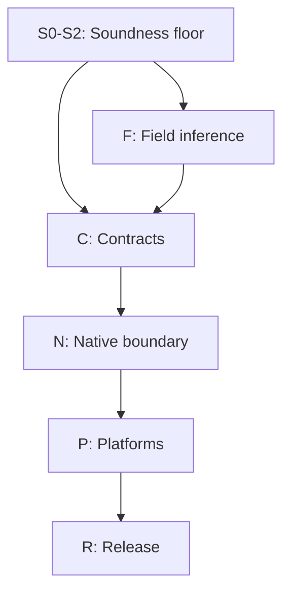

# Pfun V2 Completion Specification

**Status:** audited architecture, implementation ledger, and remaining-work specification  
**Baseline:** repository `main` at commit `2caf48874c67`  
**Date:** 2026-07-30  
**Immediate completion scope:** the sound, self-hosted V2 language; whole-program field inference; executable invariants and contracts; completed Node, browser, server, database, library, playground, diagnostic, and release surfaces  
**Later scope:** optional static discharge of executable checks  
**Completion authority:** this document classifies what exists and what remains; the source and acceptance tests remain the authority for implemented behavior

---

## Contents

1. [Purpose](#1-purpose)
2. [Audited baseline](#2-audited-baseline)
3. [Locked V2 model](#3-locked-v2-model)
4. [Immediate soundness repairs](#4-immediate-soundness-repairs)
5. [Whole-program normal-field inference](#5-whole-program-normal-field-inference)
6. [Invariants, contracts, and gradual verification](#6-invariants-contracts-and-gradual-verification)
7. [Canonical remaining-work ledger](#7-canonical-remaining-work-ledger)
8. [Dependency-ordered completion program](#8-dependency-ordered-completion-program)
9. [Decision register](#9-decision-register)
10. [Verification and acceptance strategy](#10-verification-and-acceptance-strategy)
11. [Canonical completion checklist](#11-canonical-completion-checklist)
12. [Traceability matrix](#12-traceability-matrix)
13. [Optional static discharge after V2 completion](#13-optional-static-discharge-after-v2-completion)
14. [Rejected and superseded proposals](#14-rejected-and-superseded-proposals)
15. [Maintaining this specification](#15-maintaining-this-specification)

## 1. Purpose

This document answers one question:

> Starting from the self-hosted compiler at `2caf48874c67`, what exactly must still be designed, implemented, tested, documented, and stabilized before Pfun V2 is complete?

It consolidates:

- the surviving V2 language and compiler architecture;
- the implementation that actually exists in the baseline repository;
- the whole-program field-inference design;
- the invariant, executable-contract, and gradual-verification design;
- the accepted corrections from two implementation reviews;
- the native-failure and `Result` direction established by slices E2 through E7;
- every remaining compiler, host, standard-library, browser, server, database, playground, documentation, and release task still belonging to V2.

This is not a historical narrative and not a promise that old phase numbers
remain accurate. The repository has moved well beyond the early-bootstrap
roadmap. This specification keeps the design that still holds, records work
that has already shipped, removes superseded assumptions, and gives the
remaining work one dependency-ordered completion plan.

### 1.1 The governing language goal

Pfun remains:

> A strict, compiled, statically checked procedural-functional language in
> which ordinary application code needs no type annotations, pure computation
> is separated from effects, expected failures are values, and stronger
> guarantees come from the compiler rather than from user ceremony.

The completion plan must preserve that goal. In particular:

- ordinary fields do not gain written type annotations;
- whole-program field inference replaces witness code;
- `generic` remains explicit and semantically meaningful;
- `Option` and `Result` remain the channels for expected outcomes;
- invariant violations represent defects, not routine failures;
- no solver participates in ordinary type inference;
- JavaScript remains a target and host floor, not Pfun's language model.

### 1.2 Authority order

When sources disagree, use this order:

1. **Baseline V2 source and passing acceptance tests.** These establish what is
   implemented now.
2. **The current repository V2 architecture.** This establishes the intended
   language and component model where it still agrees with the source and this
   specification.
3. **This completion specification.** This supersedes older planning and
   resolves the field-inference, invariant, contract, and review findings.
4. **Slice documents and fixtures.** These establish the contract of completed
   increments.
5. **The V1 manual and V1 libraries.** These are migration inventories only;
   they never override V2.

The supplied note describing the bootstrap as “still in early stages” is
stale. The active compiler is self-hosted, the V1 compiler is no longer in the
active build path, and slices through E7 are present in the baseline.

### 1.3 Status vocabulary

| Status | Meaning |
|---|---|
| **Implemented** | Present end to end in the baseline source and covered by an acceptance or focused test. |
| **Partial** | Some required layers exist, but the final language or platform contract is incomplete. |
| **Designed** | Normative behavior is settled here, but implementation is absent. |
| **Unresolved** | A bounded language or API decision must be made before the dependent phase starts. |
| **Later** | Deliberately outside the V2 completion gate. |
| **Removed** | An older proposal or V1 behavior does not belong to V2. |

“Implemented” in this document is baseline-relative. A later edit must update
the baseline commit and rerun the evidence gates before changing a status.

### 1.4 Definition of V2 complete

V2 is complete when all of the following are true:

1. The compiler is self-hosted from the checked-in seed and reaches a
   byte-identical fixed point.
2. Every successful compiler build also reaches an identical canonical
   field-schema manifest fixed point.
3. The ordinary type system is sound without witness code, `TAny` cannot
   approve application operations or ground fields, and opaque types are
   enforced.
4. Pure code, expected failures, invariant defects, host faults, and
   abandonment boundaries have distinct, documented semantics.
5. Invariants and contracts execute correctly without a solver on every
   supported target.
6. Node bundle, Node files, browser, server, TEA, and playground paths all use
   the same canonical checking pipeline.
7. Host operations return `Result` or `Option` for every recoverable failure;
   raw throws remain only for defects, impossible ABI misuse, resource
   exhaustion, or process/host initialization failure.
8. The public V2 standard-library surface is no longer dependent on the
   repository-root V1 `lib/` tree.
9. The V2 language tour, server example, browser/TEA example, database example,
   and library conformance examples all pass.
10. Documentation describes the implemented language rather than the old
    bootstrap or V1 behavior.
11. Every immediate checklist item in Section 11 is complete.

The optional solver in Section 13 is not part of this completion gate.

---

## 2. Audited baseline

### 2.1 Verified implementation snapshot

The baseline repository is clean at:

```text
commit 2caf48874c67
branch main
```

The checked-in compiler is:

```text
boot/pfc.js
```

The active compiler source is under `src/`; V1 compiler source is not part of
the active build path.

The aggregate acceptance runner discovers 24 slice runners:

```text
slice A
slice B, B2, B3, B4, B5, B6
slice C1, C2, C3, C4
slice D1, D2, D3, D4, D5, D6
slice E1, E2, E3, E4, E5, E6, E7
```

The generated compiler unit harness contains 32 Pfun test files in addition
to host, smoke, semantic, and slice-specific tests.

Audit verification on 2026-07-30:

```text
complete slice sweep: 24 passed, 0 failed
generation 1 == generation 2: byte-identical
```

### 2.2 Implemented compiler foundation

| Area | Status | Baseline evidence |
|---|---|---|
| Lexer, parser, immutable AST, spans and ids | **Implemented** | `src/syntax/`; generated lexer/parser tests |
| Import graph and deterministic topological checking | **Implemented** | `src/graph/modgraph.pf`; graph tests |
| Structured diagnostics | **Implemented** | `src/check/diag.pf`; diagnostic goldens |
| Module interfaces, including record and union shapes | **Implemented** | `src/check/iface.pf`; interface tests |
| HM-style inference with explicit generic declarations | **Implemented** | `src/check/types.pf`; type and grounding tests |
| SCC inference for top-level recursive groups | **Implemented** | binding-group machinery in `types.pf` |
| Deferred `HasField`, `Equatable`, and `Comparable` constraints | **Implemented** | `types.pf`; focused type tests |
| Purity with type-aware proc invocation | **Implemented** | `src/check/purity.pf`; purity tests |
| Union and list exhaustiveness | **Implemented** | `src/check/exhaust.pf`; exhaustiveness tests |
| One production `checkGraph` pipeline | **Implemented** | `src/check/check.pf`, `src/compile/pipeline.pf` |
| Stable JS AST and printer | **Implemented** | `src/compile/js.pf`; printer goldens |
| Type-directed emitter | **Implemented** | `src/compile/emit.pf`; emitter tests |
| Node and browser linker | **Implemented** | `src/compile/link.pf`; link tests |
| Self-tail-call lowering, including match arms | **Implemented** | `tailCallsOf`, `emitTailMatch`; tail-match tests |
| Memo function lowering and runtime cache | **Implemented** | emitter `$memoize`; host implementation |
| Fixed-point self-hosting | **Implemented** | slice gates rebuild the compiler and compare output |

### 2.3 Implemented language surface

| Area | Status | Notes |
|---|---|---|
| Strict evaluation outside lazy-list production | **Implemented** | V2 has no lazy `let` or lazy argument semantics. |
| `function`, `fn`, `proc`, `async proc` | **Implemented** | Static purity boundary. |
| First-class sync and async proc values | **Implemented** | Slice E1; invocation remains effectful. |
| Explicitly typed proc lambdas | **Implemented** | Sync and async proc types remain distinct. |
| Monomorphic-by-default functions | **Implemented** | `generic function` and `generic proc` opt in. |
| Normal and `generic` fields | **Partial** | Generic slots work; normal fields still freeze too early and rely on witnesses. |
| Records, unions, imported shapes and matching | **Implemented** | Includes cross-module record shapes. |
| Combined unions and nominal widening | **Implemented** | Slice E2. |
| One ambient `Result<Value, Error>` | **Implemented** | Slice E3. |
| `|>`, `|?>`, `|!>` | **Implemented** | Slice E4. |
| `Option` reads and list patterns | **Implemented core** | Ambient `nth`/indexing and public `list.head`/`tail` are total; unsafe ambient intrinsics remain exposed. |
| `NonZero` division rules | **Implemented** | Literal-zero rejection, literal coercion and safe helpers are tested. |
| Hybrid arbitrary-precision `Int` | **Implemented** | Safe `number` fast path and `bigint` overflow path. |
| Float total ordering | **Implemented core** | `$cmpF`/`$eqF`; conversion and rounding surface still need repair. |
| Byte literals and binary I/O | **Implemented** | Byte arithmetic semantics remain incomplete. |
| Lazy list syntax, lowering and host representation | **Implemented core** | Public constructors, inspection and forcing contracts remain incomplete. |
| Mutable dict/array literals and indexing | **Implemented core** | Public operation modules are incomplete. |
| `extern` parsing and private emission | **Partial** | Encapsulation policy exists; capability and `Any` confinement need enforcement. |
| `opaque type` syntax and interface kind | **Partial** | Representation access is not yet rejected. |

### 2.4 Implemented commands and targets

The checked-in compiler supports:

```text
pfc check <entry.pf>
pfc build <entry.pf> --target node-bundle
pfc build <entry.pf> --target node
pfc build <entry.pf> --target browser
pfc run <entry.pf> [args...]
```

| Target or command | Status |
|---|---|
| Check-only graph validation | **Implemented** |
| Single-file Node bundle | **Implemented** |
| Multi-file Node program | **Implemented** |
| Bare browser HTML bundle | **Implemented** |
| Compile-and-run through Node | **Implemented** |
| `serve` | **Designed / absent** |
| TEA page target through generated glue | **Designed / absent** |
| Browser compiler playground | **Designed / absent** |
| Installed `pfun` launcher and stable release packaging | **Partial / unresolved** |

### 2.5 Implemented host and library floor

| Surface | Status |
|---|---|
| Node stdout/stderr/stdin with `Result` | **Implemented through E7** |
| Process args and environment snapshots | **Implemented** |
| Generated Node-bundle child runner | **Implemented** |
| Whole-file and handle-based text I/O | **Implemented core** |
| Binary reads/writes and buffers | **Implemented core** |
| Async/await and `sleep` | **Implemented** |
| Cancellable one-shot timers | **Implemented** |
| Structured `NativeError` variants | **Implemented foundation** |
| Timer callback exception/rejection containment | **Implemented** |
| Timer callback completion observation | **Absent** |
| Typed nominal JSON | **Implemented as `Option`** |
| TOML | **Implemented in `src/stdlib/toml.pf`** |
| Public list and string facades | **Implemented** |
| V2 testing library and colored runner | **Implemented** |
| Minimal `math` builtin module | **Implemented core** |
| HTTP client/server | **Absent** |
| PostgreSQL/MariaDB adapters | **Absent** |
| Browser DOM/fetch/event floor | **Absent** |
| TEA, view, theme and semantic HTML V2 modules | **Absent** |

### 2.6 Documentation that is stale rather than unfinished code

The following statements in older files must not be used as status evidence:

- the bootstrap is in “early stages”;
- `check`, `run`, browser builds, proc lambdas, memoization, match-arm TCO,
  lazy host representation, slot defaulting, record interfaces, buffers, or
  mutable containers are merely planned;
- V2 procs are second-class;
- V2 is generally lazy;
- the active compiler requires the V1 TypeScript/npm build;
- `lib/` is the V2 standard library;
- pure code can never terminate through a defect.

These are documentation-repair tasks, not implementation tasks.

### 2.7 Source reconciliation

The specification was assembled from the following evidence classes:

| Source | Treatment |
|---|---|
| Baseline `main` source, host, seed, scripts, fixtures, and tests | Audited as implementation truth at `2caf48874c67`. |
| `pfun_v2_architecture.md` and the repository architecture copy | Retained for the V2 execution, compiler, purity, data, and target model where not superseded by shipped slices or this specification. |
| `Pfun-Whole-Program-Field-Inference-Invariants-Contracts-and-Gradual-Verification.md` | Incorporated normatively into §§5–6 and phases F1–C6. |
| `bootstrap-style-guide.md` | Applied to bootstrap sequencing, seed compatibility, deterministic output, small coherent changes, and acceptance gates. |
| Slice documents through E7 | Used to mark Result, proc-value, pipeline, native-error, console, file, and timer work as implemented. |
| `pfun-manual.md` and repository-root `lib/` | Used only to inventory V1 concepts and libraries that may still merit a V2 redesign. |
| `Document-notes.txt` | Used as an initial inventory; stale bootstrap-status claims were rejected. |
| Two repository-backed design reviews | Accepted where verified, including fact invalidation, cleanup semantics, `TAny`, TCO boundaries, `isLazy`, lambda facts, and contextual syntax; rejected items are recorded in §14. |

No remaining-work item is classified solely because it appeared in the V1
manual. It must also fit the locked V2 model and the completion boundary in
§1.4.

---

## 3. Locked V2 model

### 3.1 Execution and evaluation

Pfun V2 is compiled-only:

```text
load -> lex -> parse -> graph -> check -> emit -> link -> run/write/serve
```

There is no interpreter and no REPL in the core architecture.

Evaluation is strict and left-to-right:

- every `let` initializer runs once at the binding;
- arguments run once before a call;
- record fields and list elements run once in source order;
- general bindings are never thunks;
- only explicitly lazy list production defers element production;
- forced lazy cells are memoized.

This strictness rule is required by contract evaluation and construction
ordering. It is not an incidental implementation detail.

### 3.2 Pure and procedural code

- `function` and `fn` are pure.
- Named `proc`, anonymous `proc`, and `async proc` values are first-class.
- Creating, binding, storing, selecting, importing, exporting, passing, and
  returning a proc value is pure.
- Invoking a proc value is effectful and therefore legal only at top level or
  in proc context.
- Sync and async proc types do not unify.
- Proc lambdas are explicitly typed and monomorphic.
- Named `generic proc` is the polymorphic proc form.
- Descriptors remain the preferred representation when pure code requests an
  effect rather than registering an eventual callback.

### 3.3 Types and annotations

Pfun remains annotation-light:

- ordinary functions, values, fields, and local bindings have inferred types;
- ordinary normal-field type annotations are not added;
- explicit type expressions remain necessary at native `extern` boundaries
  and on proc-lambda parameters/results;
- normal declarations are monomorphic;
- `generic function`, `generic proc`, and `generic` fields opt into distinct
  forms of polymorphism;
- `generic` is not a workaround for unresolved evidence.

Normal and generic fields have opposite meanings:

| Normal field | `generic` field |
|---|---|
| One monomorphic type across the complete program | One hidden slot instantiated per containing value |
| Inferred from every real use | Intentionally allowed to vary |
| Represented by one rigid `TFieldVar` after this plan | Represented by a hidden named-type argument |
| Never generalized | Generalized with the enclosing binding when allowed |

### 3.4 Data and operators

- Records and discriminated unions are nominal.
- Combined unions give directional nominal widening and unique least-upper-bound
  joins.
- Variant construction ownership remains with the declaring union.
- `Option` represents ordinary absence.
- One ambient `Result<Value, Error>` represents recoverable failure.
- Domain error unions occupy the `Result` error slot.
- `+` is numeric only.
- `++` is string only.
- List concatenation uses named functions.
- Integer `/` and `%` require `NonZero` or return `Option` through safe helpers.
- Float arithmetic is IEEE-754 and total; comparison uses Pfun's total order.
- Byte arithmetic wraps modulo 256 and is emitted through Byte-specific host
  helpers rather than Int arithmetic.

### 3.5 Four failure categories

The earlier statement “pure code cannot fail” is replaced by a more precise
model.

| Category | Meaning | Channel |
|---|---|---|
| Static rejection | Ill-typed, impure, non-exhaustive, inaccessible or unsupported source | Diagnostic |
| Expected absence/failure | Valid program and state; operation has an ordinary negative outcome | `Option` or `Result` |
| Invariant defect | The program reached a state the programmer declared impossible | `InvariantViolation` and abandonment |
| Engineering/host catastrophe | Runtime/compiler bug, corrupt ABI, resource exhaustion, process initialization failure | System handler or host termination |

A pure function may:

- return normally;
- diverge;
- terminate by raising an invariant violation.

It may not catch a violation, perform effects, or convert a violation into
ordinary `Result` data.

### 3.6 Abandonment and shared state

To **abandon** is to stop one logical computation and transfer its invariant
defect to the nearest active handler. To **abort** is to reach the process or
browser-application root. The system handler is the outermost abandonment
boundary, not a second defect kind.

Abandonment is locally safe when the abandoned unit owns the state it may have
invalidated. Request-local immutable values satisfy that rule naturally.
Shared mutable state and external effects require explicit lifecycle design.

For a protected transaction:

- every thrown exit leaving the protected body runs rollback before the
  original failure continues;
- normal completion runs commit;
- an inner invariant handler may consume a defect before it leaves the
  transaction body, after which normal completion may commit;
- sending mail, charging a payment, and other irreversible operations still
  require idempotency, post-commit sequencing, or compensation.

`protect` guarantees cleanup ordering. It does not make an arbitrary sequence
of external effects transactional.

### 3.7 Native boundary

Native code must:

- remain private behind `extern` or builtin manifest entries;
- return only Pfun values, opaque handles, `Option`, `Result`, or declared
  domain unions;
- catch recoverable host errors and translate them;
- rethrow invariant sentinels before translating broad catches;
- never leak raw JS objects, `undefined`, promises with undocumented
  rejection behavior, or host exceptions into ordinary Pfun APIs.

`Any` is not a public dynamic type. Its restricted role is defined in Section
4.

### 3.8 Completion non-goals

V2 completion does not add:

- an interpreter or REPL;
- object-oriented classes or method dispatch;
- general lazy evaluation;
- automatic currying as an implicit arity feature;
- ordinary user-written field annotations;
- typeclasses, traits, interfaces, or row polymorphism;
- exceptions for expected failures;
- a new functional record-update expression;
- cached list lengths;
- a changed meaning for `take`;
- solver-driven type inference;
- a requirement that `Promise.all` aggregate every error value;
- a proof that arbitrary pure code terminates.

---

## 4. Immediate soundness repairs

These repairs precede the larger field and contract work. They close
user-reachable holes in the baseline checker and prevent the new system from
building on permissive recovery types.

### 4.1 `TAny` is not evidence

The baseline has both:

```text
TAny
TUnknown
```

Both currently unify permissively. `TAny` is also considered comparable and
can reach ordinary code through `length`, `slice`, `find`, and `findSlice`.
That permits this unsound shape:

```pfun
type Box = { value };

let box = Box { value = slice(0, 1, "hi") };
let doubled = box.value * 2;
```

The checker can accept the field as `Any`, specialize the multiplication as
integer multiplication, and emit a program that fails at runtime on a string.

Normative rules:

1. `TAny` and `TUnknown` are never concrete field solutions.
2. A type containing either one at any depth is not operationally grounded.
3. `TAny` may not discharge `Equatable`, `Comparable`, numeric, callable,
   field-access, indexing, JSON-schema, emitter-specialization, or contract-case
   requirements.
4. Flowing `TAny` into a normal field produces a targeted diagnostic unless a
   builtin overload first recovers the real type.
5. Flowing `TUnknown` into a normal field taints the field without binding it.
   If the unknown came from an earlier diagnostic, do not emit a redundant
   second error.
6. `TAny` may not appear in a finalized ordinary export or schema manifest.
7. `ITAny` obeys the same interface rules.
8. Generic slots may not hide `Any`; `List<Any>`, `Result<Any, E>`, and similar
   nested forms are still unresolved/dynamic.

Required diagnostics distinguish:

```text
error[Type]: dynamic `Any` cannot determine `Box.value`
```

from recovery suppression:

```text
the field remained unknown because an earlier expression failed to type-check
```

### 4.2 Replace ordinary builtin `Any` with overload cases

The four baseline `TAny` signatures become real type-directed cases:

```text
length : List<a>       -> Int
length : Str           -> Int
length : Array<a>      -> Int
length : Dict<k, v>    -> Int

slice : Int, Int, List<a> -> List<a>
slice : Int, Int, Str     -> Str

find : List<a>, a -> Option<Int>
find : Str, Str    -> Option<Int>

findSlice : List<a>, List<a> -> Option<Int>
findSlice : Str, Str         -> Option<Int>
```

The list cases of `find` and `findSlice` also produce the existing
`Equatable(a)` requirement.

The builtin manifest gains a list of inference cases rather than one
permissive scheme. Case selection:

1. Instantiates candidate schemes.
2. Discards candidates contradicted by known types.
3. Selects the unique remaining case when possible.
4. Defers an unresolved overload when a field or local type is still unknown.
5. Produces an ambiguity diagnostic if finalization leaves several cases.
6. Produces a mismatch diagnostic if no case survives.

An unresolved overload may constrain a field only when one unique case has
been selected. It must never use `Any` as a stand-in for selection.

Contract metadata is attached to each selected case. For example, only the
list case of `length` carries the lazy-list precondition.

### 4.3 Confine or remove `Any`

The immediate design keeps `Any` only as a quarantined native-boundary token:

- legal in private `extern` declarations;
- illegal in ordinary exported interfaces;
- manipulated only by typed native decoder/encoder operations;
- never directly comparable, printable by structural assumptions, indexed,
  called, or projected;
- never accepted as a normal field solution.

After the native wrapper and decoder work is complete, audit whether `TAny` and
`ITAny` can be removed entirely. Removal is preferred if every necessary
boundary can instead use an opaque handle or a typed decoder.

### 4.4 Enforce opacity

The parser and interface kind already recognize `opaque`; representation
enforcement is missing.

Outside the defining module, an opaque type:

- may be named, stored, passed, returned, compared only if its public
  capabilities allow it, and consumed by exported functions;
- may not be constructed;
- may not expose or access fields;
- may not expose or match variants;
- may not be included into another union by representation;
- may not be fabricated through `Any`;
- may not have its representation emitted into a public contract.

The final interface exports:

- nominal identity;
- hidden generic arity;
- permitted exported values/functions;
- public contract observers and logical summaries;
- no private record or variant shape.

`NonZero`, `TimerHandle`, file handles, buffers where appropriate, future
server handles, database connections, and foreign handles rely on this rule.

### 4.5 Numeric completion repairs

The baseline float and byte floor is not yet a complete V2 numeric contract.

Required work:

- expose `floatToInt : Float -> Option<Int>`, returning `None` exactly for
  non-finite input;
- ensure `floor`, `ceil`, and `round` cannot produce a JS `NaN` or infinity
  while claiming the static type `Int`;
- settle their final API before the numeric conformance phase;
- route Byte arithmetic and bit operations through wrapping `$*B` helpers
  instead of unifying Byte operands with Int;
- test `NaN`, infinities, `-0`, safe-integer edges, bigint promotion, Unicode
  scalar conversion, and byte wraparound;
- use `NativeNumericError` only for genuinely host-dependent recoverable
  failures, not for statically preventable type mistakes.

The final `floor`/`ceil`/`round` API is an unresolved item in Section 9.
`floatToInt` is already settled by the architecture. Every chosen operation
must preserve the rule that a Pfun `Int` is always represented by a valid
canonical integer.

### 4.6 Preserve the `Char` scalar invariant

The architecture defines `Char` as exactly one Unicode scalar, while `Str`
length, offsets, and slicing remain UTF-16 code-unit based for stable source
positions and O(1) offsets.

The baseline `chr` correctly rejects the surrogate range, but every other
Char-producing path also needs conformance coverage. In particular, lookup at
a code-unit offset must return `None` when the offset points into the trailing
half of a surrogate pair; it must never manufacture a lone surrogate as a
`Char`.

Completion requires:

- validate `nth`/string indexing at leading and trailing surrogate offsets;
- validate `asc` only against real `Char` values at host boundaries;
- keep `chrU` and comparable unchecked scalar construction compiler-only;
- test lexer literals, UTF-8 decode, file reads, buffers, splitting, matching,
  and verified character access with one- and two-code-unit scalars;
- preserve the documented code-unit behavior of `length` and `slice` without
  weakening the scalar invariant for values statically typed `Char`.

---

## 5. Whole-program normal-field inference

### 5.1 Why this work exists

Pfun declarations intentionally name normal fields without spelling their
types:

```pfun
export type Module = {
	path,
	stmts,
	nextId
}
```

The baseline checker infers declaration fields while checking the declaring
module. When real evidence lives in parser, checker, emitter, or driver
modules, compiler source uses uncalled witness functions and values to pin
types locally.

That is not an acceptable user-facing language rule. Dead code must not be
semantically required merely to explain a data shape to the compiler.

The replacement is:

> Every normal nominal field has one rigid identity across the complete
> imported program. Real constructions, accesses, operations, calls, and
> executable predicates jointly infer its monomorphic type.

### 5.2 Complete program

For field inference, the complete program is:

- the transitive source-import closure of every requested entry or generated
  root;
- the builtin interfaces used by that closure;
- every checked body in every module in that closure.

It is not call-graph reachability. Dead-code elimination runs after
finalization and cannot decide a field schema.

Adding or removing an import may therefore change the schema. The canonical
manifest makes that change explicit.

### 5.3 Stable field identity

Every normal field receives:

```text
FieldKey = {
	path,
	typeName,
	variantName,   // absent for a record field
	fieldName
}
```

The key:

- comes only from canonical declaration identity;
- includes variant identity;
- never includes a fresh type-variable id, traversal index, hash iteration
  order, or unstable AST allocation;
- has one centralized collision-free encoding when stored as a string;
- renders structurally in diagnostics and manifests.

### 5.4 Type representation

Add:

```pfun
export type Type = {
	...
	| TVar: id
	| TFieldVar: key
}
```

and, where interfaces use a separate type:

```pfun
export type IfaceType = {
	...
	| ITVar: id
	| ITFieldVar: key
}
```

`TFieldVar` is not an ordinary `TVar` with a special number.

It is:

- rigid across module and interface boundaries;
- never generalized;
- never freshened by instantiation;
- never slot-defaulted to `Unit`;
- substituted only through program field state;
- preserved by provisional interface conversion;
- followed by occurs checking;
- formatted by declaration identity.

### 5.5 Field shapes

The baseline representation contains:

```text
FieldMono(type)
FieldSlot(index)
FieldCommon(shapes)
```

Change normal fields to:

```text
FieldMono(FieldKey)
```

Keep:

- `FieldSlot(index)` for intentionally generic fields;
- `FieldCommon(members)` for a field shared across every variant of a union or
  combined union.

`FieldCommon` must unify every member's actual field type. It may never return
`TUnknown` merely to approve access.

### 5.6 Nested rigidity

If use establishes:

```text
Container.items = List<a>
```

the nested `a` belongs to the program field solution. A generic helper may not
later generalize it and instantiate the same field as both `List<Str>` and
`List<Int>`.

Use inference levels:

1. Ordinary variables are allocated at the current lexical level.
2. Program fields live at level 0.
3. Binding a field to a type lowers every reachable unbound ordinary variable
   in that type to level 0.
4. Binding a level-0 variable recursively lowers its right-hand side.
5. Generalization quantifies only ordinary variables above the environment
   level.

This applies through every container and nominal argument.

### 5.7 Constraint sources

All real typed uses may constrain a normal field:

- record and variant construction;
- field access;
- pattern binding;
- operators over field projections;
- function argument and result flow;
- list, record, union, `Option`, and `Result` containment;
- executable `invariant`, `requires`, `ensures`, and field `where`
  predicates;
- selected builtin overload cases.

Proof results never constrain a field. Predicate expressions contribute
ordinary HM constraints before any logical translation exists.

### 5.8 `TAny` and recovery types during field binding

Field binding first applies current substitutions, then:

```text
contains TAny     -> targeted dynamic-field diagnostic; do not bind
contains TUnknown -> taint/incomplete evidence; do not bind
contains self key -> occurs diagnostic
otherwise         -> lower nested variables to level 0 and bind
```

A prior valid field solution unified against `Any` is not widened to `Any`.
The dynamic flow is diagnosed at its source.

### 5.9 Three-stage graph checking

Production checking becomes:

```text
collect -> infer -> finalize
```

#### Collect

In canonical path and source order:

- bind top-level names and export kinds;
- collect record and union declarations;
- assign generic slot indices;
- assign every normal `FieldKey`;
- build record, variant, common-field, and combined-union shapes;
- build provisional interfaces;
- report declaration-shape errors.

#### Infer

In topological body order, with one shared program field state:

- preserve existing local HM and SCC rules;
- preserve module ownership of ordinary exported schemes;
- let imported field keys receive constraints;
- infer every body and executable predicate exactly once;
- record unresolved `HasField`, overload, equality, comparison, emission, and
  boundary decisions rather than guessing;
- retain provenance for every field contributor.

#### Finalize

After all bodies:

1. Chase ordinary and field substitutions to a fixed point.
2. Retry deferred `HasField`, overload, equality, and comparison constraints.
3. Resolve every `FieldCommon`.
4. Apply final substitutions to node types and typed predicates.
5. Resolve emitter and boundary decisions.
6. Enforce operational groundedness.
7. Build finalized type cores and interfaces.
8. Produce conflict/unresolved diagnostics.
9. Produce the canonical field-schema manifest only for a complete successful
   inference.

Finalization is idempotent.

### 5.10 Program checker state

Conceptually:

```pfun
export type ProgramTcSt = {
	nextVar,
	subst,
	fieldSubst,
	varLevels,
	fieldOrigins,
	pending,
	deferred,
	inferenceComplete,
	diags
}
```

Required helpers include:

```text
fieldKeyOf
applyType
bindVar
bindField
lowerToLevel
freeGeneralizableVars
instantiate
fieldTypeFromShape
collectProgramDecls
inferProgram
finalizeProgram
```

### 5.11 Provisional and finalized interfaces

A provisional interface exposes enough declaration identity to check
importers:

- top-level export names and kinds;
- nominal type names and generic arity;
- constructors and accessible shapes for non-opaque types;
- stable `ITFieldVar` keys;
- combined-union membership.

It does not claim that a normal field schema or contract-safety summary is
final.

A final interface:

- applies final field substitutions;
- preserves allowed symbolic field identities;
- omits opaque representation;
- adds executable contract metadata and safe-observer summaries;
- contains no `Any` in ordinary exported positions.

Importers may constrain an imported `ITFieldVar`. They may not reach backward
and specialize an exporter's ordinary local or callable `TVar`.

### 5.12 Operational groundedness

A normal field may remain symbolic when no runtime or downstream decision
needs its representation.

A concrete type is required when the field participates in:

- numeric/string/byte operator specialization;
- call shape or arity;
- equality/comparison selection;
- indexing;
- pattern or variant discrimination;
- JSON/HTTP/database schema generation;
- native encode/decode;
- contract case selection;
- any emitted host intrinsic that depends on type.

Operational groundedness fails for unresolved `TFieldVar`, relevant `TVar`,
`TAny`, `TUnknown`, or a nested type containing them.

The diagnostic names the operation, declaration, and missing evidence. It does
not recommend `generic` without explaining that `generic` changes the data
model.

### 5.13 Error suppression

If a body or body fragment was skipped because of an earlier error,
`inferenceComplete` is false.

The build may still report:

- direct source diagnostics;
- field conflicts supported by complete contributor sites.

It suppresses:

- unresolved-field diagnostics whose evidence might have come from a skipped
  body;
- deferred overload/emission/boundary diagnostics dependent on that evidence;
- publication of a final schema manifest.

This prevents one typo from producing a page of false field errors.

### 5.14 Conflict provenance

A field-conflict diagnostic includes:

- the declaration;
- the first concrete contributor;
- the incompatible contributor;
- both resolved types;
- relevant containment paths when the conflict is nested.

Example:

```text
error[Type]: conflicting types for `Module.path`
  declared at src/syntax/ast.pf:84:2
  established as Str:
    src/syntax/parser.pf:211:18
  conflicting Int constraint:
    src/check/check.pf:97:24
  a normal field has one monomorphic type across the complete program
```

### 5.15 Canonical schema manifest

Every successful complete build emits deterministic schema data sorted by:

```text
path, type name, variant name, field order
```

Each field records:

- normal or generic;
- stable key or slot;
- finalized canonical type or symbolic key;
- field predicate identity when present.

No fresh variable ids or map iteration order appear.

For manifest run `i`:

```text
compiler Gi compiles compiler source S
  -> compiler artifact Gi+1
  -> schema manifest Mi emitted by Gi for S
```

The fixed point compares:

```text
G1 == G2
M1 == M2
```

Thus `M1` is emitted by generation 1 while it compiles `S`, and `M2` is emitted
by generation 2 while it compiles the same `S`. It is not the manifest emitted
by the seed while producing generation 1. Running generation 2 for `M2` may
also produce a generation-3 artifact; the ordinary compiler fixed point is
already the explicit `G1 == G2` comparison.

### 5.16 Witness removal

After the pipeline works:

1. Inventory every grounding witness, signature anchor, synthetic constructor,
   and uncalled helper.
2. Classify whether it contributes only type evidence or has real behavior.
3. Remove type-only witnesses in small batches.
4. Require unit tests, complete slice tests, compiler fixed point, and schema
   manifest fixed point after each batch.
5. Add regression tests proving that each removed witness leaves the manifest
   unchanged.

Removing genuine code is not required. Removing fake evidence is.

---

## 6. Invariants, contracts, and gradual verification

### 6.1 Layering

The correctness design is implemented in this order:

1. runtime invariant defect foundation;
2. `invariant` and explicit `violation`;
3. proc-only handling and unconditional cleanup;
4. executable `requires` and `ensures`;
5. field `where` plus trusted/untrusted construction adapters;
6. list forcing contracts and safe verified accessors;
7. boundary reporting and task-root hardening;
8. optional static discharge later.

Layers 1 through 7 belong to V2 completion. Layer 8 does not.

### 6.2 Failure representation

The host provides one branded opaque sentinel:

```text
InvariantViolation {
	kind,
	message,
	site,
	predicate
}
```

Application code cannot construct, inspect, or match it. Handler arms receive
an opaque value and may obtain stable public information through dedicated
observers such as `violationMessage`.

Site metadata contains:

```text
path
line
column
callable
kind
canonical rendered predicate
```

Predicate metadata uses one canonical rendered form, not raw source
whitespace.

### 6.3 `invariant`

Surface:

```pfun
invariant expression;
```

Rules:

- the expression is typed exactly once by ordinary HM inference;
- it must be `Bool`;
- it is a pure predicate context;
- it is evaluated once at runtime;
- false raises `InvariantViolation`;
- true establishes facts for subsequent analysis;
- it is legal in pure or proc code;
- it cannot be handled in pure code.

Explicit defect:

```pfun
violation("message")
```

This raises the same sentinel with explicit-violation metadata.

### 6.4 `handling invariants`

Surface:

```pfun
handling invariants {
	body
} with failure -> {
	handler
}
```

Rules:

- proc-only;
- dynamically encloses awaited work in the same call chain;
- catches only `InvariantViolation`;
- ordinary host errors propagate;
- a violation raised by the handler arm propagates to the next outer handler;
- a handler may deliberately swallow a violation;
- swallowing does not imply rollback or valid shared state.

### 6.5 `protect`

Surface:

```pfun
protect {
	body
} complete {
	onNormalExit
} unwind {
	onAbnormalExit
}
```

Rules:

- proc-only;
- `complete` runs on every normal transfer leaving the protected body;
- `unwind` runs on every abnormal exit, including invariant violations and
  ordinary host throws;
- `Result` and `Option` values are normal completion;
- cleanup cannot consume or replace the original failure;
- an unwind failure is fatal and reports both the primary and cleanup causes;
- a boolean/discriminated completion state is used, never a thrown-value
  sentinel (`throw null` is legal JavaScript);
- a handler does not run merely because `unwind` ran;
- cleanup arms may perform proc operations;
- cleanup arms may not `return` from the enclosing callable or perform an
  outward `break`/`continue`.

The current language has no user `break`/`continue` syntax, but the control
validator must preserve the rule if those forms are ever added.

### 6.6 Cleanup control context

Purity/procedural context is insufficient to validate cleanup.

Add a control context recording at least:

```text
callable kind
async status
loop depth
cleanup-arm depth
whether outward return is allowed
```

Entering `complete` or `unwind`:

- retains proc capabilities;
- disables outward return;
- resets or marks enclosing loop transfers as outward;
- reports a control-flow diagnostic rather than relying on emitter behavior.

### 6.7 JavaScript lowering

The JS AST gains a finally-capable statement, for example:

```pfun
| JsTry: body, catchName, handler, finalizer
```

Equivalent lowerings are allowed, but observable semantics must include:

- `complete` after fallthrough, return, and every future normal loop transfer;
- `unwind` after every throw, including `null`;
- original normal transfer after `complete`;
- original thrown value after `unwind`;
- no cleanup control transfer suppressing the original exit.

### 6.8 TCO boundaries

The baseline TCO loop wraps an entire function body. New dynamic boundaries
must not be crossed by a synthesized `continue`.

Initial rule:

> A self-call lexically enclosed by `protect`, `handling invariants`, a
> handler arm, `complete`, or `unwind` is not eligible for TCO.

The tail-call collector must carry boundary depth and ignore such calls.

Preconditions on an otherwise eligible self-tail-recursive callable run at the
top of every emitted `while (true)` iteration against the current parameter
values.

Postconditions are different. A logical recursive call creates one
postcondition obligation per call frame, and those obligations may mention the
frame's parameter values. Mutating parameters in a loop and checking only the
last frame is unsound.

Initial safe rule:

> A callable with `ensures` is not eligible for TCO.

A later optimization may preserve contracted TCO with explicit parameter
snapshots or a proved tail-stable postcondition, but it must not silently
change contract semantics.

### 6.9 Task roots and broad catches

The following create task roots:

- unawaited async calls;
- timers;
- HTTP request callbacks;
- browser/TEA events;
- observable callbacks and completions;
- explicit future task-spawn operations;
- losing race tasks that continue.

Every root installs a system or application handler.

Every broad host catch begins with:

```js
if ($isInvariantViolation(error)) throw error;
```

before translating the error into `NativeError`, `Result`, or another expected
boundary value.

Node process-root violations:

- render a stable report to stderr;
- exit with software-error status 70.

Browser application-root violations:

- report visibly and to developer tools;
- stop dispatch into the affected invalid model.

Server request-root violations:

- log;
- return 500 if still possible;
- abandon only the request by default.

### 6.10 Executable `requires`

Surface:

```pfun
function nthV(xs, index)
	requires 0 <= index && index < length(xs);
{
	nthU(xs, index)
}
```

The semicolon is mandatory. It prevents the existing `IDENT {` record-literal
grammar from consuming the callable body brace.

Rules:

- a callable may have zero or more `requires` clauses;
- clauses execute in source order and a successful earlier clause establishes
  facts for later clauses;
- every ordinary Pfun precondition executes in the callee;
- it executes on every call, including every TCO iteration;
- it participates in HM inference;
- success establishes facts in the body;
- aliases cannot bypass it;
- public preconditions cannot expose opaque representation.

### 6.11 Executable `ensures`

Surface:

```pfun
function clamp(value, low, high)
	requires low <= high;
	ensures result { low <= result && result <= high }
{
	...
}
```

Rules:

- a callable has at most one `ensures` clause; a compound postcondition uses
  ordinary Boolean connectives;
- one result binder local to the clause;
- the binder may not shadow a parameter;
- every normal return is checked;
- early returns lower through one postcondition epilogue;
- failure raises an invariant violation;
- success establishes a direct-call fact at the caller;
- indirect alias calls retain runtime checks but do not export unsupported
  caller facts;
- trusted host postconditions follow Section 6.19 instead.

### 6.12 Contextual grammar

No new spelling in this design becomes a globally reserved keyword. The parser
recognizes these spellings contextually at their statement or clause
positions, and they remain legal identifiers elsewhere:

```text
invariant
requires
ensures
handling
invariants
protect
complete
unwind
```

The baseline `with` token retains its existing keyword status; this work does
not create or remove that reservation.

The lexer does not add them indiscriminately to the global keyword table.
The parser recognizes identifier text contextually in declaration and arm
positions.

This preserves baseline fields such as `EmittedModule.requires`.

### 6.13 Field `where`

Example:

```pfun
type Bounds = {
	low,
	high where low <= high
}
```

Rules:

- field expressions are evaluated once, left-to-right, into temporaries;
- predicates are evaluated after their referenced fields exist;
- a false predicate during ordinary internal construction raises a violation;
- untrusted decoding returns `Err(ValidationError)`;
- one predicate implementation serves both adapters;
- V2 has no record-update expression; changed records are complete new
  constructions and rerun all predicates;
- any future update syntax must lower through the complete predicate sequence.

### 6.14 Internal and untrusted adapters

Internal construction:

```text
evaluate fields -> check predicates -> construct nominal value
```

Untrusted JSON/HTTP/database/foreign construction:

```text
parse raw input
  -> validate base types
  -> validate field predicates
  -> construct nominal value
  -> Ok
```

Failure returns a validation error containing:

```text
path
field
predicate
message
```

Hostile peer input never becomes an invariant violation merely because it
fails a refinement.

### 6.15 Predicate safety

Before any solver, the compiler asks:

> Can this predicate execute as a bounded pure Boolean computation under the
> facts known here?

The initial accepted subset includes:

- scalar literals and arithmetic that already type-checks;
- immutable locals, parameters and projections;
- Boolean connectives and comparisons;
- the chosen lazy-representation predicate;
- compiler-declared safe builtin cases;
- bounded-prefix operations;
- whole-list operations only when strictness is known;
- pure, acyclic, non-higher-order user observer functions with finalized
  transitive safety summaries.

Initially reject:

- effects, mutation, `await`, or proc calls;
- arbitrary recursion;
- unknown higher-order calls;
- mutable containers, buffers, handles, or raw foreign values;
- whole-list traversal without a strictness fact;
- floating-point predicates until the exact contract policy is settled.

This is a contract-safety diagnostic, not a solver residual.

### 6.16 Fact domain and transfer

The initial fact domain is intentionally small:

```text
StrictList(valuePath)
LazyList(valuePath)
NonNegative(valuePath)   // optional builtin convenience
```

`valuePath` begins with lexical binding identity, not displayed source name.

Transfer:

- `left && right`: facts from `left == true` enter `right`;
- `left || right`: facts from `left == false` enter `right`;
- branches receive facts implied by their selecting condition;
- joins retain only facts present on every incoming path;
- `let alias = value` transfers stable facts to the immutable alias;
- assignment kills every fact rooted at the assigned binding;
- a loop header pre-kills facts rooted at every binding assigned anywhere in
  the loop body;
- loop exits intersect the zero-iteration and all normal-exit paths;
- shadowed names have new binding identities.

Lambda entry:

- begins with facts established by its own parameters/contracts;
- may import facts about immutable captures that held at closure creation;
- imports no facts rooted in captured `var` bindings;
- never assumes that a fact established later at one call site exists at every
  invocation.

### 6.17 Declaration-local field safety

Field predicates may not depend on construction-site facts.

At declaration:

1. Start with finalized schema-intrinsic facts.
2. Check predicates in declaration order.
3. Add facts from successful earlier predicates.
4. Apply short-circuit transfer inside the current predicate.

Therefore:

```pfun
items where !isLazy(items) && length(items) > 0
```

is safe, while:

```pfun
items where length(items) > 0
```

is rejected unless another prior schema predicate established strictness.

The same accepted predicate then works for every internal constructor and
untrusted decoder without action at a distance.

### 6.18 Safe public observers

An exported contract on an opaque type cannot read private fields:

```pfun
// invalid outside the defining representation
requires row < matrix.height;
```

Use an exported observer:

```pfun
export function height(matrix) { matrix.height }

export function at(matrix, row, column)
	requires row >= 0 && row < height(matrix);
{
	...
}
```

The first contract release must admit a pure user function in a predicate when
its transitive summary proves:

- it is outside every recursive call-graph SCC;
- it performs only bounded scalar/record work;
- it calls only safe builtin cases and already summarized safe functions;
- it has no unknown higher-order calls;
- its required strictness facts hold.

These summaries are finalized after typing and purity and exported only in
final interfaces.

### 6.19 Trusted host contracts

Ordinary Pfun contracts are executable.

Trusted host intrinsics are the narrow exception:

- host preconditions execute dynamically;
- host postconditions are axioms available after normal return;
- host postconditions are not rechecked after every call;
- every trusted postcondition is validated by cross-host conformance tests.

The manifest records:

```text
Checked
TrustedHostAxiom
```

as the postcondition policy.

### 6.20 Memoization and optimization

- `memo` caches normally returned values only.
- It never caches an invariant violation.
- Repeated failure receives the current call's metadata rather than replaying a
  cached sentinel.
- A strict pure call may not be removed merely because its result is unused:
  it may diverge or violate.
- Dead-call elimination requires proof that the call terminates normally and
  cannot violate.

#### Generic-field predicate limit

An executable predicate may contribute ordinary type evidence for normal
fields, parameters, locals, and its result binder. It may not specialize an
intentionally generic field slot.

For example, a predicate that calls `length` on a `generic cells` field is
rejected in the first implementation because it would constrain the slot to a
list-like type. Use a normal field, an opaque smart constructor, or a future
explicit generic capability design.

#### Higher-order contract limit

The first contract release does not express a contract on a function-valued
parameter and does not propagate caller facts through an arbitrary callable
value. That requires latent contract information through aliases, closures,
partial application, parameters, results, interfaces, and variance.

Calling an aliased contracted function still runs the callee-side checks.
Caller-side postcondition facts are propagated only for a statically resolved
direct callable identity. General higher-order contract metadata is Later.

### 6.21 List forcing classes

Every list operation receives one forcing class:

| Class | Meaning |
|---|---|
| `NONE` | Does not force input. |
| `PREFIX` | Forces a finite runtime-bounded prefix. |
| `MODE` | Preserves strict/lazy output mode. |
| `MATERIALIZE` | Forces a bounded prefix and returns a strict finite list. |
| `SEARCH` | Scans until decided and may inspect an unbounded prefix. |
| `FULL` | May require the complete logical input and therefore requires strict input. |

Examples:

| Operation | Class |
|---|---|
| `cons`, lazy constructors | `NONE` |
| patterns, `head`, `tail`, `nth`, `drop` | `PREFIX` |
| `map`, `filter`, lazy append | `MODE` |
| `take` | `MATERIALIZE` |
| `any`, `all`, `find` | `SEARCH` |
| `length`, `reverse`, `reduce`, sort, equality, stringify, JSON encode | `FULL` |

`FULL` is a forcing class, not an asymptotic class. On an array-backed strict
list, `length` and `nthV` bounds checking are O(1).

`take` already materializes in the baseline. Its meaning does not change.

### 6.22 `isLazy` is a new capability

V2 intentionally removed V1's `isInfinite`; it does not exist in the baseline.
The contract design needs an O(1) representation fact:

```text
isLazy(value)
```

This is a deliberate, scoped reversal of the earlier “representation should
not normally leak” decision, not a rename.

Semantics:

- false means a list is fully materialized and finite;
- true means it has lazy representation and may be finite or infinite;
- it does not decide mathematical infinitude.

Its visibility and module placement remain an explicit decision in Section 9.

### 6.23 Public lazy constructors

`repeat`, `iterate`, and `cycle` do not exist in the baseline. Completion
requires either those constructors or another documented source of genuinely
unbounded lazy lists before the contract tests can use them.

The phase must decide:

- ambient vs `lazy` module placement;
- exact strict/lazy behavior;
- empty-cycle behavior;
- forcing metadata;
- whether a separately named lazy-prefix/view operation is included.

`take` remains the strict materializer.

### 6.24 Verified direct access

Unsafe intrinsics remain necessary for compiler-proved lowering:

```text
$nthU
$chrU
```

They do not remain ordinary ambient user APIs.

Public direct operations live in explicit modules:

```pfun
import { nthV } from "list/verified";
import { chrV } from "char/verified";
```

Before verification they execute preconditions. After optional verification,
proved callers erase those checks.

Compiler-internal uses in the lexer, JS printer, compatibility helpers,
pattern emitter, linker ABI, and seed remain available through a trusted
intrinsic namespace or other compiler-only mechanism.

### 6.25 Boundary report

The compiler emits a conservative invariant report containing:

- every executable invariant/contract site;
- whether it remains residual;
- possible abandonment boundaries;
- task-root and process-root reachability;
- uncertainty caused by higher-order or detached flow.

It does not claim exact path counts. When uncertain, it includes the process
root.

### 6.26 Compiler representation and pass order

Conceptual source AST additions are:

```pfun
export type ContractClause = {
	requires,
	ensures
}

export type EnsureClause = {
	binder,
	predicate,
	span
}

export type Stmt = {
	...
	| SInvariant: id, predicate, span
	| SHandling: id, body, binder, handler, span
	| SProtect: id, body, complete, unwind, span
}
```

Callable declarations gain a contract. A field declaration gains
`predicate : Option<Expr>` but deliberately gains no declared type.

After HM constraint generation, typed predicate records retain expression
identity, resolved types, spans, canonical rendering, and stable binding/field
references. The later contract pass consumes those records; it never re-infers
them.

Final interfaces add:

```pfun
export type CallableContract = {
	requires,
	ensures,
	safety
}

export type ContractSafetySummary = {
	bounded,
	requiredFacts,
	callees
}

export type TypeContract = {
	fieldPredicates
}
```

Only a finalized interface can claim `bounded = true`. Provisional interfaces
carry field keys and declaration identity but no finalized safety claim.

The production checker order is:

1. collect graph declarations and provisional interfaces;
2. infer all bodies and predicate expressions with shared field state;
3. finalize types, field schemas, deferred constraints, overload cases, and
   operational requirements;
4. run purity;
5. run exhaustiveness;
6. run contract safety and fact analysis;
7. construct final contract-bearing interfaces and the checked program.

The contract pass returns, conceptually:

```pfun
export type ContractSite = {
	id,
	kind,
	predicate,
	span,
	factsIn,
	factsOut
}

export type ContractResult = {
	sites,
	callableContracts,
	typeRefinements,
	strictness,
	diags
}
```

Emitter and linker work includes:

- finally-capable JS AST;
- invariant, explicit violation, handler, and protection lowering;
- callable precondition prologues and postcondition epilogues;
- TCO eligibility barriers;
- field-predicate constructor checks;
- internal versus untrusted construction adapters;
- task-root wrappers;
- runtime-helper requirement tracking;
- equivalent Node-file, Node-bundle, browser, server, and TEA root behavior.

No emitter receives an unresolved overload or operationally relevant field
type. A field may remain symbolic only in a representation-independent
position that requires no emitted type choice.

## 7. Canonical remaining-work ledger

This section is the canonical inventory of work remaining after the baseline
commit. A feature is not complete merely because a host helper, syntax node, or
design note exists. It is complete only when its language surface, checker,
emitter, host behavior, tests, bootstrap path, and documentation agree.

### 7.1 Checker and language core

| Capability | Baseline status | Completion requirement |
|---|---|---|
| SCC-based top-level inference | Implemented | Preserve through all later checker changes. |
| Strict evaluation outside explicit lazy lists | Implemented | Keep as a locked semantic rule. |
| First-class pure and proc functions | Implemented | Preserve purity distinctions in interfaces and higher-order checking. |
| `Result` and E7 native-result floor | Implemented | Extend the same model to every remaining recoverable native failure. |
| Ordinary named fields | Partial | Replace witness-dependent `FieldMono`/`FieldCommon` behavior with the whole-program scheme in §5. |
| Record interfaces across imports | Implemented | Extend them with provisional and finalized field schemas. |
| `TAny`/`TUnknown` soundness | Partial | Complete the repairs in §4 before new field inference can depend on groundedness. |
| Builtin overload relationships | Designed | Replace the four ordinary `Any` signatures with type-directed cases. |
| Opaque types | Partial | Enforce construction, observation, and interface boundaries. |
| Invariants and contracts | Designed | Implement §6 without making the optional solver a prerequisite. |
| Contract-safety analysis | Designed | Add forcing classes, flow facts, invalidation, and callable safety summaries. |
| Source excerpts in diagnostics | Partial | Load source text and render stable spans and caret excerpts in the CLI. |
| Byte arithmetic | Partial | Route the settled wrapping semantics through Byte-specific checker and emitter cases. |
| Float-to-Int and rounding | Partial | Add settled `floatToInt : Float -> Option<Int>` and decide safe `floor`/`ceil`/`round` signatures. |
| Unicode scalar integrity | Partial | Ensure every Char-producing host path preserves the one-scalar invariant at code-unit boundaries. |
| Variant-constructor namespace | Unresolved | Settle program-global versus module-qualified constructor identity before large library ports. |

The checker completion work must not add ordinary source-level type annotations.
Explicit callable and module contracts may carry type information through
language-defined declaration forms, but field inference remains whole-program
and annotation-free.

### 7.2 Host and native boundary

The current host is a strong floor, not the completed public platform. It
already provides process launch support, files, timers, JSON primitives,
buffers, arrays, dictionaries, mathematics, lazy-list machinery, and the
checked-in compiler ABI. Some of those facilities are compiler-internal or have
an incomplete failure contract.

| Boundary | Baseline status | Remaining work |
|---|---|---|
| Console I/O | Implemented | Preserve E7 `Result` behavior and cross-target diagnostics. |
| Basic file I/O | Implemented | Add the metadata and directory operations listed below. |
| Timers | Implemented | Expose observation of callback completion/failure or explicitly restrict detached timers. |
| JSON | Partial | Replace `Option`-only parse/stringify failure with typed native `Result` errors. |
| Buffers | Partial | Prevent raw mode/range failures; use typed modes, static checks, or `Result`. |
| Numeric host operations | Partial | Prevent `NaN`/infinity from inhabiting `Int`; add checked conversions. |
| Arrays and dictionaries | Partial | Define public mutable modules without exposing raw host objects accidentally. |
| Environment/process information | Partial | Define a narrow, testable public capability surface. |
| HTTP client | Missing | Add asynchronous `Result`-based requests, cancellation, and size/time limits. |
| HTTP server | Missing | Add lifecycle-safe listener and request/response APIs. |
| Database adapters | Missing | Add PostgreSQL and MariaDB behind a common typed value/error model. |
| Browser DOM and fetch | Missing | Add generated glue and a deterministic event boundary. |
| Native exception translation | Partial | Complete the audit and preserve invariant defects through every broad catch. |

Every host entry point is classified as one of:

1. total and non-throwing;
2. recoverable and `Result`-returning;
3. a deliberate invariant-defect boundary;
4. trusted compiler-only machinery.

No public host function remains in an unclassified “may throw JavaScript”
category.

### 7.3 Native error families

The existing error vocabulary reserves more categories than the current public
surface fully uses. Completion makes those categories real or removes them.

| Family | Required use |
|---|---|
| `NativeIoError` | Console and file open/read/write/metadata/directory/rename/watch failures, with a stable operation field. |
| `NativeProcessError` | Generated Node-bundle launch and any later process-boundary failures. |
| `NativeTimerError` | Timer setup, cancellation, and observed callback failures. |
| `NativeJsonError` | Parse and stringify failures with stable messages and optional positions. |
| `NativeBufferError` | Invalid mode, range, encoding, and conversion failures. |
| `NativeNumericError` | Non-finite and out-of-range conversions or arithmetic selected as checked. |
| `NativePlatformError` | Unsupported capability or platform-specific initialization failure. |
| `NativeHttpError` | Transport, protocol, timeout, cancellation, and configured-limit failures. |
| `NativeDbError` | Connection, transaction, query, decoding, and driver failures. |

Names may be consolidated before they become public, but all recoverable cases
must still be represented by stable variants and values rather than host
exceptions or message parsing.

Invariant defects are not members of these families. A host adapter that catches
widely must rethrow the invariant sentinel before translating any other
failure.

### 7.4 File, process, and mutable facilities

The completed file module includes, subject to platform support:

- read and write;
- append;
- existence and metadata;
- file-versus-directory tests;
- size and modification time;
- directory listing and creation;
- rename/move;
- deletion with explicit semantics;
- optional watch support with lifecycle and error observation.

Operations that are unavailable on a target return `NativePlatformError`.
Browser builds reject unsupported imports during linking rather than producing
late reference failures.

Public mutable collections are explicit modules. They do not alter the locked
rule that ordinary Pfun values are immutable. Their APIs:

- use opaque handles;
- retain generic element/key/value relationships in interfaces;
- expose mutation only from proc contexts;
- return `Option` or `Result` for absence and recoverable failure;
- do not leak raw JavaScript arrays, maps, objects, or buffers;
- specify iteration order where it is observable.

### 7.5 Standard-library migration

`src/stdlib/list.pf`, `string.pf`, and `toml.pf`, together with the testing
modules, are the active V2 library floor. The root `lib/` directory is a V1
archive and is not linked into V2 programs.

The remaining migration is semantic, not mechanical:

| V1 area | V2 disposition | Dependencies |
|---|---|---|
| `listutils` | Mostly superseded by `src/stdlib/list.pf`; port only missing useful operations. | Verified access and lazy-list decisions. |
| `stringlib` | Mostly superseded by `src/stdlib/string.pf`; audit gaps. | Character conversion API. |
| `toml` | Superseded by `src/stdlib/toml.pf`; continue conformance coverage. | None. |
| Compression | Port as explicit binary `Result` API. | Buffer completion. |
| Cryptography | Port only reviewed primitives; avoid home-grown protocol layers. | Buffer and platform capability model. |
| Date/time and locale | Redesign around explicit zones/locales and native errors. | Platform boundary. |
| Randomness | Split deterministic PRNG state from secure platform randomness. | Buffer and platform boundary. |
| HTML parsing/rendering | Port into the browser/server web stack. | Variant namespace and string/buffer stability. |
| TEA, view, and theme | Redesign for V2 proc values and browser event roots. | Browser runtime and invariant task-root policy. |
| Server dispatch | Replace with the new HTTP server API. | HTTP server. |
| DB schema utilities | Port behind common database metadata values. | Database adapters. |
| Data-model generation | Rebuild against V2 schema/type interfaces. | DB schema and stable constructor namespace. |

Every port must:

- use current V2 syntax and module interfaces;
- replace expected exceptions with `Result`;
- remove V1 representation assumptions;
- include unit and cross-target tests where applicable;
- avoid reintroducing ambient unsafe operations;
- be documented as a V2 module rather than kept as compatibility folklore.

### 7.6 Public lazy-list surface

The host already implements the lazy representation and `take` already
materializes a prefix. What is missing is a coherent public surface.

Completion requires:

- the visibility decision for `isLazy`;
- at least one genuine infinite-list constructor;
- a module home and stable names for `repeat`, `iterate`, and `cycle`, if those
  names are accepted;
- a lazy-prefix operation distinct from materializing `take`, if retained;
- forcing-class metadata for all relevant builtins and library functions;
- finite and infinite conformance tests;
- explicit cancellation/resource behavior for lazy sources backed by native
  resources.

Lazy file, network, or database sources must not rely on garbage collection to
release resources. They use a scoped consumer, explicit close operation, or
another lifecycle-safe design.

### 7.7 HTTP client and server

The HTTP layer is a V2 completion feature, not a prerequisite for compiler
self-hosting.

The client surface supports:

- method, URL, headers, and strict or streaming body values;
- typed status, headers, and response body;
- timeout and cancellation;
- configured response-size limits;
- redirect policy;
- `Result` errors that separate transport failure from a valid non-2xx
  response.

The server surface supports:

- an opaque listener;
- an explicit `listen` operation;
- a first-class proc request handler;
- typed request and response values;
- streaming only when its ownership rules are explicit;
- orderly shutdown;
- per-request invariant root handling;
- a policy for detached work started by a request;
- protection of sockets and other leases on all exits.

The exact callable shape of `listen` is unresolved. The chosen form must not
hide startup failure, must make shutdown observable, and must not force the
server to exit merely because one request returns an application error.

A `serve` CLI command is added only after the listener API is stable. It is not
an alias for executing an arbitrary proc with undocumented host globals.

### 7.8 Database and persistence

Database support begins with a common driver-neutral layer:

```text
DbValue
DbRow
DbError
DbConnection
DbTransaction
```

`DbValue` represents null, booleans, integers, floats or decimals according to
the chosen policy, text, bytes, and temporal values without passing raw driver
objects into Pfun.

Completion requires:

- PostgreSQL and MariaDB adapters;
- connection acquisition and release;
- parameterized queries;
- strict row materialization by default;
- optional lifecycle-safe streaming;
- transaction helpers using `protect`;
- commit on normal completion;
- rollback on every abnormal exit;
- schema introspection;
- portable schema metadata;
- migration of useful V1 schema and data-model tooling;
- schema-drift comparison at application startup or an explicit verification
  command;
- generated parameterized CRUD modules with explicit new-versus-persisted
  identity;
- integration tests against supported database versions.

Driver-specific features live in driver-specific modules. The common layer does
not pretend dialect differences do not exist.

### 7.9 Browser runtime and TEA stack

The existing browser build target emits JavaScript but does not constitute a
browser application platform. Completion adds:

- generated DOM and event glue;
- a mount/root lifecycle;
- browser fetch backed by the HTTP value model where practical;
- deterministic scheduling of messages and updates;
- invariant handling at browser event roots;
- headless-browser acceptance tests;
- V2 HTML/view/theme modules;
- a TEA-style application loop that uses current first-class proc values;
- source-linked runtime diagnostics in development builds.

The browser runtime never exposes a raw JavaScript exception as a normal Pfun
application value. Recoverable browser failures use `Result`; invariant defects
reach the configured root handler.

### 7.10 Playground

The playground is built on the compiler’s existing in-memory loading
capability. It is complete when a user can:

- edit a multi-module V2 program;
- check it without server filesystem access;
- see structured, source-linked diagnostics;
- build and run a browser-safe program;
- stop or restart runaway execution without reloading the editor;
- inspect normal output and invariant reports;
- share or export a reproducible source bundle.

The first version need not be a package manager, debugger, or production
deployment service. It must use the real compiler and linker rather than a
second language implementation.

### 7.11 Tooling, documentation, and release

Completion includes the surrounding product surface:

- replace the stale root README and package metadata;
- publish one authoritative V2 language manual;
- preserve the architecture and this completion specification as design
  records rather than user tutorials;
- document every public builtin and standard module;
- add caret excerpts and stable diagnostic codes;
- provide installed compiler launchers and a documented runtime-root policy;
- package the checked-in seed and required host files;
- define supported Node and browser versions;
- run clean-source bootstrap and acceptance tests in release CI;
- publish examples that are themselves tested;
- remove or clearly label V1 archival material.

`PFUN_HOME`, installed-path discovery, executable names, and packaging layout
remain an explicit release decision. The compiler must not depend on the source
checkout’s directory structure after installation.

## 8. Dependency-ordered completion program

The phase labels below are stable planning identifiers, not promises about
calendar releases. Within a phase, the bootstrap rule applies:

1. make a coherent source change;
2. build generation 1 with the checked-in seed;
3. build generation 2 with generation 1;
4. compare generation-1 and generation-2 compiler output;
5. compare the manifests emitted by those compilers for the same source set;
6. run the relevant acceptance suites;
7. refresh the checked-in seed only at an explicit checkpoint.

No phase silently changes the language semantics used to build the compiler
that implements that phase.



### 8.1 S0 — Freeze and measure the baseline

Status: **Partial**

Tasks:

1. Record the exact source commit, seed hash, Node version, and host platform.
2. Run the complete slice suite and generated Pfun unit suite.
3. Record cold and warm compiler timings and peak memory.
4. Save the current generated compiler as a comparison artifact.
5. Inventory every `TAny`, `ITAny`, `TUnknown`, `FieldMono`, `FieldCommon`,
   unsafe intrinsic, broad host catch, and reserved-but-unused native error.
6. Mark stale documents and tests so they cannot be mistaken for current
   semantics.

Acceptance:

- the baseline compiler reaches a two-generation fixed point;
- all current acceptance tests pass;
- the inventory is reproducible with checked-in commands;
- later phases can compare diagnostics, performance, and generated output
  against this baseline.

### 8.2 S1 — Repair `Any`, recovery, and builtin relationships

Status: **Designed**

Tasks:

1. Prevent `TAny` and `TUnknown` from binding or grounding a normal field.
2. Preserve the difference between an explicit `Any` flow and recovery taint.
3. Reject operational use that succeeds only through either permissive type.
4. Replace `length`, `slice`, `find`, and `findSlice` with real type-directed
   cases.
5. Add nested-type checks so `List(Any)` and equivalent shapes do not masquerade
   as finalized schemas.
6. Decide whether `Any` remains only as a host/compiler escape hatch or is
   removed altogether.

Acceptance:

- the known `slice`-into-field arithmetic example is rejected statically;
- valid list, string, dictionary, and buffer cases retain their actual types;
- an earlier recovery error does not produce a misleading cascade;
- no field access succeeds merely through `TAny` or `TUnknown`;
- the fixed point and current test suites remain green.

### 8.3 S2 — Enforce opacity, numeric safety, and scalar integrity

Status: **Designed**

Tasks:

1. Enforce opaque construction and observation across module boundaries.
2. Export public observers with accurate pure/contract-safe summaries.
3. Prevent non-finite values from inhabiting `Int`.
4. Implement settled `floatToInt` and wrapping Byte arithmetic, and settle the
   safe `floor`/`ceil`/`round` signatures.
5. Audit every Char-producing host path and reject trailing-surrogate offsets.
6. Add compile-time and runtime boundary tests.

Acceptance:

- clients cannot construct or project an opaque representation;
- defining modules retain the intended internal access;
- every numeric host helper matches its declared Pfun result type;
- invalid conversions return stable typed absence/errors rather than raw host
  values;
- no operation produces a lone-surrogate value typed as `Char`.

### 8.4 F1 — Stable field identity and rigid variables

Status: **Designed**

Tasks:

1. Add `FieldKey` and deterministic key allocation.
2. Add `TFieldVar` and `ITFieldVar`.
3. Add occurs checks and nested rigidity.
4. Replace type-bearing `FieldMono` state with key-bearing field references.
5. Thread keys through AST, checker, interface, and diagnostic structures.
6. Keep generated ordering independent of hash-map iteration and worker
   scheduling.

Acceptance:

- the same complete program produces byte-identical keys on repeated builds;
- nested rigid variables cannot be accidentally generalized or rebound;
- interface serialization preserves keys losslessly;
- no user-visible source name is used as binding identity.

### 8.5 F2 — Collection and provisional interfaces

Status: **Designed**

Tasks:

1. Split graph checking into collect, infer, and finalize stages.
2. Allocate record schemas before dependent module bodies are inferred.
3. Export provisional interfaces within the active whole-program check.
4. Collect construction, projection, pattern, call, operator, and boundary
   constraints with provenance.
5. Define import-closure reachability from explicit roots.

Acceptance:

- import order does not change inferred schemas;
- cycles receive stable provisional identities;
- deleting one body cannot cause unrelated keys to be reallocated;
- every constraint can be traced to a stable source span and role.

### 8.6 F3 — Shared inference and operational grounding

Status: **Designed**

Tasks:

1. Infer all reachable bodies against one program checker state.
2. Add field-specific binding and conflict logic.
3. Implement operational constraints and grounding checks.
4. Apply incomplete-body taint and cascade suppression.
5. Preserve local HM generalization where it does not capture field variables.

Acceptance:

- independent evidence for the same field converges;
- contradictory uses report both relevant spans;
- fields used only structurally may remain abstract where permitted;
- operationally used fields must be grounded without `Any`, `Unknown`, or
  unresolved variables;
- one local type error does not create a page of secondary field errors.

### 8.7 F4 — Final interfaces, manifest, and witness removal

Status: **Designed**

Tasks:

1. Finalize public interfaces only after successful inference.
2. Replace `FieldCommon -> TUnknown` fallback with a principled field shape or
   diagnostic.
3. Emit the canonical schema manifest.
4. Add stable rendering for types, keys, provenance, and predicates.
5. Remove witness code from the compiler and library in small steps.
6. Compare the manifest at every bootstrap generation.

Acceptance:

- generation 1 and generation 2 emit byte-identical manifests for the same
  sources;
- removing each designated witness leaves the manifest unchanged;
- dead private code cannot silently erase evidence required by a live boundary;
- public interfaces contain no unresolved, `Any`, or recovery-only schema.

### 8.8 C1 — Invariant sentinel and primitive checks

Status: **Designed**

Tasks:

1. Add contextual `invariant` syntax and AST nodes.
2. Add the unforgeable runtime sentinel and stable metadata.
3. Emit exactly-once predicate evaluation.
4. Preserve defects through all broad host and runtime catches.
5. Add root formatting and source locations.

Acceptance:

- true invariants continue normally;
- false invariants raise the sentinel with canonical metadata;
- a host exception is not mislabeled as an invariant defect;
- task and process roots never expose a raw unhandled rejection for an
  invariant defect;
- invariant checks participate in ordinary HM checking.

### 8.9 C2 — Handlers, protection, and control-flow boundaries

Status: **Designed**

Tasks:

1. Implement `handling invariants`.
2. Implement `protect`, unconditional failure cleanup, and success completion.
3. Add the cleanup control context and forbid escaping transfers.
4. Make protected and handled regions TCO barriers.
5. Make every handler and native task entry an invariant root.
6. Specify nested handler propagation.

Acceptance:

- `unwind` runs once on every thrown failure, including `throw null`;
- `complete` runs once only after normal body completion;
- the original abnormal exit cannot be suppressed by cleanup control flow;
- a defect raised in a handler arm reaches the next outer handler;
- self-calls under protected or handled regions are not tail-call optimized;
- resource examples commit or roll back exactly once.

### 8.10 C3 — Callable contracts and contracted recursion

Status: **Designed**

Tasks:

1. Implement semicolon-delimited contextual `requires`.
2. Implement `ensures` with an explicit result binder.
3. Run entry checks at every logical invocation.
4. Place entry checks inside existing TCO loops.
5. Initially make a callable with `ensures` ineligible for TCO.
6. Admit transitively safe pure acyclic observers and export their summaries.
7. Keep trusted host postconditions as conformance-tested axioms.

Acceptance:

- preconditions run at the callee boundary, including higher-order aliases;
- postconditions run on each normal return;
- a failing precondition or postcondition is an invariant defect;
- no postcondition is lost through parameter mutation in a TCO loop;
- opaque public contracts can use approved observers;
- builtin preconditions remain dynamic while trusted postconditions are not
  redundantly emitted at each call.

### 8.11 C4 — Field predicates and boundary validation

Status: **Designed**

Tasks:

1. Implement field `where` syntax and canonical predicate rendering.
2. Check predicate types and contract safety against declaration-local facts.
3. Evaluate construction fields once, left to right.
4. Evaluate each predicate once after complete construction.
5. Add internal and untrusted boundary adapters.
6. Add list-element path reporting.

Acceptance:

- a self-guarding strictness predicate is accepted;
- an unguarded possibly nonterminating predicate is rejected;
- internal construction validates once;
- untrusted decoding validates once at the boundary and does not reconstruct
  the record through a second public validation path;
- nested failures contain stable paths and source metadata.

### 8.12 C5 — Safety facts, laziness, and verified access

Status: **Designed**

Tasks:

1. Implement binding-identity-based fact transfer and invalidation.
2. Handle `&&`, `||`, branches, assignments, loops, shadowing, and lambda
   captures.
3. Add forcing-class summaries.
4. Introduce `isLazy` with its deliberate V2 rationale.
5. Choose and add public lazy constructors.
6. Add verified direct access and hide ambient unsafe access.
7. Preserve trusted compiler-internal intrinsics.

Acceptance:

- assignment and loop backedges cannot retain stale strictness facts;
- a lambda inherits no fact rooted in a mutable capture;
- `!isLazy(xs) && length(xs) > 0` checks safely in one predicate;
- infinite-list tests use constructors that actually exist;
- `take` remains materializing;
- strict-list `length` remains constant-time;
- ordinary user code cannot call the raw unsafe intrinsics.

### 8.13 C6 — Reporting and stabilization

Status: **Designed**

Tasks:

1. Emit the conservative boundary report.
2. Add stable defect and contract-site IDs.
3. Integrate reports into Node, bundled Node, and browser builds.
4. Add report and manifest fixed-point comparisons.
5. Establish compiler time and memory budgets relative to S0.

Acceptance:

- report ordering and content are deterministic;
- uncertainty is represented conservatively;
- all three targets agree on executable contract behavior;
- the feature set stays within the approved performance envelope.

### 8.14 N1 — Finish native `Result` conversion

Status: **Partial**

Tasks:

1. Convert JSON failure from `Option`-only behavior to typed `Result`.
2. Close buffer mode/range/encoding throw paths.
3. Close numeric non-finite and conversion holes.
4. Expose or deliberately constrain timer callback completion.
5. Audit every broad catch for invariant-sentinel preservation.
6. Remove unused native error categories or cover them with real APIs.

Acceptance:

- no public recoverable native operation leaks a raw host exception;
- every translated failure has a stable variant and structured payload;
- invariant defects survive translation unchanged;
- the Node, bundled Node, and browser hosts pass a shared conformance matrix.

### 8.15 N2 — File, process, and mutable modules

Status: **Partial**

Tasks:

1. Complete file metadata, directories, rename, and supported watch behavior.
2. Define the narrow process/environment surface.
3. Publish opaque array, dictionary, and buffer modules.
4. Add target-capability checks at link time.

Acceptance:

- mutable operations require proc context;
- cross-target unsupported operations fail at check/link time or return the
  documented platform error;
- iteration and resource lifetimes are specified and tested.

### 8.16 P1 — HTTP and serving

Status: **Missing**

Tasks:

1. Settle the client and listener API decisions.
2. Implement Node HTTP client and server adapters.
3. Add request-root invariant handling and orderly shutdown.
4. Add cancellation, timeouts, configured limits, and streaming lifecycle.
5. Add the `serve` command only after the API is stable.

Acceptance:

- local integration tests cover success, application errors, transport errors,
  cancellation, timeout, shutdown, and invariant failure;
- every socket/listener is released exactly once;
- one failed request cannot corrupt or terminate unrelated requests.

### 8.17 P2 — Databases

Status: **Missing**

Tasks:

1. Define the common values, errors, rows, connections, and transactions.
2. Implement PostgreSQL and MariaDB adapters.
3. Add schema introspection and portable metadata.
4. Port schema utilities and data-model generation.

Acceptance:

- parameterized queries and typed row decoding are covered against both
  databases;
- transactions commit once on success and roll back once on every abnormal
  exit;
- driver objects and raw exceptions never cross the boundary;
- generated models compile under the same V2 bootstrap and test rules.

### 8.18 P3 — Browser, TEA, and web libraries

Status: **Missing**

Tasks:

1. Implement DOM, events, mount lifecycle, and browser fetch.
2. Port/redesign HTML, view, theme, and TEA modules.
3. Add headless-browser tests and source-linked runtime errors.
4. Align browser task roots with invariant handling.

Acceptance:

- a tested counter-sized TEA application builds and runs;
- events are deterministic and do not leak raw host exceptions;
- fetch, cancellation, and rendering failures follow the native error policy;
- browser artifacts contain no Node-only dependencies.

### 8.19 P4 — Playground

Status: **Missing**

Tasks:

1. Build a multi-file editor around the in-memory compiler.
2. Render structured diagnostics and invariant reports.
3. Execute browser-safe programs in a replaceable worker or iframe runtime.
4. Add explicit stop/restart for runaway execution.
5. Add reproducible import/export or share bundles.

Acceptance:

- the playground uses the checked-in real compiler build;
- a documented example checks, runs, and reports source errors correctly;
- an infinite loop can be stopped without losing the source workspace;
- user code cannot access the playground host outside the documented
  capabilities.

### 8.20 P5 — Library and example completion

Status: **Partial**

Tasks:

1. Audit gaps in the current list, string, TOML, and testing modules.
2. Port the approved V1 library areas according to §7.5.
3. Rewrite examples around current Result, proc-value, and contract semantics.
4. Turn every published example into an automated test.

Acceptance:

- no active example imports the V1 archive;
- all public modules have generated API documentation and tests;
- examples pass on every target they claim to support.

### 8.21 R1 — Documentation, packaging, and release

Status: **Partial**

Tasks:

1. Replace stale root metadata and user documentation.
2. Publish the V2 manual and module reference.
3. Define installed launcher, runtime-root, and package layouts.
4. Add clean-machine and clean-checkout release tests.
5. Label or relocate archival V1 material.
6. Publish supported platform/version policy and upgrade notes.

Acceptance:

- every command in the README and manual is executed in CI;
- installation does not depend on a repository checkout;
- a released seed reaches the documented fixed point;
- all completion checklists in §11 are satisfied.

## 9. Decision register

This register prevents an open question from being smuggled into an
implementation phase as an accidental API decision.

### 9.1 Settled decisions

| Decision | Resolution |
|---|---|
| Evaluation strategy | Strict except for explicitly lazy list representations. |
| User type annotations | Not part of ordinary V2 source. |
| Functions | Pure and proc values are first class; the purity distinction remains enforced. |
| Expected failure | Represented as `Result`, not exceptions. |
| Defects | Raised by executable invariants/contracts through a distinct sentinel. |
| Normal fields | Inferred across the complete import closure using rigid field variables. |
| Reachability for field inference | Transitive import closure from explicit program/generated roots, not call-graph DCE. |
| `Any` as grounding evidence | Forbidden. |
| Field-predicate safety | Declaration-local, including facts established earlier within the same predicate. |
| Trusted host postconditions | Conformance-tested axioms, not runtime residual checks. |
| `protect.unwind` | Runs for every thrown abnormal exit and preserves the original failure. |
| TCO under protection/handlers | Ineligible in the first implementation. |
| TCO with `ensures` | Ineligible in the first implementation. |
| Float-to-Int conversion | `floatToInt : Float -> Option<Int>`; `None` exactly on non-finite input. |
| Byte arithmetic | Wraps modulo 256 through Byte-specific host helpers. |
| `take` | Materializes a strict prefix, matching current behavior. |
| Strict-list length | Array length and constant-time; no cached-length redesign. |
| Unsafe direct access | Compiler-only intrinsic; verified public wrappers are explicit imports. |
| Record updates | No special update expression in V2; complete reconstruction reruns field predicates. |
| Static solver | Optional later phase; never participates in type inference. |

### 9.2 Decisions required before dependent phases

| Decision | Default direction | Deadline |
|---|---|---|
| Retain or remove `TAny`/`ITAny` | Remove from ordinary builtin and user typing; retain only a narrowly audited internal escape hatch if indispensable. | Before S1 closes. |
| `isLazy` visibility | Put representation inspection in an explicit contracts/lazy module unless ergonomics demonstrate that ambient use is necessary. | Before C5 source syntax freezes. |
| Lazy constructors | Use an explicit lazy-list module; add only names with clear strictness and retention semantics. | Before C5 acceptance tests. |
| Lazy prefix | Retain `take` as materializing; add a differently named lazy prefix only if real use cases justify it. | Before public lazy module release. |
| `floor`/`ceil`/`round` signatures | Prefer `Option<Int>` for non-finite input or another explicit failure contract; do not return `NaN`/infinity under static `Int`. | Before S2 closes. |
| Variant-constructor identity | Prefer module qualification or import-resolved identity over permanent program-global collisions. | Before P2/P3/P5 ports. |
| Timer completion | Prefer an observable task/handle result over silent detached callback failure. | Before N1 closes. |
| HTTP `listen` shape | Return an observable listener handle or setup `Result`; make shutdown explicit. | Before P1 implementation. |
| Streaming ownership | Prefer scoped consumers or handles with explicit close/cancel. | Before HTTP/DB streaming ships. |
| `extern` capabilities | Keep externs private and require linker/manifest target capability declarations before untrusted playground or packaged use. | Before P4 and R1 close. |
| Installation layout | Provide a stable launcher and runtime-root discovery independent of checkout layout. | Before R1 packaging. |

If a default direction is rejected, the replacement decision must be written
here before code depending on it merges.

### 9.3 Intentionally later decisions

These are not V2 completion blockers:

- solver language and implementation;
- proof-certificate format;
- multi-process or distributed compiler execution;
- native-code backend;
- package registry and dependency solver;
- debugger;
- interactive REPL;
- optimizer work beyond correctness-preserving existing transforms;
- latent higher-order contract annotations and caller-fact propagation through
  arbitrary callable values;
- advanced HTTP/2 or HTTP/3 features;
- ORM policy beyond schema metadata and generated data models.

## 10. Verification and acceptance strategy

### 10.1 Test layers

Every completed capability is tested at the lowest useful layer and again at
the boundary where a user can observe it.

| Layer | Purpose |
|---|---|
| Checker unit tests | Unification, shapes, facts, summaries, diagnostics, and recovery. |
| Compile-pass tests | Accepted source and stable inferred interfaces. |
| Compile-fail tests | Diagnostic code, primary span, related spans, and absence of cascades. |
| Runtime tests | Observable V2 semantics and Result/defect separation. |
| Host conformance tests | Trusted builtin relationships and cross-target equivalence. |
| Bootstrap tests | Two-generation compiler and manifest fixed points. |
| Integration tests | Files, timers, HTTP, databases, browser, and process roots. |
| Property/fuzz tests | Parser robustness, type/substitution invariants, deterministic field inference, and host encoders/decoders. |
| Documentation tests | Every public example and command. |
| Performance tests | Compiler time, memory, generated size, and selected runtime behavior. |

### 10.2 Diagnostic assertions

Compile-fail tests assert stable diagnostic codes and semantic roles, not an
entire prose paragraph when ordinary wording may improve. Tests may additionally
lock important rendered output.

For field conflicts, tests assert:

- field key and displayed record/field name;
- required versus observed type;
- the grounding or operational use;
- both conflicting source spans when applicable;
- suppression after an upstream incomplete-body error.

For contracts, tests assert:

- predicate site;
- canonical predicate rendering;
- binding/path metadata;
- boundary or task-root metadata;
- distinction from host and expected failures.

### 10.3 Bootstrap fixed point

Let `S` be the compiler source set and `G0` the checked-in seed.

```text
G1 = compile(G0, S)
G2 = compile(G1, S)
M1 = manifest(G1, S)
M2 = manifest(G2, S)
```

The fixed-point gate is:

```text
bytes(G1) == bytes(G2)
bytes(M1) == bytes(M2)
```

`M1` is the manifest produced by running generation 1 over `S`; `M2` is the
manifest produced by running generation 2 over the same `S`. It is not the
manifest produced during the build that created that compiler generation.

When build metadata is intentionally embedded, the comparison uses the
repository’s canonical normalization step, which itself is tested and cannot
discard semantic output.

### 10.4 Seed refresh checkpoints

A seed refresh is explicit after a coherent phase, never an incidental result
of editing generated output. Before refresh:

1. the old seed builds generation 1;
2. generation 1 builds generation 2;
3. compiler and manifest fixed points pass;
4. the phase’s focused tests pass;
5. the full current suite passes;
6. the generated seed diff is reviewed.

Syntax or semantic migrations that the old seed cannot compile are split into
seed-compatible bridge steps. Quiet semantic changes receive the same care as
loud parser changes.

### 10.5 Cross-target conformance

The same source programs are checked and, when supported, run under:

- Node output;
- bundled Node output;
- browser output in a headless browser.

Target-specific capabilities may differ, but shared values, arithmetic,
records, lists, Results, JSON, buffers, invariants, contracts, and diagnostic
metadata agree.

Target-specific imports are rejected or reported through the documented
platform capability model. They do not become missing-global failures.

### 10.6 Service integration tests

HTTP and database integration tests use disposable local services or CI service
containers with pinned major versions. They cover:

- setup failure;
- normal success;
- application-level error values;
- timeout and cancellation;
- malformed or oversized inputs;
- invariant defects in callbacks;
- resource release after normal, expected-error, defect, and host-failure
  exits;
- shutdown while work is in flight.

Credentials enter through the supported test environment and never appear in
fixtures, generated programs, diagnostics, or snapshots.

### 10.7 Browser tests

Headless browser tests cover:

- module load and mount;
- event-to-message-to-update order;
- rendering;
- fetch success and failure;
- invariant roots;
- source locations;
- cleanup on unmount;
- absence of Node-only imports and raw unhandled rejections.

The playground adds isolation and import/export tests on top of this floor.

### 10.8 Performance budgets

S0 records an actual baseline rather than inventing an absolute number before
measurement. Every later phase reports:

- cold full-program check time;
- warm repeated check time if caching exists;
- two-generation bootstrap time;
- peak resident memory;
- generated compiler size;
- schema manifest size;
- selected runtime microbenchmarks for checks added to common paths.

A phase cannot merge a material regression without:

1. an identified cause;
2. an explicit accepted budget adjustment; or
3. a follow-up optimization included in the same completion milestone.

Performance gates use stable hardware classes and repeated measurements. They
do not pretend noisy one-off wall-clock values are exact.

Whole-program inference must remain deterministic under any permitted internal
parallelism.

### 10.9 Property and fuzz coverage

Bounded generators exercise:

- lexer/parser termination and stable diagnostic spans for arbitrary bytes
  decoded under the loader policy;
- type substitution idempotence, occurs checks, field-key stability, and
  finalization idempotence;
- schema-manifest invariance under permitted module traversal reorderings;
- list forcing limits on finite and infinite sources;
- JSON/TOML/native encoder-decoder round trips where the format is lossless;
- Int canonicalization, Float total order, Byte wraparound, and Unicode scalar
  boundaries.

Every discovered failure becomes a minimized regression fixture. Fuzzing is
not allowed to replace precise compile-pass, compile-fail, or conformance
tests.

### 10.10 Security and robustness floor

Before release:

- decoders enforce configurable input limits;
- server and database APIs use parameterized values rather than string
  interpolation helpers;
- browser and playground execution have explicit capabilities;
- diagnostics redact secrets supplied through native environments;
- generated JavaScript never uses source text as executable code except through
  the compiler’s deliberate code-generation path;
- resource handles are not serializable as ordinary values;
- native adapters validate all host values before representing them as typed
  Pfun values.

This is a language/runtime robustness floor, not a claim that every application
written in Pfun is secure.

## 11. Canonical completion checklist

This checklist is the single summary gate. Detailed phase acceptance remains
normative when a summary item is too compact to state all requirements.

### 11.1 Baseline already implemented

- [x] Self-hosted V2 compiler source and checked-in seed
- [x] SCC-based module and binding-group checking
- [x] Strict evaluation outside explicit lazy lists
- [x] Pure and proc declarations and first-class callable values
- [x] Current HM inference, variants, records, pattern matching, and pipelines
- [x] `Option` and unified `Result` language floor
- [x] Node, bundled Node, and browser build targets
- [x] `check`, `build`, and `run` commands
- [x] Match-arm TCO and current self-tail-call lowering
- [x] Memoized pure functions
- [x] Lazy-list host representation
- [x] Materializing `take`
- [x] E7 console, basic file, and timer Result conversion
- [x] Active V2 list, string, TOML, and testing modules
- [x] In-memory module loading usable by a future playground

Checked boxes describe the baseline commit only. Later changes must keep them
passing unless this specification explicitly supersedes the behavior.

### 11.2 Sound type foundation

- [ ] `TAny` and `TUnknown` cannot ground fields
- [ ] `length`, `slice`, `find`, and `findSlice` have real type relationships
- [ ] Ordinary operational checks cannot succeed only through `Any`/`Unknown`
- [ ] Nested permissive types cannot enter finalized schemas
- [ ] `Any` is removed or confined to an audited internal boundary
- [ ] Opaque types are enforced across modules
- [ ] Int values cannot contain `NaN` or infinity
- [ ] `floatToInt : Float -> Option<Int>` is implemented
- [ ] `floor`/`ceil`/`round` cannot produce invalid `Int` values
- [ ] Wrapping Byte arithmetic is implemented through Byte-specific operations
- [ ] Every Char-producing host path preserves the Unicode scalar invariant

### 11.3 Whole-program fields

- [ ] Deterministic `FieldKey`
- [ ] `TFieldVar` and `ITFieldVar`
- [ ] Rigid nested field variables
- [ ] Collect/infer/finalize graph pipeline
- [ ] Provisional interfaces
- [ ] Shared program checker state
- [ ] Complete field constraint sources
- [ ] Operational groundedness
- [ ] Incomplete-inference cascade suppression
- [ ] Conflict provenance
- [ ] Finalized public interfaces
- [ ] Canonical schema manifest
- [ ] Compiler and manifest fixed points
- [ ] Witness-code removal

### 11.4 Defects and contracts

- [ ] Unforgeable invariant sentinel
- [ ] `invariant`
- [ ] `handling invariants`
- [ ] `protect` with unconditional abnormal cleanup
- [ ] Cleanup-arm control-flow validation
- [ ] Task-root and broad-catch preservation
- [ ] `requires`
- [ ] `ensures`
- [ ] Contracted-recursion/TCO rules
- [ ] Field `where`
- [ ] Internal and untrusted construction adapters
- [ ] Contract-safety fact domain
- [ ] Assignment, loop, short-circuit, shadowing, and lambda transfer
- [ ] Safe observer summaries
- [ ] Trusted host contract conformance
- [ ] Memo/DCE defect semantics
- [ ] Conservative boundary report

### 11.5 Lists and unsafe access

- [ ] Public placement of `isLazy`
- [ ] Public infinite-list constructor or constructors
- [ ] Optional separately named lazy prefix, if approved
- [ ] Forcing-class coverage
- [ ] Verified list and character access modules
- [ ] Ambient unsafe access removed
- [ ] Trusted compiler access preserved
- [ ] Finite/infinite conformance tests

### 11.6 Native platform

- [ ] JSON uses typed `Result` errors
- [ ] Buffer mode/range/encoding failures cannot escape raw
- [ ] Numeric native failures are typed
- [ ] Timer callback completion policy is implemented
- [ ] Broad native catches preserve invariant defects
- [ ] File metadata/directory/rename surface
- [ ] Supported file watching or explicit omission
- [ ] Narrow process/environment module
- [ ] Public opaque mutable collection modules
- [ ] Link-time target capability checks

### 11.7 Services

- [ ] HTTP value and error model
- [ ] HTTP client
- [ ] HTTP listener and shutdown lifecycle
- [ ] Request invariant roots
- [ ] Cancellation, timeout, and configured limits
- [ ] Optional `serve` command
- [ ] Common database values and errors
- [ ] PostgreSQL adapter
- [ ] MariaDB adapter
- [ ] Transaction helper
- [ ] Schema introspection
- [ ] Schema-drift verification
- [ ] Data-model generation

### 11.8 Browser and playground

- [ ] DOM and event glue
- [ ] Mount/unmount lifecycle
- [ ] Browser fetch
- [ ] HTML/view/theme modules
- [ ] TEA-style application loop
- [ ] Headless browser conformance
- [ ] Multi-module playground editor
- [ ] Structured diagnostics and invariant reports
- [ ] Isolated browser execution
- [ ] Stop/restart for runaway playground programs
- [ ] Reproducible source import/export

### 11.9 Libraries, tooling, and release

- [ ] Approved V1 library areas redesigned and ported
- [ ] Public module reference
- [ ] Authoritative V2 manual
- [ ] Current root README and package metadata
- [ ] Caret source excerpts and stable diagnostic codes
- [ ] Tested published examples
- [ ] Installed launcher and runtime-root discovery
- [ ] Supported-platform policy
- [ ] Clean-checkout release CI
- [ ] V1 archive clearly labeled
- [ ] Property/fuzz coverage and minimized regression fixtures
- [ ] Performance budgets satisfied

V2 is complete only when every unchecked item in §§11.2–11.9 is checked,
removed by an explicit decision in §9, or reclassified as Later with a written
rationale that does not violate §1.4.

## 12. Traceability matrix

The paths below are baseline anchors. They identify where a change begins, not
the only files a phase may touch.

| Requirement | Baseline anchors | Primary phases |
|---|---|---|
| `Any`/field repair | `src/check/types.pf`, `src/builtins/spec.pf` | S1 |
| Opaque enforcement | `src/syntax/ast.pf`, `src/check/types.pf`, `src/check/iface.pf` | S2 |
| Numeric safety | `src/builtins/spec.pf`, `host/core.js`, emitter builtin mapping | S2, N1 |
| Unicode scalar integrity | `host/core.js`, string/list builtins, file/buffer character adapters | S2, N1 |
| Stable fields | `src/check/types.pf`, `src/check/check.pf`, `src/check/iface.pf` | F1–F4 |
| Graph collection | `src/graph/*`, checker entry points, interface loading | F2–F4 |
| Manifest | checker finalization, driver/build output, bootstrap scripts | F4 |
| Invariant syntax | lexer, parser, AST, purity/control checks | C1–C4 |
| Invariant lowering | `src/compile/emit.pf`, host runtime support | C1–C4 |
| TCO barriers | tail-call discovery and emission in `src/compile/emit.pf` | C2–C3 |
| Contract safety | checker facts, builtin specs, interface summaries | C3–C6 |
| Lazy public API | `host/core.js`, builtin specs, stdlib modules | C5 |
| Unsafe access | builtin manifest/spec, linker ABI, compiler-internal modules | C5 |
| Native Results | `host/*`, builtin specs, E7 tests | N1–N2 |
| Files/mutability | host adapters and new explicit stdlib modules | N2 |
| HTTP | new host adapters, builtin/module specs, CLI driver | P1 |
| Databases | new adapters and stdlib modules | P2 |
| Browser/TEA | browser emitter/runtime, `src/browser`, new stdlib modules | P3 |
| Playground | in-memory loader, browser compiler build, new application | P4 |
| Library ports | `lib/` archive and `src/stdlib` | P5 |
| Diagnostics | driver rendering, source loader, checker diagnostics | S0–R1 |
| Packaging | root launcher, seed, runtime paths, CI/release scripts | R1 |

The active test entry points at the baseline include the all-slices runner, the
individual slice scripts it enumerates, the generated Pfun unit harness, and
the fixed-point/bootstrap scripts. New suites are added beside those mechanisms
or replace them deliberately; they do not create an undocumented parallel test
universe.

## 13. Optional static discharge after V2 completion

Static verification is a later optimization of executable checks.

For a residual predicate `P` under facts `Γ`, the verifier asks whether:

```text
Γ ∧ ¬P
```

is satisfiable within the supported fragment.

| Result | Normal build | `--verify` build |
|---|---|---|
| `unsat` | Erase the residual check. | Erase the residual check. |
| `sat` | Keep the residual check and optionally report a counterexample. | Fail verification with a counterexample. |
| `unknown` | Keep the residual check. | Fail verification or require an explicit configured policy. |

`sat` means a violating model exists in the abstraction. It does not mean every
runtime execution violates the predicate.

The first fragment should cover bounded integers, booleans, selected lengths,
field projections, constructor tags, conjunction, disjunction, and comparisons.
Unsupported calls, recursion, mutable state, unbounded forcing, and opaque host
operations remain residual.

The solver:

- does not infer field types;
- does not choose overloads;
- does not repair `Any`;
- does not participate in general HM unification;
- is not needed to bootstrap the compiler;
- cannot change whether an otherwise well-typed program is accepted in a
  normal build;
- consumes finalized types, facts, and predicates only after ordinary checking
  succeeds.

Executable semantics remain authoritative when no solver is installed.

## 14. Rejected and superseded proposals

These items are recorded to prevent repeated design churn.

### 14.1 Cached strict-list lengths

Rejected as a response to verified indexing. Strict lists are arrays and their
length is already constant-time. Forcing classes describe termination and
representation forcing, not asymptotic traversal cost.

### 14.2 Record-update machinery

Not part of V2. There is no record-update expression in the baseline AST.
Constructing a replacement record supplies the complete value and reruns its
field predicates.

### 14.3 Changing `take` from lazy to materializing

Superseded by reality: `take` already materializes. The completion work
documents and tests that behavior. Any lazy prefix receives a distinct name.

### 14.4 Promise-combinator aggregation as a current repair

There is no current promise-combinator surface to repair, and native
`Promise.all` observes all input rejections. Future concurrency combinators must
still observe sibling failures and preserve invariant-root policy.

### 14.5 General lazy evaluation

Rejected for V2. Ordinary expressions and bindings are strict. Only explicitly
lazy list representations introduce deferred element production.

### 14.6 Field annotations and witness code

Rejected as the solution to normal-field inference. Whole-program rigid field
inference determines schemas; artificial uses and hand-written field
annotations do not.

### 14.7 Solver-directed typing

Rejected. The optional solver can erase or diagnose residual checks only after
ordinary typing and finalization.

### 14.8 Object-oriented expansion

Not a V2 completion goal. Opaque modules, records, variants, pure functions,
proc values, and explicit stateful handles remain the composition model.

### 14.9 Interpreter or REPL as a completion blocker

Rejected. The playground uses the real compiler. An interpreter, debugger, or
interactive REPL may be added later without changing the completion boundary.

## 15. Maintaining this specification

This document is baseline-relative. When the repository advances:

1. update the baseline commit;
2. attach source/test evidence to any status change;
3. mark completed phase tasks and checklist items;
4. move accepted open decisions into §9.1;
5. keep superseded decisions in §14;
6. rerun the complete acceptance and fixed-point gates;
7. record any deliberate performance-budget change.

Implementation truth can advance ahead of prose, but the discrepancy must be
resolved before a release checkpoint. An old architecture paragraph does not
override tested current behavior, and an implementation accident does not
silently override a locked semantic decision.

The completion sequence is therefore:

1. restore the sound type foundation;
2. finish whole-program field inference;
3. add executable defects and contracts safely;
4. complete the native Result and resource boundary;
5. build service and browser platforms on that foundation;
6. finish libraries, playground, documentation, and release packaging;
7. consider optional static discharge only afterward.

That sequence produces one coherent V2: self-hosted, annotation-light,
statically safe, explicit about expected failure, executable at its invariant
boundaries, portable across its supported targets, and complete enough to build
real server, database, browser, and tooling applications without falling back
to undocumented host behavior.
