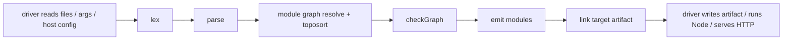

# Pfun V2 Architecture

Status: working architecture draft  
Scope: language overview, compiler architecture, and implementation plan  
Primary change from the previous draft: Pfun is specified as a compiled language only. The interpreter and REPL are removed from the core architecture.

This revision additionally locks in: first-class proc values with effectful-only
invocation (2.6); explicitly typed monomorphic proc lambdas; descriptor-based
effect requests from pure code; typing commitments for exported bindings, field
access, generic variant payloads, and proc types (2.7); `generic proc` for named
declarations; assignment as a statement; block-required `if`; no exported
`var`; the `_b` hex byte suffix; full-expression format strings; split
string/int maps (`imaps`/`imapi`); unboxed `Char`/`Byte`; a hybrid `Int`
representation; the lazy-list forcing contract; the generated-glue TEA browser
target; and the completed V1 bootstrap dialect plan.

---

# Part 1 — Overview

## 1. Design goals and language philosophy

Pfun is a small, statically checked, compiled language for writing application code as straightforward pure transformations with explicit procedural edges.

The design goal is not to be a better JavaScript. JavaScript is the first host target because it is practical, portable, and already gives Pfun a browser and Node runtime. Pfun's language model should remain independent of JavaScript's object model, exception model, and dynamic typing habits.

The core language philosophy is:

1. **Compiled-only execution.**  
   Pfun has one execution model: source code is lexed, parsed, checked, emitted, linked, and executed as compiled output. There is no separate interpreter semantics and no REPL in the core design.

2. **Static checks are the authority.**  
   Types, purity, imports, module interfaces, match exhaustiveness, and effect boundaries are checked before code is emitted. Pure code is total (2.8): runtime failures exist only at effect boundaries — host I/O and native interop, trapped inside extern wrappers and surfaced as `Result`/`Option` — plus engineering faults (non-termination, resource exhaustion).

3. **Simple code, stronger compiler.**  
   Application code should stay low-ceremony. Pfun does not require normal user-facing type annotations. The compiler infers concrete types and reports precise errors.

4. **Monomorphic by default; generic by request.**  
   Normal functions are inferred once and must have one monomorphic type. `generic function` opts into polymorphism. Generic record fields create hidden type variables for the containing type.

5. **Pure by default; procedures for effects; proc values are first-class.**
   `function` and `fn` are pure. Named procs and proc lambdas are effectful
   callables represented by `TProc`. Pure code may transport them but cannot
   invoke them. Descriptors remain the preferred representation when pure code
   is requesting an effect rather than registering a callback.

6. **Strict evaluation by default.**  
   `let` evaluates its initializer once, immediately, in source order. Pfun does not use general lazy evaluation.

7. **Lazy lists are explicit.**  
   `lazy` marks a list literal or list comprehension as lazily produced. To Pfun code, a lazy list is still logically a `List<T>`. The implementation may represent it differently, but the user-facing type remains list-like.

8. **Native interop is encapsulated.**  
   `extern` declarations are private implementation details of wrapper modules. They may not be exported. Public libraries that interact with native JavaScript must wrap native values completely and return Pfun values.

9. **No overloaded string `+`.**  
   `+` is numeric addition only. `++` is string concatenation only. Mixed string/value formatting should use explicit conversion or format strings.

10. **One source of truth for builtin surfaces.**  
    Builtin functions, builtin types, purity, platform availability, and host intrinsic names are all derived from a single manifest.

11. **The compiler itself should eventually be Pfun-shaped.**  
    Compiler passes are pure transformations over immutable data wherever possible. Effects occur in drivers: reading files, writing artifacts, serving HTTP, invoking Node, or talking to the host.

---

## 2. Semantic commitments

### 2.1 Evaluation

Pfun evaluates strictly:

```pfun
let x = expensive();
let y = x + x;
```

`expensive()` runs once at the `let` binding. The value is reused.

General lazy evaluation is intentionally avoided. Laziness exists only where explicitly requested for list construction:

```pfun
let xs = lazy [n * 2 for n <- range(1, 1000000) where n % 2 == 0];
```

The logical type of `xs` is still `List<Int>`. The compiler/runtime may represent it as a sequence thunk internally.

### 2.2 Numeric and string operators

```pfun
1 + 2              // numeric addition
1.5 + 2            // numeric addition, promotes to Float
"hi" ++ "!"        // string concatenation

"count: " ++ 3     // type error
"count: " ++ str(3)
$"count: {3}"      // preferred mixed formatting
```

`++` is string-only. It is not list concatenation. Lists use named functions such as `append`, `concat`, or library-specific operations.

### 2.3 Monomorphic functions and generic functions

A normal function is inferred once and must have one monomorphic type across all call sites in the checking scope.

```pfun
function getValue(item) {
  item.value
}

let v1 = getValue(i1);
let v2 = getValue(i2);
let v3 = getValue(i3); // error if i3 has a different generic record instantiation
```

A generic function is inferred once, then generalized. Each call site receives its own instantiation.

```pfun
generic function getValue2(item) {
  item.value
}

let v1 = getValue2(i1);
let v2 = getValue2(i2);
let v3 = getValue2(i3); // legal if item.value type remains otherwise unconstrained
```

`generic function` does not disable type checking. It only generalizes type variables that remain polymorphic after inference.

```pfun
generic function f(item, suffix) {
  trim(item.value) ++ suffix;
}
```

The call to `trim` constrains `item.value` to `Str`, so this function still rejects `Indexed<Int>`.

### 2.4 Generic record fields

A `generic` record field creates an independent hidden type variable for the containing type.

```pfun
type Indexed = {
  index,
  generic value
};
```

Conceptually:

```text
Indexed<ValueType>
  index : Int
  value : ValueType
```

Pfun does not need to expose `Indexed<T>` syntax to the user.

Example:

```pfun
type Indexed = { index, generic value };

let i1 = Indexed { index = 1, value = "hello " };
let i2 = Indexed { index = 2, value = "world" };
let i3 = Indexed { index = 3, value = 42 };

let indexedList1 = [i1, i2];      // works: List<Indexed<Str>>
let indexedList2 = [i1, i2, i3];  // type error: Indexed<Str> vs Indexed<Int>
```

Each generic field is independent by default:

```pfun
type Pairish = {
  generic left,
  generic right
};
```

Conceptually this is `Pairish<A, B>`, not `Pairish<A, A>`. Later use may force `A` and `B` to unify.

### 2.5 Native interop

`extern` is not a public abstraction mechanism. It is a native implementation detail.

```pfun
extern function jsParseHtml(source: Str) -> Any

export function parseHtml(source) {
  decodeHtmlTree(jsParseHtml(source));
}
```

Allowed:

```pfun
extern function nativeThing(x: Str) -> Any
function privateWrapper(x) { ... }
export function safePublicApi(x) { ... }
```

Rejected:

```pfun
export extern function nativeThing(x: Str) -> Any
```

Public modules that touch native JavaScript must return Pfun values, not raw DOM nodes, raw JS objects, `undefined`, host exceptions, or prototype-dependent objects.

### 2.6 Proc values are first-class; invocation is effectful

Named procs and anonymous proc lambdas are `TProc` values. Creating, binding,
storing, passing, selecting, importing, exporting, and returning a proc value
is pure. Calling one—directly or through `|>`—is legal only at top level or in
a proc body. A call in `function` or `fn` context is a `PurityD`.

Anonymous procedures are explicitly typed and monomorphic:

```pfun
let handle = proc (message: Msg) -> Unit { dispatch(message); };
let later = async proc (message: Msg) -> Unit { await dispatchLater(message); };
```

Their type-expression forms are `proc(T1, T2) -> R` and
`async proc(T1, T2) -> R`. Captured `let` values are immutable; captured `var`
bindings retain their shared lexical cell. Sync and async proc types do not
unify. Named `generic proc` remains the only polymorphic proc form.

The callback-based `timer` module is the first host surface built on this
model. `setTimer` accepts a sync `proc() -> Unit`; `setAsyncTimer` accepts an
`async proc() -> Unit`; both return `Result<TimerHandle, NativeError>`.
`clearTimer` returns `Result<Unit, NativeError>`. The split preserves the async
flag as part of `TProc` identity. Timers are one-shot and platform-neutral,
expected failures use `NativeTimerError`, and repeating application
subscriptions remain descriptor-driven.

Effectful *intent* still travels through pure code — as data. A descriptor union pairs each effect with a pure continuation that converts the effect's result into a message:

```pfun
type Cmd = {
  | CNone
  | CBatch: cmds
  | CHttpGet: url, generic toMsg      // toMsg : Str -> Msg, pure
  | CDelay: ms, generic msg
};
```

Pure code constructs descriptors; one proc per application executes them with an exhaustive `match`. The exhaustiveness checker guarantees no effect goes unhandled. This is the foundation of the TEA browser target (Phase 14b) and mirrors the shared-union server dispatch pattern.

Supporting rules:

- Calling an `async proc` without `await` from proc context is legal and means fire-and-forget: the callee starts, control continues immediately. Dispatchers rely on this so slow effects never block an event loop.
- `lazy` comprehension bodies and guards are pure contexts even inside procs, because their evaluation time is unpredictable.
- `generic proc` exists: it generalizes a proc's signature exactly as `generic function` generalizes a function's, and a generic proc is still only callable. It is required for library procs whose descriptor parameters are instantiated per application (`runCore`, app `dispatch`; see 2.7 and Phase 14b).

### 2.7 Typing commitments

Four commitments make "static checks are the authority" true. They are normative; Phase 7 implements them.

**T1 — Field access is a deferred constraint.**

`item.value` on an unannotated parameter is not typeable in textbook Hindley-Milner: there is nothing to look the field up in. Pfun uses deferred field constraints. `e.f` emits `HasField(a, "f", b)` where `a` is the subject's type and `b` a fresh variable, and the expression has type `b`. The constraint discharges when `a` resolves to a concrete record type:

```pfun
function bump(item) { item.index + 1 }
let a = bump(Indexed { index = 1, value = "x" });
```

At the declaration, `item : a` with `HasField(a, "index", Int)` (the `+ 1` fixes `Int`). The call unifies `a` with `Indexed<g>`; the constraint discharges against `Indexed`'s declaration. Deferral is what handles ambiguity honestly: if two record types share the field name and nothing ever decides between them, the constraint stays pending and is an error, not a silent guess:

```pfun
type A = { value };
type B = { value, extra };
export function f(x) { x.value }   // TypeD: cannot determine the record type of x.value
```

For `generic function` and `generic proc`, undischarged constraints over quantified variables move into the scheme and are re-checked at each instantiation:

```text
generic function getValue(item) { item.value }
getValue : forall a b. HasField(a, "value", b) => a -> b
```

**T2 — Exported non-generic bindings must be ground.**

When a module finishes checking, every exported binding whose declaration is not `generic` must have a type with no free type variables and no pending constraints. Violation is a `TypeD` with the remedy note: "add a constraining use, or declare it generic."

Why: `ModIface` is frozen data consumed topologically. If `export function firstValue(items) { head(items).value }` left the module with an open type, two importers could constrain it differently (de facto generic, contradicting the monomorphic policy) or the topologically first importer would win (checking becomes graph-order dependent). Groundedness is what makes interfaces plain data and module checking order-independent beyond topological order.

For non-exported bindings the rule follows emission, not visibility: **no emitted binding may carry pending constraints**, because emit-time operator specialization (`$eqF` vs structural equality, comparison, stringify, dict-key encoding) needs concrete types to select against. A private binding with pending constraints is a `TypeD` if it is referenced; if it is unreferenced, it is provably dead — the compiler warns (`WarnSev`) and does not emit it. Residual free type *variables* without pending constraints are harmless in dead private bindings (nothing specializes on them) and warn likewise.

Two extensions of the rule:

- **Groundedness covers exported type declarations.** Every non-generic field of an exported record or union must be ground at module end (generic fields are the type's parameters and exempt). Importers typecheck construction and field access against the frozen declaration, so an open field type would reintroduce the graph-order problem through the back door.
- **Slot defaulting.** A residual variable that occurs *only* as a hidden slot argument of a `TNamed` — never as a standalone value type, never in a pending constraint — does not violate groundedness: it defaults to `Unit`. Such a slot corresponds to variant payloads the module never constructs; any type is admissible, so one is chosen canonically. Without this, every TEA app that skips a core `Cmd` variant would fail to export `teaApp` (see the worked trace in Phase 14b).

**T3 — Generic variant payload fields.**

Variant payload fields may be marked `generic`, exactly like record fields:

```pfun
type Option = { | None | Some: generic v };
type Result = { | Ok: generic v | Err: generic e };
```

Each generic payload field introduces one independent hidden type variable on the containing union (`Option<A>`, `Result<A, B>`). Slots collapse through ordinary unification per program. This is required for `Option`, `Result`, `Cmd`, and `Sub`.

Note the model deliberately uses one slot per field rather than a shared named parameter: a hidden variable is the *whole field type*, so `CHttpGet`'s continuation (`Str -> Msg`) and `CDelay`'s payload (`Msg`) can never share a slot by name. Multi-slot unions plus unification express `Cmd`-style descriptor unions without type-parameter syntax — the worked trace in Phase 14b is the normative proof.

Recursion is uniform: when a field's type mentions the enclosing generic type (`CBatch.cmds : List<Cmd<...>>`), the recursive occurrence is at the declaration's own slots — regular datatypes only, no non-uniform recursion.

**T4 — Proc values flow normally; calls retain their effect.**

Named procs, extern procs, and proc lambdas have `TProc` types (parameters,
return, async flag). `TProc` may inhabit parameters, returns, record and variant
fields, and list/array/dict elements. It never unifies with `TFun`, and sync and
async `TProc` values do not unify. `generic proc` generalizes named `TProc`
signatures with the same scheme machinery as `generic function`; proc lambdas
are monomorphic.

**T5 — Combined unions provide nominal least upper bounds.**

A union declaration may include other unions with `...Name`. Included unions
retain their own nominal identity and constructors; inclusion only establishes
a directional widening relation from the component to the combined union. The
relation is transitive. Inference joins branches, match arms, list/array
elements, and matching named containers at the unique least combined-union
supertype. An equally specific pair of candidates is an ambiguity error.

The flattened variant set drives exhaustiveness and shared-field constraints.
Direct field access on a combined value is legal only when every flattened
variant supplies a compatible field of that name. Unknown/non-union includes,
duplicates, and cycles are declaration errors. A combined union never narrows
implicitly to a component union.

**T6 — One core `Result`; domain errors occupy its error slot.**

`$builtin/core` is the sole owner of the ambient generic
`Result<Value, Error>` and its `Ok`/`Err` constructors. Compiler packages,
builtin modules, standard-library modules, and applications reuse that type;
they do not create package-local result unions or redeclare `Ok`/`Err` to work
around the program-global constructor namespace. A subsystem that needs
structured failures declares a domain error union and places it in `Result`'s
error slot. Combined unions provide the cross-subsystem error type when one
operation can produce several domain errors.

Only a semantically different state machine merits another outcome union. Its
constructors must be globally distinct. The file module therefore retains the
three-state `ReadResult`, but owns `ReadOk`/`ReadEof`/`ReadErr`; it does not
duplicate core `Result` or its constructors.

### 2.8 Totality: pure code cannot fail

Every runtime failure in the language falls into exactly one of four classes, and the first three are the whole story for pure code:

1. **Static** — rejected by the checker: exhaustiveness (including the guard rule below), `Equatable`/`Comparable`, purity, groundedness, arity, opacity.
2. **Total by construction** — pure operations that once could fail now cannot, via IEEE floats, `NonZero`, `Option`, and list patterns.
3. **Boundary Results** — host intrinsic failures (file, HTTP, DB, decode) surface as `Result`/`Option` from procs; exceptions are trapped inside extern wrappers and never escape as exceptions.
4. **Engineering faults** — non-termination, stack exhaustion, out-of-memory, `FULL`-forcing an infinite lazy list, wrong-platform intrinsic use. No totality story covers resources; `RuntimeD` describes only this class.

The mechanisms behind class 2 and the static rules that support them:

**IEEE floats with a total order.** Float arithmetic never raises: `NaN` and `±Inf` are values, `x / 0.0` is `±Inf` or `NaN`, and every float op is total. Equality and ordering use a total order — all NaNs are equal to each other and greater than `+Inf`; `-0 == +0` — so dict keys, `sort`, and memo caches are well-defined in the presence of NaN. `isNaN`/`isFinite` give loud checks, and `floatToInt : Float -> Option<Int>` is `None` exactly on non-finite input, so NaN cannot silently exit float-land. Any JS number entering through extern is a valid Float; there is nothing to verify at the boundary.

**`NonZero` divisors.** Int `/` and `%` take a `NonZero` divisor. Two ways to produce one: a nonzero integer *literal* in divisor position coerces (`x / 2`, `n % 10` just work), and `nonZero : Int -> Option<NonZero>` proves a data-dependent divisor, forcing the zero case into a `match`. `safeDiv`/`safeMod : Int, Int -> Option<Int>` skip the proof. A literal `0` divisor is a `TypeD` at the call site. `NonZero` is a builtin `opaque` type erased to Int at runtime; the emitter performs no zero check because the type system already did. Float division needs none of this — IEEE makes it total.

**Total reads via `Option`.** `head`, `tail`, `nth`, list/string indexing `xs[i]`, and dict lookup `d[k]` return `Option`; `getOr` covers the supply-a-default pattern. Array reads and writes are proc-only and also total: `arrGet : Array<A>, Int -> Option<A>`, `arrSet : Array<A>, Int, A -> Bool` (false on out-of-range). `chr : Int -> Option<Char>` is `None` outside Unicode scalar values, so every `Char` is a scalar value and `utf8Encode` is total. Byte arithmetic wraps modulo 256.

**List patterns.** `match` decomposes lists directly — `[]`, `[x]`, `[x, _, ...rest]` — making pattern matching the canonical total decomposition (no `uncons` needed; Option-returning `head`/`tail` remain for pipelines). Exhaustiveness over lists is a length algebra: exact patterns cover one length, rest patterns cover a ray, and the checker demands every length from 0 upward is covered, reporting the smallest missing length as a witness. Matching forces a bounded prefix of a lazy list, so list patterns are total on infinite lists (PREFIX class, Phase 15).

**The guard rule.** Exhaustiveness is computed treating `where`-guarded arms as absent: every variant (and every list length) needs unguarded coverage. Guards keep their expressive power; the guarantee keeps its teeth. Consequently `matchFail` is statically unreachable and is demoted to an internal assertion — if it ever fires, that is a compiler bug, not a program error.

**`Equatable` and `Comparable`.** `==`/`!=` require both operand types `Equatable` (no `TFun` or `TProc` anywhere inside — the error Elm only catches by crashing at runtime is a `TypeD` here). `<`/`<=`/`>`/`>=` and `sort` require `Comparable`: `Int`, `Float`, `Str`, `Char`, `Byte`, `Bool`, and `List` of `Comparable` — records and variants are excluded in V2 and can be admitted later. Dict keys require `Equatable`. Both constraints ride the `HasField` machinery (2.7 T1): concrete types discharge immediately; constraints over quantified variables move into schemes and re-check per instantiation, so `generic function member(x, xs)` carries `Equatable(a)`.

**Opaque type exports.** `export opaque type` is what turns smart constructors into proofs rather than conventions: importers cannot forge a `NonZero`, construct a validated value, or match through an invariant-bearing wrapper. This is Elm's `exposing (Type)` vs `exposing (Type(..))` distinction.

---

## 3. Grammar

This grammar is normative for V2. It intentionally removes REPL-specific syntax and updates the previous grammar for compiled-only Pfun, `lazy`, `generic function`, generic record fields, private externs, and `++`.

Notation: EBNF; `{x}` = zero or more, `[x]` = optional, `|` = alternatives, terminals quoted.

## 3.1 Lexical grammar

```ebnf
comment      ::= "//" {any-not-newline} | "/*" {any} "*/"          // block comments do not nest
whitespace   ::= " " | "\t" | "\r" | "\n"

IDENT        ::= (letter | "_") {letter | digit | "_"}             // except keywords, "_" alone
WILDCARD     ::= "_"

keyword      ::= "let" | "var" | "type" | "generic" | "if" | "then" | "else"
               | "function" | "proc" | "memo" | "async" | "await" | "return" | "fn"
               | "for" | "while" | "dict" | "array" | "import" | "export" | "as" | "from"
               | "match" | "with" | "where" | "extern" | "lazy" | "true" | "false"

INT          ::= digit {digit} | "0x" hexdigit {hexdigit}
FLOAT        ::= digit {digit} "." digit {digit} [exponent]
               | digit {digit} exponent
exponent     ::= ("e" | "E") ["+" | "-"] digit {digit}

BYTE         ::= digit {digit} "b" | "0x" hexdigit {hexdigit} "_b"
                 // value must be 0..255
                 // decimal bytes: plain "b" suffix (200b); "b" is not a decimal
                 // digit, so this is unambiguous
                 // hex bytes: "_b" suffix (0xAB_b); "_" is not a hex digit, so a
                 // hex int may end in b/B (0x1B) without ambiguity

STRING       ::= '"' {strchar | escape} '"'
RAWSTRING    ::= '@"' {any-not-dquote} '"'
FORMATSTRING ::= '$' '"' {fmtchar | escape | "{" fmtexpr "}"} '"'
fmtexpr      ::= expr                                               // full expression grammar
                 // the lexer scans interpolation bodies with brace and string
                 // awareness and re-lexes them with the main token rules;
                 // nested format strings inside an interpolation are rejected
CHAR         ::= "'" (charchar | escape) "'"
escape       ::= "\\" ("n" | "t" | "\\" | "\"" | "'" | "{" | "}")

operators/punct:
  + ++ - * / % = == != < > <= >= ! && || & | |> |?> |!> << >>
  ( ) { } [ ] , ; : ? . -> => <-
```

Tokenization uses longest match. `++` is a single token and must be recognized before `+`.

`>>` and `<<` are single shift tokens in expressions. In `extern` `typeExpr` parsing, the parser may request type-expression token splitting so nested `>` delimiters can close one generic type expression at a time.

## 3.2 Programs and statements

```ebnf
program        ::= {stmt}

stmt           ::= importStmt | exportStmt | funcDecl | procDecl | externDecl
                 | letStmt | varStmt | typeDecl | returnStmt | ifStmt | whileStmt
                 | assignStmt | exprStmt | ";"

letStmt        ::= "let" IDENT "=" expr ";"
varStmt        ::= "var" IDENT "=" expr ";"                        // proc/top-level context only, checked later
assignStmt     ::= assignTarget "=" expr ";"                       // proc context only, checked later
assignTarget   ::= IDENT | postfixExpr indexSuffix                 // parser reinterprets a leading expr; checker validates
exprStmt       ::= expr [";"]
returnStmt     ::= "return" [expr] [";"]

funcDecl       ::= ["generic"] ["memo"] "function" IDENT "(" [params] ")" block
procDecl       ::= ["generic"] ["async"] "proc" IDENT "(" [params] ")" block
params         ::= param {"," param}
param          ::= IDENT | WILDCARD
block          ::= "{" {stmt} "}"                                  // no ";" after "}"

ifStmt         ::= "if" expr "then" block ["else" (block | ifStmt)]
                 // branches require blocks; "else if" chains are allowed;
                 // no dangling-else ambiguity
whileStmt      ::= "while" "(" expr ")" block [";"]

typeDecl       ::= "type" IDENT "=" "{" (recordBody | unionBody) "}" [";"]
recordBody     ::= [fieldDecl {"," fieldDecl}]
fieldDecl      ::= ["generic"] IDENT
unionBody      ::= unionItem {unionItem}
unionItem      ::= variant | "..." IDENT [","]
variant        ::= "|" IDENT [":" variantField {"," variantField}]
variantField   ::= ["generic"] IDENT

importStmt     ::= "import" importSpec "from" STRING [";"]
importSpec     ::= "{" importName {"," importName} "}" | "*" ["as" IDENT]
importName     ::= IDENT ["as" IDENT]

exportStmt     ::= "export" (letStmt | funcDecl | procDecl | ["opaque"] typeDecl)
                 // externDecl is intentionally not exportable (ParseD)
                 // varStmt is intentionally not exportable (ParseD): module
                 // mutable state is private; expose readers/updaters instead

externDecl     ::= "extern" ("function" | ["async"] "proc") IDENT
                   "(" [typedParams] ")" "->" typeExpr
                 // extern declarations are private to the module where they appear.

typedParams    ::= typedParam {"," typedParam}
typedParam     ::= IDENT ":" typeExpr
typeExpr       ::= IDENT ["<" typeExpr {"," typeExpr} ">"]         // Int, Str, List<T>, MyType, Any
                 | "(" [typeExpr {"," typeExpr}] ")" "->" typeExpr
```

Notes:

- `generic function` enables polymorphic generalization for the function.
- `generic proc` generalizes a proc's signature the same way; it exists for library procs over app-instantiated descriptor unions (see 2.7 T4 and Phase 14b).
- `generic` record fields create hidden type variables for the containing type.
- `generic` variant payload fields create hidden type variables for the containing union. `Option`, `Result`, `Cmd`, and `Sub` are declared this way.
- `...Name` includes another union's variants and establishes a directional nominal widening relation; includes may be transitive but not cyclic.
- `export opaque type` exports the type's identity (and generic arity) but not its constructors, variants, or fields: outside the defining module the type cannot be constructed, matched, or field-accessed. This is the enforcement mechanism for smart-constructor invariants such as `NonZero` (2.8).
- `extern` functions/procs are private and may not appear inside `export`.

## 3.3 Expressions

Precedence, loosest to tightest:

```text
1  pipelines         |> |?> |!>
2  ternary           ? :                        right-assoc
3  or                ||
4  and               &&
5  equality          == !=
6  comparison        < > <= >=
7  bitor             |
8  bitand            &
9  shift             << >>
10 additive          + - ++
11 multiplicative    * / %
12 unary             - ! await
13 postfix           call, index, field
14 primary
```

```ebnf
expr           ::= pipeExpr
pipeExpr       ::= ternaryExpr {("|>" | "|?>" | "|!>") ternaryExpr}
ternaryExpr    ::= orExpr ["?" expr ":" ternaryExpr]

orExpr         ::= andExpr {"||" andExpr}
andExpr        ::= equalityExpr {"&&" equalityExpr}
equalityExpr   ::= comparisonExpr {("==" | "!=") comparisonExpr}
comparisonExpr ::= bitorExpr {("<" | ">" | "<=" | ">=") bitorExpr}
bitorExpr      ::= bitandExpr {"|" bitandExpr}
bitandExpr     ::= shiftExpr {"&" shiftExpr}
shiftExpr      ::= additiveExpr {("<<" | ">>") additiveExpr}
additiveExpr   ::= multExpr {("+" | "-" | "++") multExpr}
multExpr       ::= unaryExpr {("*" | "/" | "%") unaryExpr}

unaryExpr      ::= ("-" | "!" | "await") unaryExpr | postfixExpr
postfixExpr    ::= primary {callSuffix | indexSuffix | fieldSuffix}
callSuffix     ::= "(" [expr {"," expr}] ")"
indexSuffix    ::= "[" expr "]"
fieldSuffix    ::= "." IDENT

primary        ::= INT | FLOAT | BYTE | STRING | RAWSTRING | FORMATSTRING | CHAR
                 | "true" | "false"
                 | IDENT
                 | recordExpr
                 | listExpr | lazyListExpr
                 | dictExpr | arrayExpr
                 | lambdaExpr | matchExpr | blockExpr
                 | "(" expr ")"

recordExpr     ::= IDENT "{" [fieldInit {"," fieldInit}] "}"
fieldInit      ::= IDENT "=" expr | expr                           // all-named or all-positional

listExpr       ::= "[" [listContent] "]"
lazyListExpr   ::= "lazy" "[" [listContent] "]"
listContent    ::= expr {"," expr}
                 | expr genClause {genClause} ["where" expr]

genClause      ::= "for" IDENT "<-" expr

dictExpr       ::= "dict" "{" [dictEntry {"," dictEntry}] "}"
dictEntry      ::= expr "->" expr

arrayExpr      ::= "array" "{" [expr {"," expr}] "}"

lambdaExpr     ::= "fn" (params | "(" [params] ")") "=>" (expr | blockExpr)
                 | ["async"] "proc" "(" [typedParams] ")" "->" typeExpr blockExpr

procTypeExpr   ::= ["async"] "proc" "(" [typeExpr {"," typeExpr}] ")" "->" typeExpr

blockExpr      ::= "{" {stmt} "}"

matchExpr      ::= "match" expr "with" matchArm {matchArm}
matchArm       ::= "|" pattern ["where" expr] "->" armBody
pattern        ::= WILDCARD
                 | IDENT [IDENT | WILDCARD]
                 | listPat
listPat        ::= "[" [patElems] "]"
patElems       ::= patElem {"," patElem} ["," "..." patElem]
patElem        ::= IDENT | WILDCARD
armBody        ::= exprNoBareMatch
```

Semantic notes:

- `+` is numeric addition only.
- `++` is string concatenation only.
- `lazy` is not a general expression modifier. It is valid only before a list literal/comprehension.
- Assignment is a statement, not an expression; `=` in expression position is a syntax error.
- Mutation, assignment, `while`, `var`, proc calls, and `await` are grammatically accepted where the grammar allows them but rejected by purity/effect checks in pure contexts.
- A proc value may appear in any value position. Calling one, including through
  `|>`, `|?>`, or `|!>`, requires proc or top-level context.
- `|?>` is transparent until an `Option` appears, then short-circuits `None`,
  maps raw stage returns into `Some`, and flattens `Option` returns. `|!>` does
  the same for `Result`, `Err`, and `Ok`; differing stage error types join via
  the smallest declared combined union. Neither operator performs recovery or
  converts between wrapper families.
- Evaluation order is strict, left-to-right, innermost-first.
- `&&`, `||`, and ternary short-circuit.
- `Int` is arbitrary precision.
- `Float` is IEEE-754 double.
- Mixed `Int`/`Float` arithmetic promotes to `Float`.
- Float arithmetic is IEEE-754 and total: `NaN` and `±Inf` are ordinary values; no float operation raises.
- `==` and ordering on `Float` use the total order (2.8): all NaNs are equal and greatest; `-0 == +0`.
- Int `/` and `%` require a `NonZero` divisor (2.8): a nonzero integer literal coerces; anything else needs `nonZero`/`safeDiv`.
- `Byte` arithmetic wraps modulo 256 (total).
- List patterns: elements are binders or wildcards only (no nesting, no literals); `...rest` only in tail position; a bare `[...rest]` is not a pattern (bind the subject instead). Matching forces at most (explicit elements + 1) cells of a lazy list, so list patterns are total on infinite lists.

---

# Part 2 — Architecture

## 4. Pipeline

Pfun V2 has one production pipeline.



The pipeline has two zones:

1. **Effectful driver edge**
   - read source files
   - read environment variables
   - locate libraries
   - read host JavaScript text
   - write build artifacts
   - invoke Node for `pfun run`
   - serve HTTP for `pfun serve`

2. **Pure compiler pipeline**
   - lex
   - parse
   - extract imports
   - resolve graph
   - type check
   - purity check
   - exhaustiveness check
   - emit JavaScript AST
   - link compiled modules into an artifact

There is no interpreter branch and no REPL branch.

## 5. Repository layout

Two levels. The repository root hosts the frozen V1 toolchain that builds and
tests the bootstrap; the V2 compiler lives entirely under `bootstrap/src/`.

```text
pfun/                      # repository root ($PFUN_HOME)
  src/                     # V1 TypeScript toolchain (frozen + dialect patches)
    runtime/               # pfun-runtime.js, pfun-io.js, ...
    test/                  # Jest suites (*.test.ts), incl. bootstrapLint
  dist/                    # tsc output; `node dist/main.js` is the V1 compiler
  lib/                     # V1-dialect Pfun stdlib — NOT importable from
    testing/               #   bootstrap/src (framework used by tests only)
    test/                  # legacy self-contained .pf tests
  utils/                   # gen-test-harness.js, gen-test-runner.js, pfun.sh
  bootstrap/
    src/                   # THE V2 COMPILER (bootstrap dialect; module map below)
    test/                  # <module>_test.pf (annotated); *_gen.pf and
                           #   run-tests.sh are generated, gitignored
  doc/                     # this document, bootstrap-style-guide.md
  examples/
```

The vendoring rule: **`bootstrap/src` imports nothing from `lib/`.** `lib/` is
V1-dialect (`head`/`tail`/`nth`, `+` on lists and strings) and cannot join the
V2 module graph. Anything the compiler needs is vendored inside
`bootstrap/src` in the bootstrap-safe subset. The one exception is test files
under `bootstrap/test/`, which import the `lib/testing/` framework — its
contract (annotations in, exit code out) is stable even though its
implementation is V1-dialect and known porting work.

The module map below is the target tree **inside `bootstrap/src/`**. Modules
marked ✔ exist and are tested; the rest are planned.

```text
bootstrap/src/
    compat.pf              # ✔ listAt, uncons — the ONE dialect-divergent file
    data/
      imaps.pf             # ✔ persistent immutable map, Str keys (ims* prefix)
      imapi.pf             # ✔ persistent immutable map, Int keys (imi* prefix)
      listx.pf             # ✔ vendored list helpers: appendL, concat, sortBy
      strx.pf              # ✔ vendored string helpers: strRepeat, trimRight
      result.pf            # helpers over Result/Option

    syntax/
      token.pf             # ✔ (seed: Pos, Span, smart constructors) token categories
      lexer.pf             # pure scanner
      ast.pf               # immutable AST, node ids, spans
      parser.pf            # Pratt/parser combinator hybrid

    graph/
      modgraph.pf          # import extraction, resolution, topological sort

    check/
      diag.pf              # ✔ diagnostic data model and renderer
      iface.pf             # one module interface type
      types.pf             # type inference and unification
      purity.pf            # pure/proc/effect/mutation rules
      exhaust.pf           # match exhaustiveness
      check.pf             # checkModule and checkGraph

    builtins/
      spec.pf              # single builtin manifest

    stdlib/
      list.pf
      string.pf
      option.pf
      result.pf
      math.pf
      json.pf
      lazy.pf
      tea.pf               # Cmd/Sub descriptors, pure step machinery, runCore
      ...                  # ordinary Pfun libraries

    compile/
      js.pf                # JavaScript AST and printer
      emit.pf              # CheckedModule -> EmittedModule
      teaglue.pf           # generated TEA main-loop glue for browser targets
      link.pf              # EmittedModule list -> artifact

    drivers/
      cli.pf               # command dispatch
      load.pf              # effectful graph loader
      serve.pf             # dev server
      run.pf               # compile and execute generated Node artifact

    playground/
      app.pf               # optional browser playground UI
      sandbox.pf           # sandbox protocol and srcdoc assembly

    host/
      core.js              # shared JS value ABI and host intrinsics
      node.js              # Node-only host intrinsics
      browser.js           # browser-only host intrinsics

    boot/
      pfc.js               # checked-in bootstrap compiler artifact
```

(`host/` and `boot/` sit under `bootstrap/` beside `src/` when they land;
they are shown here for the dependency picture.)

Dependency rule:

```text
compat
  ↓
data (imaps, imapi, listx, strx)
  ↓
syntax
  ↓
graph
  ↓
check
  ↓
compile
  ↓
drivers

builtins/spec is read by check and compile.
stdlib is compiled like normal Pfun code.
host is not imported by Pfun modules directly; it is read and embedded by drivers/linker.
compat and data/{listx,strx} are importable from every layer: they are the
vendored floor that keeps bootstrap/src free of lib/ imports.
```

No compiler component imports `drivers`.

## 6. Components

## 6.1 `data/imaps.pf` and `data/imapi.pf`

Two persistent maps with parallel surfaces: `imaps` keyed by `Str`, `imapi` keyed by `Int`. Under monomorphic-by-default with no typeclasses, key comparison cannot be abstracted over, so the map is stamped out once per key type.

**As implemented**, the function names carry per-module prefixes (`imsPut`/`imiPut`, `imsGet`/`imiGet`, …) rather than sharing names behind namespaced imports. The variant names (`MLeaf`/`MNode`) *are* shared, which is fine for the compiler — no module imports both maps — but means the two cannot meet in one scope; their test suites are therefore separate files. Status: implemented and tested (`bootstrap/test/imaps_test.pf`, `imapi_test.pf`; 10 tests each per the Phase 1 list).

`imaps` (Str keys) covers environments, module interfaces, builtin manifests, export maps, and variant maps. `imapi` (Int keys) covers node-id tables (`InferResult.types`, exhaustiveness side tables) and substitution maps keyed by type-variable id.

One shared immutable map shape removes the need for pass-specific map shapes. Keep the two modules textually parallel so fixes apply to both; the same test suite (mechanically transformed) runs against each.

## 6.1b `compat.pf`, `data/listx.pf`, `data/strx.pf`

The vendored floor. `bootstrap/src` imports nothing from `lib/` (§5), so the
list and string helpers the compiler needs live here, written in the
bootstrap-safe subset and shared by every layer. **These are the repositories
for list and string functions usable within the bootstrap** — a helper needed
by two compiler modules goes here, not into both consumers, and nothing
reimplements them locally.

- `compat.pf` — `listAt(xs, i)` (Option-shaped element access; normalizes
  V1 `nth`'s bare-element/`false`-sentinel behavior) and `uncons(xs)`
  (`None` / `Some { Pair { head, rest } }`, built on `slice` — there is no
  `drop` builtin). The **only** file in the tree with dialect-divergent code;
  it gets a trivial V2 body at transition, and `bootstrap/test/compat_test.pf`
  is the contract that must pass unchanged on both sides.
- `data/listx.pf` — `appendL` (`append` is an unshadowable builtin name),
  `concat` (single linear pass), `sortBy` (stable merge sort, three-way
  comparator; `cmp(x,y) <= 0` keeps the left element, and `renderAll`'s
  diagnostic ordering depends on that stability).
- `data/strx.pf` — `strRepeat` (doubling, log₂ depth) and `trimRight`
  (fold + `slice`; preserves leading and interior whitespace, which caret
  alignment in `check/diag.pf` relies on; handles CR from CRLF sources —
  `\r` is not a string escape, so it is built as `"" ++ chr(13)`).

Two implementation constraints shape everything in these files (full
rationale in `doc/bootstrap-style-guide.md`): compiled Pfun has **no
tail-call optimization**, so whole-list walks are written as `reduce` (a
runtime loop) and recursion is reserved for logarithmic depth; and fold state
threaded through builtin callbacks must be the builtin `Pair`, never a
module-local record, because such records resolve against the *calling*
module's type registry and fail across library-to-library calls in the
interpreter.

Status: implemented and tested (`compat_test.pf` 10, `listx_test.pf` 15,
`strx_test.pf` 11 — including stability, permutation properties, and
5,000-element scale tests).

## 6.2 `syntax/token.pf`

Defines:

- positions
- spans
- token categories
- helpers for matching keywords/operators

The lexer produces these tokens. The parser consumes them. Diagnostics point back to their spans.

Status: the position seed exists — `Pos`, `Span`, and the smart constructors `mkPos`/`mkSpan`/`pointSpan` (namespaced record construction does not parse in the bootstrap dialect, so cross-module callers build positions through functions). Token categories land with the lexer. Note that `check/diag.pf` reads span fields without importing this module: cross-module *field access* needs no type import; only construction and matching do.

## 6.3 `syntax/lexer.pf`

A pure scanner from source text to tokens.

It handles:

- comments
- strings
- raw strings
- format strings
- chars
- ints/floats/bytes
- keywords
- operators
- source positions

It knows nothing about parsing or type checking.

## 6.4 `syntax/ast.pf`

The AST is immutable. Every node has:

- a stable node id
- a source span
- no mutable annotation fields

Analysis results live in side tables keyed by node id.

This is one of the most important V2 decisions. The AST is syntax. Type information, exhaustiveness results, purity facts, and emit metadata are separate data.

## 6.5 `syntax/parser.pf`

The parser turns token streams into modules.

Responsibilities:

- statement parsing
- expression parsing
- type declarations
- imports/exports
- extern declarations
- generic function declarations
- generic record fields
- lazy list syntax
- `++` operator parsing
- match arm parsing

It does not resolve names, infer types, or enforce purity.

## 6.6 `graph/modgraph.pf`

The graph layer extracts imports, resolves paths, and topologically sorts modules.

It is pure once given a search environment:

```pfun
SearchEnv {
  libDir,
  pfunHome,
  builtinNames
}
```

The driver is responsible for reading files. The graph module is responsible for deciding how modules depend on each other.

## 6.7 `check/diag.pf`

Diagnostics are structured data, not strings classified later.

Each diagnostic has:

- severity
- code
- message
- path
- span
- notes

Only this module renders human-readable diagnostics.

Status: implemented and tested (`bootstrap/test/diag_test.pf`; 6 unit + 4 golden). The rendering format is decided and frozen by the golden snapshots — see Phase 2 for the format and its rationale.

## 6.8 `check/iface.pf`

`ModIface` is the single module interface type.

It contains:

- exported names and their kind
- exported types
- exported flattened union variants
- constructors owned by each exported union
- the transitive component membership of each exported union

Every checker pass consumes dependency interfaces as plain data. No resolver callbacks. No hand-maintained import table variants.

## 6.9 `check/types.pf`

The type checker performs inference, unification, generic-field handling, and monomorphic/generic function policy.

Important V2 behavior:

- normal functions are monomorphic
- `generic function` and `generic proc` generalize free type variables and carry field constraints
- generic record fields and generic variant payload fields become hidden type variables
- field access produces deferred `HasField` constraints (2.7 T1)
- exported non-generic bindings must be ground at end of module check (2.7 T2)
- named and anonymous proc signatures are first-class `TProc` values (2.7 T4)
- `+` is numeric only
- `++` is string only
- `lazy [...]` still has logical type `List<T>`
- extern signatures are checked but not exported

## 6.10 `check/purity.pf`

Purity checking enforces:

- pure functions cannot call procs
- proc values may flow through pure code; invoking one requires proc context
- pure functions cannot mutate, assign, use `while`, or use `var`
- `fn` lambdas are pure; proc-lambda bodies are proc contexts
- `lazy` comprehension bodies and guards are pure contexts even inside procs
- `await` only appears in async proc contexts; calling an async proc without `await` is legal fire-and-forget
- extern procs are effectful
- native boundary calls cannot leak into pure code unless wrapped by safe pure extern functions

The pass combines name-kind information with the inferred node-type table so
proc-valued bindings and fields remain statically visible. There is no runtime
purity check behind the static pass.

The grammar remains context-free; purity is an elaboration/checking pass.

## 6.11 `check/exhaust.pf`

Exhaustiveness checking ensures `match` expressions cover all possible union variants.

It also supports conservative guard reasoning where practical.

Runtime match-fail remains only for cases the checker accepted conservatively but the runtime values fall through guarded arms.

## 6.12 `check/check.pf`

`checkGraph` is the only checking entry point.

Every command goes through it:

- `pfun check`
- `pfun build`
- `pfun run`
- `pfun serve`
- playground compilation

There are no driver-specific weaker pipelines.

When a module fails, its dependents are not checked against missing interfaces; they are skipped with a single `ImportD` note naming the failed dependency, so one root cause never cascades into noise.

## 6.13 `builtins/spec.pf`

The builtin manifest is the single source of truth for:

- builtin module names
- builtin functions
- builtin function arity
- builtin types
- builtin purity
- platform availability
- intrinsic host names
- builtin union variants

From this manifest the compiler derives:

- checker seeds
- import surfaces
- host conformance tests
- emitter intrinsic references
- docs tables

## 6.14 `stdlib/*.pf`

Most library functionality is ordinary Pfun code.

The host provides only the primitive floor:

- arithmetic primitives
- string/list performance primitives
- mutable cells
- dictionaries/arrays/buffers
- I/O
- timers
- HTTP
- database adapters
- browser DOM mounting
- sandbox messaging

Everything else should be Pfun code reused across targets.

## 6.15 `compile/js.pf`

Defines a small JavaScript AST and a stable printer.

The compiler emits JS data, not strings. The printer is responsible for precedence, escaping, indentation, reserved words, and stable output.

This replaces regex patching and ad-hoc string assembly.

## 6.16 `compile/emit.pf`

Turns checked modules into emitted modules.

Responsibilities:

- expression lowering
- statement lowering
- function/proc emission
- match lowering
- list/lazy-list lowering
- comprehension lowering
- format string lowering
- `+`/`++` specialization from checked types
- currying where supported
- memoization
- tail-call elimination

The emitter receives checked type tables and module interfaces. It should not re-check source programs.

## 6.17 `compile/link.pf`

The linker assembles emitted modules into target artifacts:

- Node file set
- Node bundle
- browser bundle
- browser HTML page
- playground runner page

The linker owns module ids, require paths, module registry layout, host inclusion, and generated configuration modules.

No regex rewriting.

## 6.18 `host/*.js`

The only handwritten JavaScript lives in `host/`.

It implements the ABI and platform intrinsics required by the compiled output.

Host code is deliberately low-level. It is not the standard library. It is the runtime floor.

## 6.19 `drivers/*.pf`

Drivers are the effectful edge of the compiler.

They:

- read source files
- construct `SearchEnv`
- call the pure pipeline
- read host JS text
- write artifacts
- run compiled output
- serve dev builds
- print diagnostics

Drivers do not own language semantics.

## 6.20 `playground/*.pf`

The playground is optional. It should compile Pfun in the browser and run output in a sandboxed iframe.

The playground still uses the compiled-only pipeline:

```text
editor text -> lex -> parse -> checkGraph -> emit -> link -> iframe
```

No interpreter is introduced for playground execution.

## 6.21 TEA browser target

Browser applications use The Elm Architecture with pure `init`/`update`/`view`/`subs`, effect descriptors (`Cmd`) carrying pure `toMsg` continuations, and one exhaustive `dispatch` proc per app. First-class proc values are available for callback-oriented APIs but do not replace the descriptor protocol. The main loop is neither user code nor `tea.pf` code: the linker driver generates a small glue module per app that imports `{ teaApp, dispatch }` from the entry module. The glue passes through `checkGraph` like any other module, so a misconfigured entry fails with ordinary `ImportD`/`TypeD`/`PurityD`/`ExhaustD` diagnostics — configuration errors, not compiler magic. See Phase 14b.

---

## 7. How the components fit together

## 7.1 `pfun check`

```text
read files
  -> lex
  -> parse
  -> extract imports
  -> resolve graph
  -> toposort
  -> checkGraph
  -> render diagnostics
```

No code generation.

## 7.2 `pfun build`

```text
read files
  -> lex
  -> parse
  -> graph
  -> checkGraph
  -> emit each checked module
  -> link target
  -> write artifact
```

## 7.3 `pfun run`

`run` is not interpretation.

```text
read files
  -> checkGraph
  -> emit
  -> link Node bundle or temp file set
  -> execute generated JS with Node
  -> return exit code
```

## 7.4 `pfun serve`

```text
build browser client
build optional Node server/API
serve generated page and assets
route API requests to compiled server artifact
```

The server handler is compiled Pfun code, not an interpreted AST.

## 7.5 Browser playground

```text
compile compiler to browser JS
load playground app
user edits source
source is compiled in page
compiled user JS runs in sandboxed iframe
messages flow back to parent
```

The sandbox uses iframe removal to stop runaway code.

---

## 8. Key changes from V1

## 8.1 Removed interpreter

V1 had both an interpreter and compiler. V2 removes the interpreter.

Benefits:

- one semantics
- less runtime machinery
- fewer duplicated builtin implementations
- no interpreter-specific value model
- no divergence between interpreted and compiled programs
- simpler self-hosting story

## 8.2 Removed REPL

The REPL is removed from the core architecture.

Benefits:

- no partial-program checker path
- no session interface complexity
- no text-level REPL markers
- no special parser mode
- no second execution pipeline

Replacement: `pfun run scratch.pf` or editor/tooling integration that creates temporary files.

## 8.3 `lazy` is explicit list laziness

V1 described laziness as a library-only feature. V2 makes `lazy` a language keyword, but only for list literals and list comprehensions.

This keeps laziness visible without introducing general lazy evaluation.

## 8.4 `extern` cannot be exported

Native interop is private to wrapper modules.

This prevents raw host values from becoming part of ordinary Pfun APIs.

## 8.5 Generic policy changed

V1 had broader generic/type-polymorphism assumptions. V2 says:

- normal functions are monomorphic
- `generic function` is polymorphic
- generic record fields create hidden type variables
- unification determines constraints
- no ordinary type annotations are added

## 8.6 `+` no longer concatenates strings

V2 uses:

```text
+   numeric addition
++  string concatenation
```

This reduces type ambiguity and makes generic inference clearer.

## 8.7 Runtime type registry removed

Static checks are authoritative. The runtime should not maintain a shadow type system.

## 8.8 One check pipeline

V2 keeps the strongest V1 idea: one `checkGraph` for every command and target.

## 8.9 Real linker retained

The V1 architecture's real linker replaces regex patching and target-specific emit hacks. V2 keeps that.

## 8.10 Host JS floor retained but narrowed

The host remains small, explicit, and conformance-tested. More library behavior should move to Pfun where practical.

## 8.11 Proc values retained with a static invocation boundary

V1 used first-class procs plus a runtime `inPureContext` check. V2 keeps proc
values but removes the runtime check: the compiler tracks `TProc` values and
rejects their invocation from pure code. Descriptors remain available for
effect requests expressed as data.

## 8.12 Assignment demoted to statement

V1 allowed assignment expressions. V2 makes assignment a statement, eliminating `=`/`==` confusion in conditions and simplifying target validation and emission.

## 8.13 Pure code is total

V1 had runtime errors reachable from pure code: division by zero, out-of-range indexing, byte overflow, float domain errors, and match failure behind conservative guard analysis. V2 removes the entire class (2.8): IEEE floats with a total order, `NonZero` divisors, `Option`-returning reads, list patterns, the unguarded-fallback exhaustiveness rule, and static `Equatable`/`Comparable`. Runtime failure exists only at effect boundaries (as `Result`/`Option`) and as engineering faults.

---

# Part 3 — Design Details

Part 3 is the implementation spec. It explains the data types and functions from the architecture, organized by phases. Each phase includes a testing strategy.

---

# Phase 0 — Semantic lock and compatibility harness

## Goal

Before rewriting major pieces, pin down the new language decisions with executable tests.

## Decisions to lock

- compiled-only execution
- no REPL
- strict evaluation
- `lazy` only for list literals/comprehensions
- `+` numeric only
- `++` string-only
- normal functions monomorphic
- exported non-generic bindings must be ground
- `generic function` and `generic proc` polymorphic
- generic record fields and generic variant payloads introduce independent hidden type variables
- proc values are first-class; explicitly typed proc lambdas are monomorphic
- calling a proc value is legal only in proc or top-level context
- assignment is a statement; `export var` is rejected
- hex byte literals use `_b`
- format string interpolations accept full expressions
- pure code is total: IEEE floats with a total order; Int `/`/`%` require `NonZero`; pure reads return `Option`; byte arithmetic wraps
- list patterns in `match`; exhaustiveness over lists is a length algebra
- guarded arms never count toward exhaustiveness (unguarded fallback required)
- `==` requires `Equatable`; ordering requires `Comparable`; both are static
- `export opaque type` hides constructors, variants, and fields
- `matchFail` is an internal assertion, statically unreachable
- extern declarations cannot be exported
- native wrappers return Pfun values

## Tests

Create a `spec/semantics/` suite of `.pf` files and expected diagnostics/output.

Examples:

```pfun
// plus_string_error.pf
println("x" + "y");
```

Expected: `TypeD`, `+` requires numeric operands.

```pfun
// concat_number_error.pf
println("count: " ++ 3);
```

Expected: `TypeD`, `++` requires `Str, Str`.

```pfun
// format_string_ok.pf
println($"count: {3}");
```

Expected output: `count: 3`.

```pfun
// generic_record_list_error.pf
type Indexed = { index, generic value };
let i1 = Indexed { index = 1, value = "hello" };
let i2 = Indexed { index = 2, value = 42 };
let xs = [i1, i2];
```

Expected: `TypeD`, cannot unify `Indexed<Str>` and `Indexed<Int>`.

```pfun
// extern_export_error.pf
export extern function nativeThing(x: Str) -> Any
```

Expected: `ParseD`, extern declarations are private and cannot be exported.

```pfun
// export_var_error.pf
export var counter = 0;
```

Expected: `ParseD`, `var` cannot be exported.

```pfun
// proc_value_error.pf
proc ping() { println("hi"); }
let p = ping;
function bad() { p(); }
```

Expected: `PurityD`; carrying `p` is legal, invoking it from `function` is not.

```pfun
// ambiguous_export_error.pf
type A = { value };
type B = { value, extra };
export function f(x) { x.value }
```

Expected: `TypeD`, exported non-generic binding is not ground.

```pfun
// div_zero_literal_error.pf
let x = 10 / 0;
```

Expected: `TypeD`, divisor is the literal zero.

```pfun
// fn_equality_error.pf
function f(x) { x }
function g(x) { x }
let b = f == g;
```

Expected: `TypeD`, function types are not `Equatable`.

```pfun
// guard_only_coverage_error.pf
type T = { | A: n | B };
function h(t) {
  match t with
  | A a where a.n > 0 -> 1
  | B _ -> 2
}
```

Expected: `ExhaustD`, `A` has no unguarded coverage.

```pfun
// list_pattern_good.pf
function sum(xs) {
  match xs with
  | [] -> 0
  | [h, ...t] -> h + sum(t)
}
proc main() { println(str(sum([1, 2, 3]))); }
```

Expected output: `6`.

---

# Phase 1 — Core data structures

## 1. `data/imaps.pf` and `data/imapi.pf`

### Purpose

Persistent AVL maps. `imaps` is keyed by `Str`; `imapi` is keyed by `Int` and is otherwise textually parallel — same variants, same function names, imported namespaced. Two modules exist because key comparison is monomorphic and there are no typeclasses to abstract it.

Used by:

- environments
- substitutions
- module interfaces
- builtin manifest lookup
- type tables
- export tables
- dependency maps

### Types

```pfun
export type IMap = {
  | MLeaf
  | MNode: k, v, left, right, height
}
```

`MLeaf` is an empty map.  
`MNode` stores one key/value pair and two subtrees.

### Functions

```pfun
export function imEmpty()
```

Returns an empty map.

```pfun
export function imGet(m, k)
```

Looks up a key and returns `Option<Value>`.

```pfun
export function imPut(m, k, v)
```

Returns a new map with the key inserted or replaced.

```pfun
export function imHas(m, k)
```

Returns `true` when `k` exists.

```pfun
export function imRemove(m, k)
```

Returns a new map without `k`.

```pfun
export function imKeys(m)
```

Returns keys in stable sorted order.

```pfun
export function imEntries(m)
```

Returns key/value pairs in stable sorted order.

```pfun
export function imUnion(a, b)
```

Combines two maps, right-biased on duplicate keys.

```pfun
export function imFromList(pairs)
```

Builds a map from a list of pairs.

```pfun
export function imMap(f, m)
```

Transforms values while preserving keys.

### Pseudocode

```pfun
export function imGet(m, k) {
  match m with
  | MLeaf -> None
  | MNode n -> {
    // Some { n.v }, never `Some n.v`: variant juxtaposition type-checks in
    // the bootstrap dialect and fails at runtime. And remember the wrapper
    // rule: `| Some s ->` binds the whole Some; the payload is s.value.
    if k == n.k then { Some { n.v } }
    else if k < n.k then { imGet(n.left, k) }
    else { imGet(n.right, k) }
  }
}
```

### Tests

Unit tests:

- empty lookup returns `None`
- insert then get returns inserted value
- insert same key replaces value
- remove deletes key
- entries are stable sorted
- AVL height invariant holds after randomized inserts/removes
- `imUnion` right-biases duplicates

Property tests:

- `imFromList(imEntries(m))` is equivalent to `m`
- `imHas(imPut(m,k,v),k)` is true
- removing unknown key preserves existing entries

The identical suite (mechanically transformed for key type and prefixes) runs against both `imaps` and `imapi` — as separate test files, since the two share variant names and cannot be imported into one scope.

Status: implemented and passing (`bootstrap/test/imaps_test.pf`, `imapi_test.pf`; 7 unit + 3 property tests each, properties over 20 deterministic LCG seeds). The randomized AVL test earned its place immediately: it found a wrapper-binding bug in the two-children case of `imsRemove`/`imiRemove` (`s.key` where the payload is `s.value.key`) that the simple removal unit test can never reach, because a two-key map never has a node with two children. Note these tests run under `--mode compile` only: the white-box AVL checker matches `MNode` cross-module, which the V1 interpreter's variant resolution does not support.

---

# Phase 2 — Diagnostics

## 2. `check/diag.pf`

### Purpose

Diagnostics are structured data created by the pass that detects the problem. There is no substring classification after the fact.

### Types

```pfun
export type Severity = {
  | ErrSev
  | WarnSev
}
```

Error or warning.

```pfun
export type DiagCode = {
  | LexD
  | ParseD
  | NameD
  | TypeD
  | ExhaustD
  | PurityD
  | ImportD
  | ArityD
  | RuntimeD
}
```

`RuntimeD` describes only engineering faults and boundary failures (2.8 classes 3 and 4); no pure-language operation produces one.

The diagnostic category.

```pfun
export type Diag = {
  severity,
  code,
  message,
  path,
  span,
  notes
}
```

Fields:

- `severity`: error/warning
- `code`: diagnostic code
- `message`: human-readable message
- `path`: source path
- `span`: source location
- `notes`: extra advice lines

### Functions

```pfun
export function err(code, message, path, span)
```

Constructs an error diagnostic.

```pfun
export function warn(code, message, path, span)
```

Constructs a warning diagnostic.

```pfun
export function note(diag, s)
```

Returns a copy of `diag` with an extra note.

```pfun
export function renderDiag(diag, sourceOf)
```

Renders one diagnostic with file, line, column, message, and caret.

`sourceOf` is a function from path to `Option<Str>` so rendering can lazily request source text.

```pfun
export function renderAll(diags, sourceOf)
```

Sorts diagnostics by path then `span.start.offset` (stable sort — equal-position diagnostics keep emission order), then renders all, blank-line separated.

### Rendering format (decided)

This document specifies rendering *behavior*; the bytes are an implementation decision, frozen by the golden snapshots. The decision:

```text
demo.pf:2:9: error[Parse]: Expected ')' after expression.
  let b = (2;
          ^^
  note: opened here
```

- Header is `path:line:col: severity[CodeLabel]: message` — GCC/rustc shape, so editors (Emacs compilation-mode included) parse it for jump-to-error. Code labels are one word per `DiagCode` variant (`Lex`, `Parse`, `Name`, `Type`, `Exhaust`, `Purity`, `Import`, `Arity`, `Runtime`).
- The source line renders with a two-space indent, trailing whitespace trimmed (leading/interior preserved — caret alignment depends on it).
- The underline covers the span exactly: width `end.col - start.col` (end-exclusive), minimum 1 so zero-width spans (EOF, insertion points) still show one caret, clamped to the trimmed line. This deliberately drops V1's renderer quirk of placing the caret one column past the reported position.
- Multi-line spans show the first line, underlined from `start.col` to its end, plus `(span continues for N more lines)` — the "render sanely" contract, not a faithful multi-line drawing.
- Missing source (`sourceOf` answers `None`, or the span's line is past EOF) drops the snippet and keeps header and notes. Rendering never fails.

### Tests

Unit tests:

- `err` sets `ErrSev`
- `note` appends without mutating original
- render includes path/line/column
- render includes caret under span
- multi-line spans render sanely
- missing source still renders useful fallback

Golden tests:

- parse error snapshot
- type error snapshot
- import cycle snapshot
- match exhaustiveness snapshot

Golden strings are captured from real renderer output and generated into the test programmatically — never hand-typed — and are regenerated deliberately, never loosened. Mutation-verified: a one-word label change fails exactly its snapshot; a one-character caret off-by-one fails both caret unit tests and all four snapshots.

Status: implemented (`bootstrap/src/check/diag.pf`) and tested (`bootstrap/test/diag_test.pf`, 10 tests). `renderAll`'s ordering is exercised indirectly through `sortBy`'s stability tests; a dedicated `renderAll` suite is still worth adding.

---

# Phase 3 — Tokens and lexer

## 3. `syntax/token.pf`

### Types

```pfun
export type Pos = {
  line,
  col,
  offset
}
```

1-based line and column; 0-based byte or code-unit offset, depending on implementation. Pick one and use it everywhere.

```pfun
export type Span = {
  start,
  end
}
```

End-exclusive source span. (Status: `Pos`, `Span`, and smart constructors `mkPos`/`mkSpan`/`pointSpan` exist as the Phase 3 seed in `bootstrap/src/syntax/token.pf`; the compiler uses code-unit offsets.)

```pfun
export type Tok = {
  | TInt: n
  | TFloat: text
  | TBool: b
  | TStr: s
  | TRawStr: s
  | TFmtStr: s
  | TChar: c
  | TByte: b
  | TIdent: name
  | TKw: word
  | TOp: op
  | TEof
}
```

`TFloat` carries the literal's source text, not a parsed value. Float literals travel as text through the entire pipeline — token, AST, emission — so the compiler never performs decimal-to-binary conversion and never does Float arithmetic. This is a permanent design decision (exact round-trip of user literals, no host-float involvement), independent of the bootstrap; it would only be revisited if V2 ever adds float constant folding.

Token categories. Keywords and operators are payloads, not one variant per token.

```pfun
export type Token = {
  tok,
  span
}
```

### Functions

```pfun
export function isOp(token, op)
```

Returns true if `token.tok` is `TOp op`.

```pfun
export function isKw(token, word)
```

Returns true if `token.tok` is `TKw word`.

### Tests

- one test for every keyword
- one test for every operator, especially `+` vs `++`
- position tracking after newlines
- `_` token behavior
- identifiers adjacent to keywords
- `lazy` and `generic` recognized as keywords

## 4. `syntax/lexer.pf`

### Types

```pfun
type LexSt = {
  path,
  src,
  len,
  offset,
  line,
  col,
  acc
}
```

Scanner state. `acc` is reversed token output.

```pfun
type LexStep = {
  | LexTok: st, token
  | LexSkip: st
  | LexDone: st
  | LexFail: diag
}
```

One scanner step.

### Public function

```pfun
export function lex(path, source)
```

Signature:

```text
Str -> Str -> Result<List<Token>, List<Diag>>
```

### Internal functions

```pfun
function step(st)
```

Scans one token or one trivia span.

```pfun
function scanNumber(st)
```

Handles decimal ints, hex ints, floats, exponents, bytes.

```pfun
function scanString(st)
```

Handles escaped strings.

```pfun
function scanRawString(st)
```

Handles `@"..."`.

```pfun
function scanChar(st)
```

Handles character literals.

```pfun
function scanIdentOrKw(st)
```

Scans identifiers and maps keywords.

```pfun
function skipTrivia(st)
```

Skips whitespace and comments.

### Pseudocode

```pfun
export function lex(path, source) {
  let start = LexSt { path = path, src = source, len = strLen(source),
                      offset = 0, line = 1, col = 1, acc = [] };
  scan(start);
}

function scan(st) {
  match step(skipTrivia(st)) with
  | LexDone done -> Ok(reverse(cons(eofToken(done), done.acc)))
  | LexTok next -> scan(addToken(next.st, next.token))
  | LexSkip next -> scan(next.st)
  | LexFail d -> Err([d.diag])
}
```

### Tests

Unit tests:

- comments skipped
- block comments do not nest
- unterminated block comment gives `LexD`
- strings unescape correctly
- raw strings do not unescape
- format string interpolations re-lex as full token streams (strings and nested braces inside interpolations handled; nested format strings rejected)
- `0xAB_b` hex byte suffix; `0x1B` lexes as `TInt`
- `++` tokenized as one operator
- `lazy [` token sequence is keyword then bracket
- all tokens have spans

Golden tests:

- lex a representative source file and compare token sequence

Fuzz tests:

- random source never crashes lexer
- invalid input returns diagnostics, not exceptions

---

# Phase 4 — AST and parser

## 5. `syntax/ast.pf`

### Purpose

The AST represents syntax only. It does not contain inferred types, resolved names, missing variants, or emit-specific fields.

Every expression and statement has:

- `id`
- `span`

### Expression type

```pfun
export type Expr = {
  | EInt: id, n, span
  | EFloat: id, text, span
  | EBool: id, b, span
  | EStr: id, s, span
  | EChar: id, c, span
  | EByte: id, b, span

  | EVar: id, name, span

  | EUnary: id, op, operand, span
  | EBinary: id, op, lhs, rhs, span

  | EIf: id, cond, thenE, elseE, span

  | ECall: id, callee, args, span

  | ELambda: id, params, body, span

  | EBlock: id, stmts, span

  | EList: id, elems, mode, span
  | EComp: id, body, gens, guard, mode, span

  | ERecord: id, tname, fields, span

  | EField: id, object, fname, span
  | EIndex: id, object, index, span

  | EMatch: id, subject, arms, span

  | EDict: id, entries, span
  | EArray: id, elems, span

  | EAwait: id, value, span

  | EFmt: id, parts, span
}
```

Changes from V1:

- `EList` and `EComp` carry `mode`.
- `mode` distinguishes strict list construction from lazy list construction.
- `++` is simply an `EBinary` operator.
- `EFloat` carries the literal's source text (see Phase 3); floats are never parsed inside the compiler.
- Assignment is a statement: `SAssign`/`SIndexAssign`. There are no assignment expressions.
- Lambdas are always pure `fn` lambdas; `ELambda` has no proc/async flags.
- No interpreter-oriented nodes.

### Supporting expression types

```pfun
export type ListMode = {
  | StrictList
  | LazyList
}
```

`LazyList` is the AST marker for `lazy [...]`.

```pfun
export type Field = {
  fname,
  value
}
```

`fname` is `Option<Str>`. `None` means positional field construction.

```pfun
export type Pattern = {
  | PWild
  | PVariant: vname, bind
  | PList: elems, rest
}

export type PatElem = {
  | PeBind: pname
  | PeWild
}

export type MatchArm = {
  pattern,
  guard,
  body
}
```

- `PVariant.bind`: `Option<Str>`, binds the entire variant value (payload access via fields, as in V1)
- `PList.elems`: `List<PatElem>`, explicit element positions; binders or wildcards only — no nesting, no literals
- `PList.rest`: `Option<PatElem>`, tail-position rest binder; `[]` is `PList { elems = [], rest = None }`
- `guard`: optional `where` expression
- `body`: arm body

```pfun
export type GenClause = {
  gvar,
  source
}
```

List comprehension generator.

```pfun
export type DictEntry = {
  key,
  value
}
```

Dictionary entry.

```pfun
export type FmtPart = {
  | FmtLit: s
  | FmtExpr: e
}
```

Format string parts.

### Statement type

```pfun
export type Stmt = {
  | SLet: id, name, init, span
  | SVar: id, name, init, span
  | SAssign: id, name, value, span
  | SIndexAssign: id, object, index, value, span
  | SFun: id, name, params, body, kind, span
  | SType: id, decl, span
  | SExpr: id, expr, span
  | SReturn: id, value, span
  | SIf: id, cond, thenS, elseS, span
  | SWhile: id, cond, body, span
  | SImport: id, spec, rawPath, span
  | SExport: id, inner, span
  | SExtern: id, decl, span
}
```

`SExtern` is never valid inside `SExport`.

### Function kind

```pfun
export type FnKind = {
  | PureFn: memo, isGeneric
  | ProcFn: isAsync, isGeneric
}
```

- `PureFn.memo`: whether `memo` was declared
- `PureFn.isGeneric`: whether `generic function` was declared
- `ProcFn.isAsync`: whether `async proc` was declared
- `ProcFn.isGeneric`: whether `generic proc` was declared

### Type declarations

```pfun
export type TypeDecl = {
  | RecordDecl: tname, fields
  | UnionDecl: tname, variants, includes
}
```

`includes` is the ordered list of union names written as `...Name` in the
declaration body. Expansion and cycle validation happen in the type checker.

```pfun
export type FieldDecl = {
  fname,
  isGeneric
}
```

A generic record field introduces one hidden type variable.

```pfun
export type VariantDecl = {
  vname,
  fields
}
```

`fields` is a list of `FieldDecl`, so variant payload fields may be marked `generic` exactly like record fields. A `generic` payload field introduces one hidden type variable on the containing union: `type Option = { | None | Some: generic v }` is `Option<A>`. This is required for `Option`, `Result`, `Cmd`, and `Sub` (2.7 T3). Non-generic payload fields whose types mention the enclosing generic union recurse at the declaration's own slots (uniform recursion; `CBatch.cmds`).

### Imports

```pfun
export type ImportSpec = {
  | INames: names
  | INamespace: alias
  | IStar
}
```

```pfun
export type ImportName = {
  name,
  alias
}
```

### Extern declarations

```pfun
export type ExternDecl = {
  kind,
  name,
  params,
  ret,
  platform
}
```

```pfun
export type ExternKind = {
  | ExternFunction
  | ExternProc: isAsync
}
```

```pfun
export type TypedParam = {
  name,
  typeExpr
}
```

Extern declarations use type expressions because the implementation body is not available for inference.

### Module

```pfun
export type Module = {
  path,
  stmts,
  nextId
}
```

### Tests

AST construction tests:

- parser assigns unique ids
- all nodes have spans
- `generic function` becomes `PureFn(..., isGeneric = true)`
- normal function has `isGeneric = false`
- generic record field becomes `FieldDecl(..., isGeneric = true)`
- generic variant payload field becomes `FieldDecl(..., isGeneric = true)` inside `VariantDecl`
- `generic proc` becomes `ProcFn(..., isGeneric = true)`
- lazy list literal becomes `EList(..., LazyList)`
- lazy comprehension becomes `EComp(..., LazyList)`
- `++` becomes `EBinary("++", ...)`
- exported extern is rejected by parser or checker

## 6. `syntax/parser.pf`

### Types

```pfun
type PSt = {
  path,
  toks,
  index,
  nextId,
  inMatchArms
}
```

Parser cursor.

`inMatchArms` prevents `|` from being misread outside match-arm regions.

```pfun
generic type POut = {
  st,
  node
}
```

Threaded parser result.

### Public function

```pfun
export function parseModule(path, tokens)
```

Signature:

```text
Str -> List<Token> -> Result<Module, List<Diag>>
```

### Internal functions

```pfun
function pStmt(st)
```

Parses one statement.

```pfun
function pAssignOrExprStmt(st)
```

Parses a statement that begins with an expression. If the token after the expression is `=`, reinterprets the parsed expression as an assignment target (identifier or index suffix; anything else is `ParseD`) and produces `SAssign`/`SIndexAssign`; otherwise produces `SExpr`.

```pfun
function pExpr(st, minPrec)
```

Pratt expression parser.

```pfun
function pPrefix(st)
```

Parses prefix/primary expressions.

```pfun
function pInfix(st, left, minPrec)
```

Parses infix/postfix expression continuation.

```pfun
function pMatch(st)
```

Parses `match ... with`.

```pfun
function pLambda(st, isProc)
```

Parses `fn` and `proc` lambda expressions.

```pfun
function pTypeDecl(st)
```

Parses record and union declarations, including generic fields.

```pfun
function pImport(st)
```

Parses import declarations.

```pfun
function pExtern(st)
```

Parses extern declarations.

```pfun
function pParams(st)
```

Parses function/proc/lambda parameters.

```pfun
function precedenceOf(op, st)
```

Returns operator precedence. `++` shares additive precedence.

```pfun
function expectOp(st, op, what)
```

Consumes a specific operator or emits a diagnostic.

```pfun
function expectIdent(st, what)
```

Consumes an identifier or emits a diagnostic.

```pfun
function freshId(st)
```

Allocates a node id.

### Pseudocode: parsing `generic function`

```pfun
function pStmt(st) {
  if isKw(peek(st), "generic") && isKw(peek2(st), "function") then
    pFunction(advance(st), true)
  else if isKw(peek(st), "generic") && isKw(peek2(st), "proc") then
    pProc(advance(st), true)
  else if isKw(peek(st), "function") then
    pFunction(st, false)
  else
    ...
}
```

### Pseudocode: parsing lazy lists

```pfun
function pPrefix(st) {
  if isKw(peek(st), "lazy") then {
    let st1 = advance(st);
    expectOp(st1, "[", "lazy list");
    pListAfterOpen(st1, LazyList);
  } else if isOp(peek(st), "[") then
    pListAfterOpen(advance(st), StrictList)
  else
    ...
}
```

### Tests

Parser unit tests:

- all precedence levels
- `++` precedence with `+`, `*`, and ternary
- `lazy [1,2,3]`
- `lazy [x for x <- xs]`
- `lazy foo()` rejects
- `generic function map(f, xs) { ... }`
- `type Indexed = { index, generic value };`
- `export extern ...` rejects
- `export var ...` rejects
- `proc` lambdas reject
- assignment parses as a statement; `=` in expression position is a syntax error
- `generic proc dispatch(cmd) { ... }` parses with `isGeneric = true`
- `if` branches require blocks; `else if` chains parse
- nested match arm body requires braces
- list patterns parse: `[]`, `[x]`, `[x, _, ...rest]`
- `[...rest]` alone rejects; rest in non-tail position rejects
- nested/literal list-pattern elements reject
- recovery after syntax error reports multiple errors

Golden AST tests:

- parse representative module and compare normalized AST

Fuzz tests:

- parser never crashes on arbitrary token stream
- parser either returns module or diagnostics

---

# Phase 5 — Module graph

## 7. `graph/modgraph.pf`

### Types

```pfun
export type SourceFile = {
  path,
  text
}
```

File loaded by driver.

```pfun
export type ResolvedPath = {
  | UserPath: p
  | BuiltinPath: name
}
```

Resolved import target.

```pfun
export type ImportEdge = {
  spec,
  rawPath,
  resolved,
  span
}
```

Import dependency from one module to another.

```pfun
export type RawModule = {
  path,
  ast,
  edges
}
```

Parsed module plus extracted import edges.

```pfun
export type SearchEnv = {
  libDir,
  pfunHome,
  builtinNames
}
```

Search configuration, supplied by the driver.

### Functions

```pfun
export function resolveImport(rawPath, fromDir, env)
```

Resolves a string import path into `UserPath` or `BuiltinPath`.

```pfun
export function edgesOf(ast, env)
```

Extracts imports from a parsed module.

```pfun
export function toposort(mods)
```

Sorts modules dependency-first. Detects cycles.

### Pseudocode

```pfun
export function edgesOf(ast, env) {
  ast.stmts
    |> filter(isImport)
    |> map(fn s => importToEdge(s, dirOf(ast.path), env))
}
```

### Tests

Unit tests:

- relative imports resolve from module directory
- builtin imports resolve to `BuiltinPath`
- unknown import yields `ImportD`
- duplicate imports handled deterministically
- topological sort returns dependency before dependent
- import cycle produces one useful diagnostic naming cycle path

Integration tests:

- multi-file module graph
- builtin + user imports together
- failed dependency does not crash dependent checking

---

# Phase 6 — Module interfaces

## 8. `check/iface.pf`

### Types

```pfun
export type ExportKind = {
  | KFun
  | KProc
  | KValue
  | KMutable
  | KType
  | KOpaqueType
}
```

Used by name binding and purity checking. `KMutable` survives only as a diagnosis aid (`export var` is a `ParseD`); `KOpaqueType` marks `export opaque type`: the type's identity and generic arity are importable, but construction, variant matching, and field access outside the defining module are `TypeD`/`NameD`. The full declaration still travels in the interface so `Equatable`/`Comparable`/`HasField` can discharge against real structure; opacity is a visibility rule, not an information gap.

```pfun
export type ModIface = {
  path,
  kinds,
  types,
  unions,
  ownUnions,
  unionMembers
}
```

Fields:

- `path`: resolved module path
- `kinds`: `IMap Str ExportKind`
- `types`: `IMap Str Scheme`
- `unions`: flattened `IMap Str (List VariantDecl)`, with field types resolved (generic fields recorded as references to the type's own slots; non-generic fields ground per the exported-declaration rule)
- `ownUnions`: `IMap Str (List VariantDecl)` containing only constructors declared directly by each union
- `unionMembers`: `IMap Str (List Str)` containing each union's transitive nominal component closure, including itself

### Functions

```pfun
export function emptyIface(path)
```

Creates empty interface.

```pfun
export function lookupKind(iface, name)
```

Looks up exported kind.

```pfun
export function lookupType(iface, name)
```

Looks up exported type scheme.

```pfun
export function lookupUnion(iface, name)
```

Looks up union variants.

```pfun
export function lookupOwnUnion(iface, name)
export function lookupUnionMembers(iface, name)
```

Looks up locally owned constructors and nominal component membership.

```pfun
export function ifaceOfChecked(cm)
```

Extracts module interface from a checked module.

```pfun
export function ifaceOfBuiltin(bm)
```

Derives module interface from builtin manifest.

### Tests

Unit tests:

- empty interface has no exports
- lookup returns expected kind/type
- checked module exports only exported declarations
- extern declarations do not appear in iface
- builtin interface derived from manifest

Integration tests:

- named import uses iface
- namespace import uses iface
- import aliasing works
- importing non-exported extern fails

---

# Phase 7 — Type inference

## 9. `check/types.pf`

### Purpose

This pass infers types, checks expressions, enforces monomorphic/generic function policy, and produces type tables.

The algorithm is HM-*seeded* constraint inference, not textbook Hindley-Milner: unification and generalization are standard, but deferred constraints (`HasField`/`Equatable`/`Comparable`), constraint-carrying schemes, the groundedness rule, first-class effectful `TProc`, and opacity all partition work differently than Algorithm W. Reach for the constraint lifecycle in this section, not a textbook, when implementation questions come up.

### Type representation

```pfun
export type Type = {
  | TInt
  | TFloat
  | TBool
  | TStr
  | TChar
  | TByte
  | TUnit

  | TList: elem
  | TLazyList: elem
  | TArray: elem
  | TDict: keyT, valT

  | TFun: params, ret

  | TProc: params, ret, isAsync

  | TNamed: tname, args

  | TVar: v
  | TUnknown
}
```

Notes:

- `TLazyList` may exist internally if useful, but public unification should normally allow it where `TList` is expected.
- Alternatively, use only `TList` in the checker and store laziness in emit metadata. The simpler V2 default is: checker type is `TList<T>`, AST mode controls emission.
- `TNamed` carries hidden generic args for record types such as `Indexed<Str>` and for unions with generic payload fields such as `Option<Str>`.
- `TProc` describes named procs, extern procs, and proc lambdas. It is a
  first-class value type, distinct from `TFun`; its `isAsync` flag is part of
  type identity.
- `TUnknown` is for opaque imported/native cases and should be used sparingly.

Recommended simplification:

```pfun
| TList: elem
```

and no public `TLazyList`. Laziness is construction strategy, not type identity.

### Schemes

```pfun
export type Scheme = {
  vars,
  constraints,
  body
}
```

Generalized type scheme. `constraints` is a list of `HasField` constraints over the quantified variables, re-checked at each instantiation. Used for `generic function`, `generic proc`, builtins, and imports.

### Substitution

```pfun
export type Subst = {
  m
}
```

Map from type variable id to type.

### Field constraints

```pfun
export type Constraint = {
  | HasField: tvar, fname, ftype, span
  | Equatable: t, span
  | Comparable: t, span
}
```

`e.f` on a subject whose type is still a variable emits `HasField(a, "f", b)` and gives the expression type `b`. `==`/`!=` emit `Equatable` on the operand type; `<`/`<=`/`>`/`>=`, `sort`, and dict-key positions emit `Comparable` or `Equatable` (2.8). On concrete types these discharge immediately — `Equatable` holds iff the type contains no `TFun`/`TProc` anywhere; `Comparable` holds for `Int`, `Float`, `Str`, `Char`, `Byte`, `Bool`, and `List` of `Comparable` — and on type variables they defer with the same lifecycle as `HasField`. Discharge rules for `HasField`:

- `a` resolves to `TNamed(R, args)` -> look up field `f` in `R`'s declaration; unify `b` with the field's type, instantiated against `args` for generic fields; a missing field is `TypeD`.
- `a` resolves to a non-record type -> `TypeD`.
- At `generic function`/`generic proc` generalization, pending constraints of all three kinds that mention quantified variables move into the scheme and are re-checked at each instantiation (`generic function member(x, xs)` carries `Equatable(a)`).
- At end of module check, pending constraints on exported non-generic bindings violate groundedness (2.7 T2); elsewhere an unresolved constraint is `TypeD` at the constraint's span ("cannot determine the record type of `x.f`").

Pfun has no row polymorphism: two record types may share a field name, and a pending constraint stays pending until unification picks the record.

### Type-checking state

```pfun
export type TcSt = {
  nextVar,
  subst,
  pending,
  diags
}
```

`pending` holds undischarged `HasField` constraints. No globals.

```pfun
generic type TcOut = {
  st,
  val
}
```

Threaded return value.

### Inference result

```pfun
export type InferResult = {
  types,
  exports,
  unionShapes,
  diags
}
```

Fields:

- `types`: an `imapi` map (`Int` node id -> resolved type)
- `exports`: `IMap Str Scheme`, exported names to schemes
- `unionShapes`: flattened local union declarations after includes are expanded
- `diags`: diagnostics

### Public function

```pfun
export function inferModule(ast, deps)
```

Signature:

```text
Module -> IMap Str ModIface -> InferResult
```

### Internal types

```pfun
type TEnv = IMap Str TcEntry
```

```pfun
type TcEntry = {
  | TScheme: scheme
  | TMono: t
  | TNamespace: table
}
```

`TMono` is useful for non-generic function bindings and local monomorphic names.

### Internal functions

```pfun
function freshVar(st)
```

Allocates a new type variable.

```pfun
function unify(st, a, b, span)
```

Unifies two types, appending `TypeD` diagnostics on failure. Unification
attempts to discharge pending `HasField` constraints whenever a variable
resolves to a `TNamed`; `TProc` unifies structurally only with a `TProc` having
the same async flag.

```pfun
function dischargeField(st, c)
```

Discharges one `HasField` constraint once its subject variable has resolved to a concrete record type.

```pfun
function generalize(envFree, t)
```

Creates a `Scheme` from free variables not captured by the environment.

```pfun
function instantiate(st, scheme)
```

Replaces generalized variables with fresh type variables.

```pfun
function cgenExpr(st, env, e)
```

Infers/checks one expression.

```pfun
function cgenStmt(st, env, s)
```

Infers/checks one statement and returns updated environment.

```pfun
function bindImport(env, edge, deps)
```

Seeds imported names/namespaces from dependency interfaces.

```pfun
function formatType(t)
```

Renders a type for diagnostics.

```pfun
function inferRecordDecl(st, decl)
```

Builds hidden type-variable layout for generic record fields.

```pfun
function instantiateRecordType(st, decl, fieldValues)
```

Creates a concrete `TNamed` type for a record construction.

```pfun
function inferFunctionDecl(st, env, s)
```

Infers a function declaration according to monomorphic/generic policy.

### Monomorphic vs generic policy

For normal functions:

```pfun
function id(x) {
  x
}
```

The checker infers one type for `id` in the module. All uses must agree.

For generic functions:

```pfun
generic function id(x) {
  x
}
```

The checker generalizes free variables in the inferred signature:

```text
id : forall A. A -> A
```

### Export groundedness

After solving a module, every exported binding whose declaration is not `generic` must have a type with no free type variables and no pending constraints. Violations are `TypeD` with the remedy note "add a constraining use, or declare it generic".

Non-exported bindings follow the emission rule (2.7 T2): a binding with pending constraints is `TypeD` if referenced, and warn-and-don't-emit if provably dead (unreferenced); residual unconstrained type variables in dead private bindings warn only. The invariant the emitter relies on: **nothing with pending constraints is ever emitted**, because operator specialization selects concrete host operations at emit time.

Groundedness also covers exported type declarations (every non-generic field ground at module end; generic fields are the type's parameters), and applies slot defaulting first: residual variables occurring only as hidden slot arguments of a `TNamed`, with no pending constraints, default to `Unit` before the check. Both rules are exercised by the Phase 14b worked trace. Uniform recursion: a field type mentioning the enclosing generic type does so at the declaration's own slots.

This rule is what makes `ModIface.types` frozen data: importers can never influence an exporter's types, so checking stays order-independent beyond topological order. `generic function` and `generic proc` are the escape hatch when polymorphic export is the intent.

### Binding groups and recursion

Top-level declarations are checked in SCC binding groups so mutual recursion works. Within a binding group, recursive occurrences are monomorphic (no polymorphic recursion); a `generic` declaration is generalized only after its whole group solves.

### Pseudocode: function declaration

```pfun
function inferFunctionDecl(st, env, s) {
  let paramVars = freshVars(st, length(s.params));
  let fnEnv = bindParams(env, s.params, paramVars);
  let bodyOut = inferBody(paramVars.st, fnEnv, s.body);
  match s.kind with
  | PureFn k -> {
      let rawType = TFun { params = paramVars.types, ret = bodyOut.ret };
      let solved = apply(bodyOut.st.subst, rawType);
      k.isGeneric
        ? TScheme(generalize(freeVars(env), solved, bodyOut.st.pending))
        : TMono(solved)
    }
  | ProcFn p -> {
      let rawType = TProc { params = paramVars.types, ret = bodyOut.ret, isAsync = p.isAsync };
      let solved = apply(bodyOut.st.subst, rawType);
      p.isGeneric
        ? TScheme(generalize(freeVars(env), solved, bodyOut.st.pending))
        : TMono(solved)
    }
}
```

### Generic record fields

Declaration:

```pfun
type Indexed = {
  index,
  generic value
};
```

The type environment stores record metadata:

```text
Indexed fields:
  index : inferred/constrained normal field
  value : hidden type variable slot 0
```

Construction:

```pfun
let i1 = Indexed { index = 1, value = "hello" };
```

Inference:

```text
index -> Int
value -> Str
result -> TNamed("Indexed", [Str])
```

For two independent generic fields:

```pfun
type Pairish = {
  generic left,
  generic right
};
```

Result type is conceptually:

```text
Pairish<A, B>
```

### Operators

```text
+  : Int/Float arithmetic only
-  : Int/Float arithmetic only
*  : Int/Float arithmetic only
/  : Int, NonZero -> Int; Float, Float -> Float (IEEE, total)
%  : Int, NonZero -> Int; Float modulo via mathlib fmod (IEEE, total)
++ : Str, Str -> Str
== != : operand type must be Equatable
<  <= > >= : operand type must be Comparable
```

Mixed `Int`/`Float` promotion is inserted statically.

`NonZero` literal coercion: a nonzero integer literal appearing syntactically as the divisor of `/` or `%` coerces to `NonZero`; the literal `0` there is an immediate `TypeD`. Non-literal divisors must have type `NonZero`, produced by `nonZero : Int -> Option<NonZero>` (or avoided via `safeDiv`/`safeMod`). No constant propagation: `let two = 2; x / two` is a `TypeD` — inline the literal or the proof. There is no flow-sensitive refinement: `if y != 0 then x / y` does not typecheck, deliberately.

This will be the most commonly hit totality diagnostic, so its message is spelled out here as part of the spec: the `TypeD` for a non-`NonZero` divisor must print all three remedies concretely — `match nonZero(y) with | Some nz -> x / nz.v | None -> ...`, `safeDiv(x, y)`, or inlining a literal — not just name the expected type.

Float arithmetic is total; there is no `FloatDomain`. Float `==`/ordering use the total order (2.8), implemented by the host (`$eqF`/`$cmpF`).

### Lazy lists

```pfun
lazy [expr for x <- xs]
```

Type inference is the same as strict list comprehension:

```text
List<T>
```

Emitter uses `LazyList` mode to emit lazy construction.

### Extern typing

Externs require explicit type signatures because no Pfun body exists.

```pfun
extern function jsParse(source: Str) -> Any
```

The extern name is added to the local module environment, but never to the exported interface.

### Tests

Unit tests:

- fresh type vars are unique
- unification succeeds for same types
- unification fails with useful messages
- occurs check catches recursive type
- `+` rejects strings
- `++` rejects non-strings
- format string accepts any printable expression
- normal function monomorphic across all uses
- generic function polymorphic at separate call sites
- generic function still respects body constraints
- generic record fields instantiate hidden type variables
- independent generic record fields remain independent
- lazy list infers `List<T>`
- exported extern rejected/not exported
- residual type variables in an exported non-generic binding are `TypeD`
- `HasField` with two candidate record types stays pending until a use decides
- generic scheme constraints are re-checked at instantiation
- `TProc` may inhabit parameters, returns, fields, and collection elements
- sync and async `TProc` values do not unify
- proc-lambda parameter and return annotations are enforced
- generic variant payloads (`Option`, `Result`) instantiate per use
- `generic proc` generalizes like `generic function`
- mutually recursive functions check as one binding group
- literal nonzero divisor coerces; literal `0` divisor is `TypeD`; variable divisor requires `NonZero`
- golden: the non-`NonZero`-divisor diagnostic prints all three remedies
- `==` on a type containing a function is `TypeD`; `Equatable(a)` carried in generic schemes
- `<` on records is `TypeD` (`Comparable` excludes records in V2)
- opaque type: construction/match/field access outside the module is rejected; importing the name works
- private binding with pending constraints: `TypeD` when referenced; warned and not emitted when dead
- list pattern binders take the element type; rest binds `List<elem>`
- unused hidden slots in an exported binding default to `Unit` (counter app exports `teaApp` without HTTP commands)
- residual variable in a *value* position (not a slot) still violates groundedness
- non-generic field of an exported type declaration with an open type is `TypeD` at the declaring module
- recursive generic union field (`CBatch.cmds`) types at the declaration's own slots

Integration tests:

- `map` implemented as `generic function map(f, xs)`
- `filter`, `fold`, `optionMap`
- `Indexed<Str>` list works
- mixed `Indexed<Str>`/`Indexed<Int>` list fails
- imported generic functions instantiate correctly
- imported monomorphic functions remain monomorphic

Golden diagnostics:

- monomorphic function used at two incompatible types
- bad `++`
- bad generic record construction
- field not found
- unknown variant

Property tests:

- applying substitution is idempotent after solve
- instantiate(generalize(t)) does not reuse old type variables
- alpha-equivalent schemes compare equal

---

# Phase 8 — Purity and effects

## 10. `check/purity.pf`

### Public function

```pfun
export function checkPurity(ast, deps)
```

Returns `List<Diag>`.

### Scope

```pfun
type PScope = {
  frames
}
```

Stack of name/kind maps.

### Functions

```pfun
function kindOf(scope, name)
```

Finds name kind in local frames or dependency interfaces.

```pfun
function walkStmt(scope, inPure, s, acc)
```

Checks one statement.

```pfun
function walkExpr(scope, inPure, e, acc)
```

Checks one expression.

```pfun
function enterFunction(scope, s)
```

Determines whether function body is pure.

### Rules

R1. A proc value may be created, bound, passed, stored, selected, imported,
exported, or returned in any context.
R2. A proc value is not called from pure context. `fn` bodies are pure;
`proc`-lambda bodies are proc contexts carrying their own async flag.
R3. `var`, `SAssign`, `SIndexAssign`, array/dict mutation, and `while` are rejected in pure context.  
R4. `await` only appears inside `async proc` bodies. Calling an async proc without `await` is legal in proc context and means fire-and-forget: the callee starts and control continues.  
R5. `lazy` comprehension bodies and guards are pure contexts regardless of the enclosing context.  
R6. Extern procs are effectful; extern functions are pure by declaration, and that claim is trusted at the boundary.  
R7. Native wrapper modules must expose safe Pfun values only; this is partly type-level and partly package/lint-level.

Purity consumes the inferred node-type side table. That lets it recognize a
`TProc` after the value has flowed through a binding or field; there is no
runtime purity check.

### Tests

Unit tests:

- pure function calling proc fails
- proc calling proc succeeds
- pure function using `var` fails
- pure function assigning fails
- pure function using array mutation fails
- proc using mutation succeeds
- await outside async fails
- await inside async proc succeeds
- proc name in argument position succeeds when it is only transported
- proc value in a record field succeeds
- direct and field-selected proc calls from pure code fail
- proc-lambda mutation is checked in proc context
- sync and async proc values do not unify
- fire-and-forget async proc call accepted in proc context
- `lazy` comprehension body calling a proc fails

Integration tests:

- native wrapper has private extern + exported pure decoder
- exported safe function accepted
- raw extern export rejected before purity or by name/export checker

Golden diagnostics:

- call proc from pure function
- mutate in pure function
- await outside async

---

# Phase 9 — Exhaustiveness

## 11. `check/exhaust.pf`

### Types

```pfun
export type ExhaustResult = {
  missing,
  diags
}
```

- `missing`: an `imapi` map (`Int` match node id -> missing variant names)
- `diags`: diagnostics

### Guard rule

Exhaustiveness is computed treating `where`-guarded arms as absent: every flattened variant of a union subject (including variants inherited by a combined union), and every list length of a list subject, needs unguarded coverage (an unguarded arm or a wildcard). V1's conservative numeric/boolean guard-interval analysis is deleted — the rule is stricter, simpler, and sound, and it is what makes `matchFail` statically unreachable (demoted to an internal assertion).

### List coverage

For a list-typed subject, coverage is a length algebra over the unguarded arms: `[]` and exact patterns `[x, y]` each cover one length; a rest pattern `[x, ...t]` covers the ray `>= 1` (prefix length k covers `>= k`); a wildcard covers everything. Exhaustive iff every length from 0 upward is covered: with minimal ray k, lengths `0 .. k-1` must each be covered exactly. The diagnostic reports the smallest uncovered length as a witness pattern (e.g. missing `[_, _]`, or `[_, _, ...]` when no ray exists).

### Public function

```pfun
export function checkExhaustiveness(ast, types, unions)
```

### Internal functions

```pfun
function unguardedArms(arms)
```

Filters to arms without `where` guards; only these count toward coverage.

```pfun
function variantsForSubject(t, unions)
```

Gets union variants from subject type. Rejects matching on an opaque union outside its defining module.

```pfun
function listCoverage(arms)
```

Computes the covered exact-length set and the minimal rest-pattern ray for a list subject; returns the smallest uncovered length, if any.

### Tests

Unit tests:

- wildcard arm exhaustive
- all variants exhaustive
- missing variant detected
- guarded arms never count: guard-only coverage of a variant is `ExhaustD`
- `[]` + `[h, ...t]` exhaustive over lists
- `[]` + `[x]` alone is not exhaustive (witness `[_, _, ...]`)
- `[h, ...t]` alone is not exhaustive (witness `[]`)
- exact patterns fill the gap below the minimal ray (`[]`, `[x]`, `[x, y, ...t]` exhaustive)
- matching an opaque union outside its module is rejected

Integration tests:

- builtin union `Option` checked statically
- imported union checked statically
- match on generic record field payload behaves correctly

Golden diagnostics:

- missing `None`
- missing union variant from imported module
- nested match missing variant
- list match missing `[]`
- list match with smallest-length witness `[_, _]`
- guard-only coverage names the uncovered variant

---

# Phase 10 — Canonical checker

## 12. `check/check.pf`

### Types

```pfun
export type CheckedModule = {
  ast,
  types,
  iface,
  missing
}
```

Checked module plus side tables.

```pfun
export type CheckedProgram = {
  modules
}
```

Topologically ordered checked modules.

### Functions

```pfun
export function checkModule(raw, deps)
```

Runs all checking passes on one module.

```pfun
export function checkGraph(mods)
```

Runs checking over topologically sorted modules.

### Pseudocode

```pfun
export function checkModule(raw, deps) {
  let typeResult = inferModule(raw.ast, deps);
  let purityDiags = checkPurity(raw.ast, deps);
  let unionTable = unionTableFrom(deps, typeResult.exports);
  let exhaust = checkExhaustiveness(raw.ast, typeResult.types, unionTable);

  let all = typeResult.diags + purityDiags + exhaust.diags;

  if length(all) > 0 then
    Err(all)
  else {
    let cm = CheckedModule {
      ast = raw.ast,
      types = typeResult.types,
      iface = ifaceFrom(raw, typeResult.exports),
      missing = exhaust.missing
    };
    Ok(cm);
  }
}
```

```pfun
export function checkGraph(mods) {
  let z = Fold { ifaces = builtinIfaces(), out = [], diags = [], failed = imEmpty() };

  let r = reduce(fn acc, m => {
    let failedDeps = filter(fn e => imHas(acc.failed, edgePath(e)), m.edges);

    if length(failedDeps) > 0 then
      Fold {
        ifaces = acc.ifaces,
        out = acc.out,
        diags = acc.diags + [depFailedNote(m, failedDeps)],
        failed = imPut(acc.failed, m.path, true)
      }
    else {
      let deps = ifacesFor(m.edges, acc.ifaces);

      match checkModule(m, deps) with
      | Ok cm -> Fold {
          ifaces = imPut(acc.ifaces, m.path, cm.value.iface),
          out = cons(cm.value, acc.out),
          diags = acc.diags,
          failed = acc.failed
        }
      | Err ds -> Fold {
          ifaces = acc.ifaces,
          out = acc.out,
          diags = acc.diags + ds.message,
          failed = imPut(acc.failed, m.path, true)
        }
    }
  }, z, mods);

  length(r.diags) == 0
    ? Ok(CheckedProgram { modules = reverse(r.out) })
    : Err(r.diags);
}
```

### Tests

`depFailedNote` emits exactly one `ImportD` per skipped module, naming the failed dependency; no pass ever runs against missing interfaces.

Unit tests:

- successful module produces interface
- failed module produces diagnostics
- failed module does not produce interface
- dependent of a failed module is skipped with one `ImportD` note, not re-checked
- diagnostics from all passes are batched
- dependency interfaces are visible

Integration tests:

- every driver command uses `checkGraph`
- browser and node targets reject the same invalid source
- failed dependency produces useful dependent diagnostics

Golden tests:

- multi-error module reports all errors in stable order

---

# Phase 11 — Builtins and stdlib

## 13. `builtins/spec.pf`

### Types

```pfun
export type Purity = {
  | PurePrim
  | ImpurePrim
}
```

```pfun
export type Platform = {
  | AllPlat
  | NodeOnly
  | BrowserOnly
}
```

```pfun
export type BuiltinFn = {
  name,
  arity,
  scheme,
  purity,
  platform,
  intrinsic
}
```

```pfun
export type BuiltinModule = {
  mname,
  fns,
  unions
}
```

### Values

```pfun
export let coreTypes = [...]
```

Core unions and records:

- Option
- Result (the sole program-wide `Ok`/`Err` owner)
- NonZero (opaque; smart constructor `nonZero` in the math module; erased to Int at runtime)
- Pair
- platform-neutral error/value types

```pfun
export let coreIntrinsics = [...]
```

No-import intrinsic floor used by emitted code.

```pfun
export let builtinModules = [...]
```

Modules such as:

- io
- file (`ReadResult` owns the distinct `ReadOk`/`ReadEof`/`ReadErr` streaming states and reuses core `Result` for ordinary failures)
- math
- json
- async
- http
- foreign
- timer
- db/postgresql
- db/mariadb
- browser/dom
- browser/tea (message queue for the TEA loop)

### Functions

```pfun
export function builtinIface(mname)
```

Derives `ModIface` for a builtin module.

```pfun
export function intrinsicNames(plat)
```

Returns host intrinsic symbols required by a platform.

```pfun
export function stdlibSurface()
```

Returns global stdlib interface.

```pfun
export function allBuiltinIfaces()
```

Returns map of builtin paths to interfaces.

### Host intrinsic floor

Keep the floor small. Candidate groups:

Values and ops:

```text
add sub mul div mod neg
eq neq lt lte gt gte
eqF cmpF isNaN isFinite floatToInt
bitAnd bitOr shl shr
truthy record charOf byteOf stringify curry memoize matchFail
```

Strings/lists:

```text
strLen strConcat split join asc chr codePointAt codePoints
utf8Encode utf8Decode
listLen nth sliceList range getOr
```

Mutable structures:

```text
arrNew arrGet arrSet arrLen arrPush arrRemove arrInsert
dictNew dictGet dictPut dictHas dictRemove dictKeys dictVals
```

Totality signatures (2.8): `nth`, `head`, `tail`, `dictGet`, `arrGet`, `codePointAt`, and index-suffix reads return `Option`; `arrSet` returns `Bool` (false on out-of-range); `chr : Int -> Option<Char>` is `None` outside Unicode scalar values; `byteOf : Int -> Option<Byte>` is `None` outside 0..255; `floatToInt : Float -> Option<Int>` is `None` on non-finite input; byte ops wrap modulo 256. `div`/`mod` take a statically `NonZero` divisor and perform no runtime zero check. `matchFail` is an internal assertion, statically unreachable under the guard rule. The builtin `math` module additionally exports `nonZero : Int -> Option<NonZero>`, `nzValue : NonZero -> Int`, `safeDiv`/`safeMod : Int, Int -> Option<Int>`, and `fmod`.

```text
bufNew bufAppend bufToStr bufToBytes bufLen
refNew refGet refSet
```

Effects:

```text
print println flushOut readLine readCharIn scriptArgs getEnv envVars exitWith
```

Platform modules:

```text
fileRead fileWrite fileOpen ...
httpGet httpRequest httpListen
sleepMs timerSet timerClear
jsonParse jsonPrint
dbConnect dbQuery dbClose
foreignRequire foreignGet foreignCall
mountHtml clearOutput attachDomHandler
teaEnqueue teaNextEvent
sandboxRun postToParent
```

The manifest drives a conformance test: every intrinsic declared for a platform must exist in the corresponding host file.

### Tests

Unit tests:

- builtin iface derived correctly
- purity is correct
- platform filtering works
- builtin union variants visible to exhaustiveness checker
- extern wrapper imports resolve

Conformance tests:

- `host/core.js` exports all `AllPlat` intrinsics
- `host/node.js` exports Node intrinsics
- `host/browser.js` exports browser intrinsics
- no undeclared host export is used by emitted code

Docs tests:

- generated builtin docs match manifest

## 14. `stdlib/*.pf`

### Purpose

Reusable libraries are ordinary Pfun modules.

Candidate modules:

- `list.pf`
- `string.pf`
- `option.pf`
- `result.pf`
- `lazy.pf`
- `math.pf`
- `json.pf`
- `html.pf`
- `theme.pf`
- `view.pf`
- `tea.pf` (see Phase 14b)
- database adapters

### Lazy library

`lazy` syntax creates lazy list representations, but list operations should remain ordinary library functions where possible.

Examples:

```pfun
export generic function map(f, xs) { ... }
export generic function filter(pred, xs) { ... }
export generic function take(n, xs) { ... }
```

These should work on logical lists regardless of strict/lazy construction, as long as the runtime representation supports it.

### Tests

Unit tests:

- every stdlib function
- generic functions instantiate correctly
- lazy list functions do not force more than needed
- list functions work with strict and lazy lists

Golden tests:

- stdlib examples compile and run
- docs examples compile and run

Property tests:

- map identity
- map composition
- filter preserves subset
- append length law
- take/drop law where finite

---

# Phase 12 — JavaScript AST and printer

## 15. `compile/js.pf`

### Purpose

The emitter produces JavaScript AST nodes. The printer is the only module that turns JS AST into text.

### Expression type

```pfun
export type JsExpr = {
  | JNum: raw
  | JBig: digits
  | JStr: s
  | JBool: b
  | JNull
  | JId: name

  | JArr: elems
  | JObj: props

  | JArrow: params, body, isAsync
  | JCall: callee, args
  | JNew: callee, args

  | JMember: obj, fname
  | JIndex: obj, idx

  | JBin: op, l, r
  | JLogic: op, l, r
  | JUn: op, e
  | JCond: c, t, e

  | JAssignE: target, value
  | JAwait: e
}
```

`JNum.raw` is verbatim text. Int literals in the safe range and all Float literals emit as `JNum` carrying the token's source text (normalized only where JS syntax requires, e.g. a leading `0`); the printer never formats a host float. Combined with text-carrying `TFloat`/`EFloat`, no float value ever exists inside the compiler.

### Body type

```pfun
export type JsBody = {
  | JbExpr: e
  | JbBlock: stmts
}
```

### Statement type

```pfun
export type JsStmt = {
  | JsExprS: e
  | JsConst: name, init
  | JsLet: name, init
  | JsAssign: target, value
  | JsIf: c, thenB, elseB
  | JsWhile: c, body
  | JsRet: value
  | JsFun: name, params, body, isAsync
  | JsTry: body, catchName, handler
  | JsThrow: e
  | JsBreak
  | JsContinue
  | JsBlock: body
  | JsLabel: name, body
}
```

### Functions

```pfun
export function printJs(stmts)
```

Stable JS printer.

```pfun
export function mangle(name)
```

Escapes/reserves JavaScript identifiers.

```pfun
function prec(e)
```

Returns JS precedence level.

```pfun
function printExpr(e, parentPrec)
```

Prints expression with required parentheses.

```pfun
function printStmt(s, indent)
```

Prints statement with indentation.

### Tests

Unit tests:

- string escaping
- reserved word mangling
- precedence for nested binary expressions
- async arrow printing
- object/array printing
- stable indentation

Golden tests:

- representative JS AST prints to expected JS
- printed JS parses under Node

Property tests:

- printer never emits undefined/null text accidentally
- mangle produces valid JS identifiers

---

# Phase 13 — Emitter

## 16. `compile/emit.pf`

### Types

```pfun
export type EmitOpts = {
  moduleId,
  singletons,
  browserSafe
}
```

- `moduleId`: stable emitted module id
- `singletons`: map of singleton variant to union
- `browserSafe`: Node-only intrinsics emit diagnostic throw in browser builds

```pfun
export type Require = {
  | HostReq
  | BuiltinReq: mname
  | UserReq: path
}
```

```pfun
export type EmittedModule = {
  moduleId,
  body,
  exportNames,
  requires,
  schemas
}
```

- `body`: JS statements
- `exportNames`: names to expose
- `requires`: dependencies
- `schemas`: runtime schema setup if needed for records/variants

### Public function

```pfun
export function emitModule(cm, opts)
```

### Context

```pfun
type ECtx = {
  types,
  opts,
  asyncDepth,
  paramTypes,
  tailCtx
}
```

### Internal functions

```pfun
function emitExpr(ctx, e)
```

Emits expression to `JsExpr`.

```pfun
function emitStmt(ctx, s)
```

Emits statement to `List<JsStmt>`.

```pfun
function emitFn(ctx, s)
```

Emits function/proc declaration.

```pfun
function emitMatch(ctx, e)
```

Lowers match expression into straight-line checks.

```pfun
function emitComp(ctx, e)
```

Lowers strict/lazy comprehensions.

```pfun
function emitFmt(ctx, e)
```

Lowers format string to concatenation/stringify calls.

```pfun
function specializeBin(ctx, op, l, r)
```

Chooses numeric/string host operations using checked types.

```pfun
function tailCallsOf(name, body)
```

Finds self-tail calls.

```pfun
function emitLazyList(ctx, e)
```

Emits lazy list construction.

```pfun
function emitExternDecl(ctx, s)
```

Binds private native function symbol within module scope only.

### `+` and `++` emission

`+` uses numeric specialization:

```text
Int + Int       -> host $addI (hybrid small-int/bigint, see Phase 15)
Float + Float   -> host $addF (raw number +; IEEE, total, no domain check)
Int + Float     -> promote Int to Float
Float + Int     -> promote Int to Float
```

`++` emits string concatenation:

```text
Str ++ Str -> host.strConcat or JS +
```

No auto-stringification.

### Lazy list emission

For:

```pfun
lazy [body for x <- xs where guard]
```

Emitter produces a lazy sequence/list object. The exact JS representation belongs to host/core, but the emitter marks it as lazy construction rather than precomputing an array.

Pseudocode:

```pfun
function emitComp(ctx, e) {
  match e.mode with
  | StrictList -> emitStrictComprehension(ctx, e)
  | LazyList -> emitLazyComprehension(ctx, e)
}
```

### Match lowering

```pfun
function emitMatch(ctx, e) {
  let subj = emitExpr(ctx, e.subject);
  let sName = fresh("$s");
  let body = armsToIfs(ctx, sName, e.arms)
             + [JsThrow(runtimeMatchFail(e.span))];

  JCall(
    JArrow([sName], JbBlock(body), isAsync = false),
    [subj]
  )
}
```

### Tail-call elimination

Self-tail recursion:

```pfun
function fact(n, acc) {
  n == 0 ? acc : fact(n - 1, acc * n)
}
```

Emits as loop:

```js
function fact(n, acc) {
  while (true) {
    if ($eqI(n, 0)) return acc;
    const $n = $subI(n, 1);
    const $acc = $mulI(acc, n);
    n = $n;
    acc = $acc;
    continue;
  }
}
```

### List pattern compilation

A `PList` arm compiles to a length guard plus unchecked element loads:

```text
[]              -> $listExactLen(xs, 0)
[x, y]          -> $listExactLen(xs, 2); x = $nthU(xs, 0); y = $nthU(xs, 1)
[x, ...rest]    -> $listMinLen(xs, 1);  x = $nthU(xs, 0); rest = $listRest(xs, 1)
```

`$listExactLen(xs, k)` and `$listMinLen(xs, k)` are lazy-aware and force at most `k + 1` cells; `$nthU` is unchecked, guarded by the length test; `$listRest(xs, k)` is O(1) — a lazy tail for lazy lists, a host-internal offset view for array-backed lists (Phase 15) — so recursive `[h, ...t]` traversal is linear, not quadratic. Under the guard rule the arm chain is statically exhaustive, so the emitted chain needs no trailing `matchFail` on the happy path; the internal assertion remains only as a compiler-bug tripwire.

### Tests

Unit tests:

- literals emit correctly
- records/variants emit ABI-compatible objects
- `+` emits numeric operation
- `++` emits string concat
- format strings emit stringify parts
- lazy list emits lazy constructor
- strict list emits array/list constructor
- match lowers correctly
- list patterns compile to length guards + unchecked loads; rest is O(1)
- Int division emits no zero check (divisor statically NonZero)
- tail recursion lowers to loop
- extern declarations are module-private

Golden JS tests:

- compile known Pfun file and compare JS output
- printed JS is stable
- emitted JS parses and runs

Behavior tests:

- run compiled outputs under Node
- strict and lazy list examples produce same logical values where finite
- lazy infinite list can be `take`n without nontermination
- generic stdlib functions emit once and instantiate through checker

---

# Phase 14 — Linker

## 17. `compile/link.pf`

### Types

```pfun
export type Target = {
  | NodeFiles: outDirRel
  | NodeBundle
  | BrowserBundle: page
}
```

```pfun
export type PageMode = {
  | BarePage: title
  | ServeApp: apiPath
  | TeaPage: title
  | PlaygroundRunner
}
```

```pfun
export type HostSrc = {
  coreText,
  platformText
}
```

```pfun
export type OutFile = {
  relPath,
  text
}
```

```pfun
export type Artifact = {
  | FileSet: files
  | SingleJs: text
  | HtmlPage: text
}
```

### Function

```pfun
export function link(mods, target, host)
```

### Node bundle shape

```js
(function(){
  'use strict';

  /* host core */
  /* host node */

  const $mods = {};
  const $cache = {};

  function $req(id) {
    if ($cache[id]) return $cache[id].exports;
    const m = { exports: {} };
    $cache[id] = m;
    $mods[id](m.exports, $req);
    return m.exports;
  }

  $mods["main"] = function(exports, $req) {
    ...
  };

  $req("main");
})();
```

### Browser bundle

Browser bundle includes:

- host core
- host browser
- module registry
- optional generated config module
- page shell when target is HTML

### Tests

Unit tests:

- module ids stable
- require paths correct
- NodeFiles output creates expected files
- NodeBundle contains host core + node
- BrowserBundle contains host core + browser
- ServeApp injects apiPath through generated config module
- TeaPage includes the generated glue module and invokes its `main`
- no regex rewriting

Integration tests:

- multi-module Node bundle runs
- browser bundle loads in headless browser
- node-only intrinsic in browser emits helpful runtime diagnostic
- linked module cache prevents double initialization

Golden tests:

- artifact structure snapshots

---

# Phase 14b — TEA browser target

## 17b. `stdlib/tea.pf` and `compile/teaglue.pf`

### Design

Browser apps use The Elm Architecture and descriptor-based effects. Three pieces:

1. **A pure application record.** `init`/`update`/`view`/`subs` are pure functions; `update` returns a `Step` of new model plus a command descriptor.
2. **Descriptors with pure continuations.** Effects are union values. Anything callable inside them (`toMsg`) is a pure function converting an effect's result into a message. Pure code constructs descriptors; nothing in pure code fires anything.
3. **One exhaustive dispatch proc per app, and a generated loop.** The app owns effect execution as an exhaustive `match` — the same shape as shared-union server dispatch. The main loop itself is a generated glue module, so the ergonomics match a framework-provided `run()` without `tea.pf` ever needing the app's types.

The compiler's only special knowledge is a codegen convention in the linker driver: "the TEA target generates glue that imports `{ teaApp, dispatch }` from the entry module." The glue passes through `checkGraph` like every other module, so every misconfiguration surfaces as an ordinary diagnostic. There is no unchecked path and no semantic rule in the checker.

### `stdlib/tea.pf`

```pfun
export type Step = { model, cmd };

export type TeaApp = { init, update, view, subs };
// init   : Step                      startup model plus startup command
// update : (Msg, Model) -> Step      pure
// view   : Model -> Html             pure
// subs   : Model -> Sub              pure

export type Cmd = {
  | CNone
  | CBatch: cmds
  | CDelay: ms, generic msg
  | CHttpGet: url, generic toMsg          // toMsg : Str -> Msg
  | CHttpPost: url, body, generic toMsg   // toMsg : Str -> Msg
  | CFocus: elemId
};

export type Sub = {
  | SNone
  | SBatch: subs
  | STick: ms, generic toMsg              // toMsg : Int -> Msg
};

export generic proc runCore(cmd)
export generic proc reconcileSubs(active, wanted)
export proc render(html)

export generic function mapCmd(f, cmd)
export generic function mapSub(f, sub)
export function subKey(sub)
```

`runCore` executes the core `Cmd` variants with an exhaustive match. HTTP variants start `async` procs fire-and-forget; on completion the async proc applies the pure `toMsg` to the result and calls `teaEnqueue`. `reconcileSubs` diffs the active subscription set against the wanted set by `subKey` (a pure, stable string key) and starts/stops host timers, returning the new active set. `mapCmd`/`mapSub` rewrap continuations for nested components.

`runCore`, `reconcileSubs`, `mapCmd`, and `mapSub` must be declared `generic`: their descriptor parameters instantiate per application, and export groundedness (2.7 T2) would otherwise reject them. The core union is kept deliberately small; apps add effects by wrapping, not by extending it.

### Entry contract

A TEA entry module exports exactly two well-known names, fixed conventions like `main`:

```pfun
export let teaApp = TeaApp { init = init0, update = update, view = view, subs = subs };
export generic proc dispatch(cmd) { ... }
```

Apps with custom effects wrap the core union:

```pfun
type AppCmd = { | Std: generic c | SendReq: req, generic toMsg };

export generic proc dispatch(cmd) {
  match cmd with
  | Std s -> runCore(s.c)
  | SendReq r -> startApiCall(r.req, r.toMsg)
}
```

`Std`'s payload **must** be `generic`. A non-generic field gets one module-frozen type, so plain `Std: c` would pin `c : Cmd<D0, G0, P0>` at fixed slot instantiations that the *declaring* module must ground by its own module end (groundedness of exported type declarations, 2.7 T2) — which it generally cannot, since the constructions that would ground them live in `update`, possibly in another module, behind a frozen interface. `generic c` makes the slot per-use and leaves nothing global to ground. `SendReq.req` is deliberately non-generic: it must ground to the shared `Request` type, and does, via `startApiCall`.

Adding a variant to `AppCmd` without a dispatch arm is `ExhaustD` in the app's own source — the client-side mirror of the shared-union server guarantee. `dispatch` is declared `generic proc` so that slots its own body does not constrain (continuations only the runtime applies) remain quantified and instantiate at the glue's call site.

### Worked inference trace

This trace is normative: it is the proof-by-example that multi-slot unions plus unification tie the app's `Msg` type through the whole loop, and it exercises three rules that exist because of it — uniform recursion, slot defaulting, and groundedness of exported type declarations (2.7 T2/T3). If `check/types.pf` disagrees with this trace, the implementation is wrong.

App under trace (a counter with a delayed tick and one server call; note it never uses `CHttpGet`/`CHttpPost`):

```pfun
type Msg = { | Tick | Fetch | Got: generic r };
type AppCmd = { | Std: generic c | SendReq: req, generic toMsg };

function update(msg, m) {
  match msg with
  | Tick _ -> Step { model = bump(m), cmd = Std { c = CDelay { ms = 500, msg = Tick } } }
  | Fetch _ -> Step { model = m, cmd = SendReq { req = ListAnns, toMsg = fn r => Got { r = r } } }
  | Got g -> Step { model = apply(m, g.r), cmd = Std { c = CNone } }
}
```

0. **Declarations.** `Cmd` in `tea.pf` carries slots `<D, G, P>` (`CDelay.msg`, `CHttpGet.toMsg`, `CHttpPost.toMsg`). `CBatch.cmds` is non-generic; by uniform recursion its type is `List<Cmd<D, G, P>>` — the recursive occurrence is at the declaration's own slots. `AppCmd` carries `<S1, S2>`.
1. **`CDelay` construction** (Tick arm): fresh `Cmd<d1, g1, p1>`; `msg = Tick` unifies `d1 := Msg`. The enclosing `Std` construction is a fresh `AppCmd<s1a, s2a>` with `s1a := Cmd<Msg, g1, p1>`.
2. **`SendReq` construction** (Fetch arm): fresh `AppCmd<s1b, s2b>`; `req = ListAnns` checks against the grounded `Request` field; `toMsg = fn r => Got {...}` gives `s2b := Resp -> Msg` (with `Got`'s slot instantiating to `Resp`).
3. **Arms unify.** All three arms return `Step`, so their `cmd` types unify: `s1a = s1b`, `s2a = s2b`. One instantiation survives: `AppCmd<Cmd<Msg, g1, p1>, Resp -> Msg>`. A `CBatch { cmds = [a, b] }` anywhere would force `a` and `b` into this same instantiation via `List<Cmd<D, G, P>>`.
4. **Slot defaulting at export.** `g1`/`p1` are residual — the app never constructs an HTTP command — and they occur only as hidden slot arguments with no pending constraints, so groundedness defaults them to `Unit` rather than erroring (2.7 T2). Exported: `teaApp : TeaApp` with `update : (Msg, Model) -> Step`, `cmd : AppCmd<Cmd<Msg, Unit, Unit>, Resp -> Msg>` — fully ground. Without defaulting, every app that skips a core variant would fail with an "ambiguous type" pointing at a variant it never wrote.
5. **`dispatch` generalizes.** Its `Std` arm calls `runCore(s.c)` at a fresh instantiation `Cmd<f1, f2, f3>`, constraining nothing; its `SendReq` arm pins `S2 := Resp -> Msg` via `startApiCall`. Scheme: `forall f1 f2 f3. AppCmd<Cmd<f1, f2, f3>, Resp -> Msg> -> Unit`.
6. **The glue ties the knot.** `dispatch(step.cmd)` instantiates the scheme and unifies with step 4's type: `f1 := Msg`, `f2 := Unit`, `f3 := Unit`. This one call site is where `update`'s output type and `dispatch`'s input type meet; the defaulted slots instantiate `runCore`'s `CHttpGet` arm at `toMsg : Str -> Unit` — statically fine, dynamically unreachable, since nothing constructs that variant at this instantiation.
7. **`Msg` at the queue.** `let msg = await teaNextEvent(); teaApp.update(msg, model)` instantiates `teaNextEvent`'s boundary scheme at `Msg`. The queue itself is type-erased at the host; the `forall M` scheme is boundary-trusted like any intrinsic, and every *statically visible* `Msg` flow — update arms, `toMsg` fields, DOM decoders, `dispatch` — is unified by steps 1-6.

The sharp edge to know about: a defaulted slot is frozen in the exporting module's interface. If another module later wants to combine that value with a command that *does* use the slot, unification fails against `Unit` with a mismatch error; the remedy is constructing both in one module or routing through a `generic` helper. Sound, occasionally surprising, documented.

### Generated glue

For target `TeaPage`, the driver appends one generated module to the graph before `checkGraph`:

```pfun
// <generated:tea-main>
import { teaApp, dispatch } from "<entry>"
import * as Tea from "tea"

// Tea.* names come from stdlib tea; bare teaNextEvent is a
// browser-floor intrinsic (no import), like println.
proc main() {
  var model = teaApp.init.model;
  var active = SNone;
  Tea.render(teaApp.view(model));
  dispatch(teaApp.init.cmd);
  active = Tea.reconcileSubs(active, teaApp.subs(model));
  while (true) {
    let msg = await teaNextEvent();
    let step = teaApp.update(msg, model);
    model = step.model;
    Tea.render(teaApp.view(model));
    dispatch(step.cmd);
    active = Tea.reconcileSubs(active, teaApp.subs(model));
  }
}
```

Because the glue is checked like any other module, misconfiguration produces ordinary diagnostics: a missing export is `ImportD`; `dispatch` declared as a `function` is `PurityD`/`TypeD` at the glue's call site; a wrong `teaApp` shape is `TypeD`. The glue's call `dispatch(step.cmd)` is also the unification point that ties the app's command union between `update` and `dispatch`.

### `compile/teaglue.pf`

```pfun
export function teaPrecheck(rawEntry)     // syntactic scan -> List<Diag>
export function teaGlueModule(entryPath)  // -> RawModule at path "<generated:tea-main>"
```

`teaPrecheck` scans the entry module's export statements for a value named `teaApp` and a proc named `dispatch` (export kind and name are syntactically visible) and, when absent, emits one friendly `ImportD` spanning the entry module's top ("TEA target requires `export let teaApp` and `export proc dispatch`"). It is advisory: users get a diagnostic in their own file instead of one pointing into generated code. The glue passing through `checkGraph` remains the enforcement mechanism, so nothing unsound can slip past a precheck bug.

Diagnostic rendering for generated code: `renderDiag`'s `sourceOf` answers `<generated:tea-main>` with the generated module text; virtual paths render exactly like files.

### Event queue and DOM events

Host floor (`browser/tea`): `teaEnqueue(msg)` appends a message to a FIFO queue; `teaNextEvent()` is an async proc resolving with the next message. The DOM never calls into Pfun directly: `view.pf` attributes carry a `Msg` value or a pure decoder (`Str -> Msg`); `host/browser.js` applies the decoder to the DOM event payload and enqueues the result. JS-interop callbacks use the same channel — foreign code posts messages; it never holds a Pfun proc. This is the ports model, and it is what keeps the extern boundary verifiable.

### Linker

`PageMode` gains `TeaPage: title`. The TEA page shell contains host core + browser, the module registry, all compiled modules including the glue, and invokes the glue's `main`. TEA-plus-API composition (a `client.pf`/`server.pf` app) layers the `ServeApp` generated-config mechanism on top; the client side is unchanged.

### Tests

Unit tests:

- `teaPrecheck` missing `teaApp`/`dispatch` produces a diagnostic spanning the entry module
- `teaGlueModule` output parses and has stable node ids
- `subKey` stable across equal descriptors
- `reconcileSubs` starts/stops timers correctly against a mock host
- `mapCmd` rewrites continuations; `CBatch` recurses

Integration tests:

- the worked-trace app compiles; unused `Cmd` slots default to `Unit`; `dispatch` instantiates at the glue call site exactly as traced
- counter app compiles; click -> enqueue -> update -> render round trip
- app command union with a missing dispatch arm fails with `ExhaustD` in app source
- `dispatch` declared as a function fails with `PurityD` at the glue call site
- HTTP command round-trips through `toMsg` against a mock fetch
- a diagnostic inside the glue renders with the virtual path

Behavior tests:

- fire-and-forget HTTP does not block subsequent events
- the queue preserves order under burst enqueue

---

# Phase 15 — Host runtime ABI

## 18. Runtime value ABI

Compiled Pfun values use the shared ABI.

| Pfun type | JS representation |
|---|---|
| Int | `number` while within the safe-integer range, `bigint` beyond it; canonical: a value in the safe range is always a `number` |
| Float | `number` |
| Bool | `boolean` |
| Str | `string` (UTF-16 code units) |
| Char | `string` holding exactly one Unicode code point (1-2 code units) |
| Byte | `number` in 0..255 |
| NonZero | erased: represented exactly as Int |
| Nil/Unit | `null` |
| List | strict array or lazy-list object behind common helper API |
| Record/variant | `{$t: "VariantOrTypeName", $u: "UnionName"|undefined, f: [field0, ...]}` |
| Fn/Proc | JS function |
| array | `{$arr: Array}` mutable cell |
| dict | `{$dict: Map<encodedKey, value>}` |
| Promise | native `Promise` |

Lazy lists may use:

```js
{$lazy: true, step: () => ...}
```

or another host-internal shape. Pfun code should not inspect representation directly.

### Hybrid Int representation

The static type is `Int` everywhere; the representation is invisible to Pfun code. Values stay JS numbers while within the safe-integer range and promote to `bigint` beyond it. All Int arithmetic goes through host helpers (`$addI`, `$subI`, `$mulI`, `$divI`, `$modI`, `$eqI`, `$ltI`, ...):

- `+ - *`: compute on the number fast path, then check `Number.isSafeInteger(result)`. Any true result at or beyond 2^53 rounds to a double at or beyond 2^53, which fails the check, so the operation is redone in `bigint`. This detection is sound.
- `/ %`: take the bigint path unless both operands are comfortably small (|x| < 2^31), avoiding double-rounding pitfalls near the precision limit.
- Mixed operands: if either side is `bigint`, compute in `bigint`.
- **Canonicalization invariant**: every bigint-path result that lands back in the safe range is converted to `number`. `5` never coexists with `5n`, so equality, comparison, dict-key encoding, and stringify see exactly one form.

The emitter prints safe-range Int literals as `JNum` and only out-of-range literals as `JBig`. Rationale: a self-hosted compiler does Int arithmetic on every node id, offset, and counter; number-speed on the common path matters, and arbitrary precision is preserved.

**Staging.** Bring-up may ship the helpers bigint-only (`$addI` computes in bigint, canonicalization becomes the identity, `JNum` literals promote on entry) and flip to the hybrid fast path in a later performance pass — the flip is then a change to about ten functions in `host/core.js` and nothing else. The load-bearing requirement is day-one: **the emitter must route every Int operation through the `$*I` helpers from the start and never emit raw operators on Int**. Deferring the optimization is cheap; deferring the indirection turns the flip into an emitter rewrite.

### Float total order

Float arithmetic is raw IEEE-754 — total, no domain checks. Equality and ordering go through `$eqF`/`$cmpF`, which implement the total order: `-Inf < finite < +Inf < NaN`; all NaNs equal; `-0 == +0`. Dict-key encoding canonicalizes `-0` to `+0` and every NaN to one canonical NaN, so total-order equality and key identity agree. `isNaN`/`isFinite` are ordinary predicates; `floatToInt` is `None` exactly on non-finite input (every finite double truncates to a representable Int).

### Char, Str, and UTF-8

Static types are authoritative (8.7), so `Char` and `Byte` need no boxing:

- `Char` is a JS string holding exactly one Unicode code point (one or two UTF-16 code units).
- `Str` indexing, `strLen`, and slicing are **code-unit** based: O(1) on the JS host and consistent with `Pos.offset` in the lexer. Code-unit slicing can split a surrogate pair; character-correct traversal uses the code-point helpers.
- `codePointAt(s, i)` returns `Option<Char>` at a code-unit offset (`None` out of range or mid-surrogate-pair); `codePoints(s)` returns a lazy list of `Char`. `chr : Int -> Option<Char>` is `None` outside Unicode scalar values (out of range or in the surrogate gap), so every `Char` is a scalar value and `utf8Encode` is total; `asc` is total.
- UTF-8 exists only at I/O boundaries: `utf8Encode : Str -> bytes`, `utf8Decode : bytes -> Str`; source files are decoded as UTF-8 by the loader.
- Operations that would have needed runtime type discrimination (stringify, equality, dict-key encoding) are type-specialized at emit time, exactly like `specializeBin` for `+`/`++`.

One cosmetic loss: runtime `stringify` of a record cannot distinguish a `Char` field from a single-character `Str` field — they print identically. Statically they never mix, so this affects display only.

## 19. `host/core.js`

Responsibilities:

- value construction
- equality/comparison
- numeric operations (hybrid Int fast path, promotion, canonical normalization)
- string concat and code-point helpers
- stringify
- record/variant ABI
- curry/memoize
- match failure
- list helpers
- lazy-list helpers
- array/dict/buffer/ref cells

Tests:

- every ABI constructor
- hybrid Int arithmetic: fast path, overflow promotion at the 2^53 boundary, canonicalization (no bigint ever holds a safe-range value)
- float total order: NaN == NaN, NaN > +Inf, -0 == +0; dict keys canonicalize NaN and -0
- Option-returning reads: nth/dictGet/arrGet out of range; arrSet returns false out of range
- byte wraparound at both edges
- byte literal/conversion range rejection (`byteOf(300)` is `None`; arithmetic never range-errors)
- string concat rejects non-string if reached dynamically
- list helpers work on strict/lazy lists
- equality behavior stable
- record/variant tags stable

### List intrinsic forcing contract

Strict and lazy lists share the static type `List<T>`, so every list operation must define its behavior on a lazy input. Each host intrinsic and each stdlib list function declares one forcing class; this is the contract stdlib authors code against.

```text
NONE    never forces:
        cons, lazy constructors

PREFIX  forces a bounded prefix; total on infinite lists:
        head (1), tail (1), nth(i) (i+1), take(n) (n), drop(n) (n),
        any/all/find (until decided), zipWith (incremental, stops at
        the shorter list), list patterns (explicit elements + 1)

MODE    mode-preserving:
        map, filter, take, drop, zipWith, append
        strict in  -> strict out (all work done now)
        lazy in    -> lazy out  (work deferred to force time, memoized)
        append: lazy if either input is lazy (an incremental concat
        node: yields from the first list until it ends, then the
        second — total even when the first is infinite); strict copy
        only when both inputs are strict

FULL    forces the entire list; total only on finite lists,
        diverges on infinite lists by design:
        listLen, reverse, foldl, foldr, sort,
        == and != on lists, stringify, json encode, toArray
```

Rules:

- A forced lazy cell is memoized: force-once, then shared. Consuming a lazy list twice does not re-run comprehension bodies.
- Representation is invisible to equality: a strict list and a fully forced lazy list with equal elements are `==`.
- `FULL` operations on infinite lists diverge; that is the documented contract, not a bug (an engineering fault under 2.8, class 4).
- Rest bindings are O(1): a lazy tail for lazy lists; for array-backed lists, a host-internal offset view (`{$arr, $off}`) behind the common list-helper API. Views are invisible to Pfun code and normalized by the host where needed.
- Every new stdlib list function must document its class; conformance tests exercise each intrinsic against both representations.

## 20. `host/node.js`

Responsibilities:

- stdio
- filesystem
- process args/env
- timers
- HTTP server/client
- database adapters
- foreign require/call boundary

Tests:

- conformance against manifest
- file read/write
- HTTP listen/respond
- timer smoke test
- db adapter mocked tests
- foreign boundary converts exceptions to Pfun Result/RuntimeD

## 21. `host/browser.js`

Responsibilities:

- DOM mounting
- event attachment
- fetch-based HTTP
- timers
- sandbox runner
- postMessage bridge

Tests:

- conformance against manifest
- DOM mount in headless browser
- event handler dispatch
- fetch wrapper mocked
- sandbox iframe sends events
- sandbox rejects wrong event source
- no `allow-same-origin`

---

# Phase 16 — Drivers

## 22. `drivers/load.pf`

### Functions

```pfun
proc loadGraph(entryPath, env)
export function loadGraphMem(files, entryPath, env)
```

`loadGraph` is the effectful Node loader; it reads files with the `file` builtin. `loadGraphMem` is a pure loader over an in-memory map of path to source text; the playground uses it with stdlib sources embedded in its bundle. Both share the pure per-module step `parseOne(path, text, env)` (lex, parse, extract edges). The split remains intentional for deterministic tests and browser embedding even though proc capabilities can now be transported as values.

Pseudocode:

```pfun
proc loadGraph(entryPath, env) {
  var queue = [entryPath];
  var seen = imEmpty();
  var raws = [];

  while length(queue) > 0 {
    let path = head(queue);
    queue = tail(queue);

    if !imHas(seen, path) then {
      let text = readFileText(path);
      match lex(path, text) with
      | Err ds -> return Err(ds.message)
      | Ok toks -> match parseModule(path, toks.value) with
        | Err ds -> return Err(ds.message)
        | Ok ast -> {
            let edges = edgesOf(ast.value, env);
            raws = cons(RawModule { path = path, ast = ast.value, edges = edges }, raws);
            queue = queue + unresolvedUserEdges(edges);
            seen = imPut(seen, path, true);
          }
    }
  }

  Ok(reverse(raws));
}
```

Tests:

- loads entry
- follows imports
- avoids duplicate load
- reports lex/parse errors
- reports missing files
- handles builtin imports without file read
- `loadGraphMem` resolves from the in-memory map only and is pure

## 23. `drivers/cli.pf`

### Commands

```text
pfun check <file>
pfun build <file> --target node|node-bundle|browser [-o dir] [--page title]
pfun run <file> [args...]
pfun serve <file> [--port N]
pfun playground -o dir
```

No REPL command.

### Pseudocode: build

```pfun
proc build(entry, target, outDir) {
  let env = makeSearchEnv(entry);

  match loadGraph(entry, env) with
  | Err ds -> { printDiags(ds.message); exitWith(1) }
  | Ok raws -> match toposort(raws.value) with
    | Err ds -> { printDiags(ds.message); exitWith(1) }
    | Ok mods -> match checkGraph(mods.value) with
      | Err ds -> { printDiags(ds.message); exitWith(1) }
      | Ok prog -> {
          let emitted = emitAll(prog.value, target);
          let host = readHostSources(target);
          let artifact = link(emitted, target, host);
          writeArtifact(artifact, outDir);
        }
}
```

### Pseudocode: run

```pfun
proc run(entry, args) {
  let tempDir = makeTempDir();
  build(entry, NodeBundle, tempDir);
  let code = nodeExec(tempDir + "/main.js", args);
  exitWith(code);
}
```

Tests:

- check success exit 0
- check failure exit 1
- build writes expected files
- run executes compiled artifact
- serve starts and returns page
- no command bypasses `checkGraph`

---

# Phase 17 — Playground

## 24. `playground/sandbox.pf`

### Types

```pfun
export type RunEvent = {
  | EvStdout: text
  | EvMount: html
  | EvError: message, line, col
  | EvExited: code
}
```

### Functions

```pfun
export function encodeEvent(ev)
```

Encodes event as JSON.

```pfun
export function decodeEvent(json)
```

Decodes event from JSON.

```pfun
export function buildRunnerDoc(js, hostText)
```

Builds sandbox `srcdoc`.

### Sandbox requirements

- iframe uses `sandbox="allow-scripts"` only
- no `allow-same-origin`
- CSP blocks network and external resources
- parent validates `event.source`
- timeout removes iframe
- stop removes iframe
- Node-only intrinsics throw helpful diagnostics

Tests:

- encode/decode round trip
- runner doc contains CSP
- runner doc excludes network permissions
- parent rejects unrelated postMessage
- timeout removes iframe

## 25. `playground/app.pf`

Responsibilities:

- editor
- Run/Stop buttons
- diagnostics pane
- output pane
- compile source in browser (sources resolved with `loadGraphMem` over an in-memory file map; stdlib text embedded in the playground bundle)
- run compiled output in iframe

Important: the playground compiles and runs compiled JavaScript. It does not interpret AST.

Tests:

- compile valid source in page
- show diagnostics for invalid source
- run prints stdout
- stop kills runaway loop
- DOM output events render safely

---

# Phase 18 — End-to-end testing strategy

## 26. Test pyramid

### 26.0 Implemented infrastructure

Unit and golden testing for `bootstrap/src` is running today on the V1 toolchain:

- Test files live in `bootstrap/test/<module>_test.pf`, annotated with `//![suite("Name")]` / `//![test("Name")]`, main-less and self-contained per file. Pure suites have zero-parameter tests; a suite whose annotation is followed by a proc is an effect-capturing inputs builder, and its tests take one parameter (the inputs record).
- `utils/gen-test-harness.js` generates a sibling `<module>_test_gen.pf` per file and a `run-tests.sh` orchestrator. The generator emits lambda-closing inside a pure function and a lambda-free `main`, dodging the V1 fn-in-proc purity quirk, so effectful suites work today. Generated files are gitignored and regenerated, never edited.
- The orchestrator runs each test file as its own process (per-file isolation also converts non-termination into a timeout failure), `cd`s to the project root derived from its own location, defaults `PFUN_HOME` to that root, and aggregates exit codes — nonzero on any failure. `runSuites` signals via the `exit(code)` builtin.
- `--mode compile` is the required mode: exit codes are reliable there, and it is the only mode V2 will have. One module under test per file (parallel modules share variant names). Golden strings are captured from real output programmatically, never hand-typed, and every new suite is mutation-checked once — break the code, confirm the right tests go red.

Current coverage: 66 tests across six files — `compat_test` (10, the dialect-transition contract), `listx_test` (15, including sort stability and permutation properties), `strx_test` (11), `imaps_test`/`imapi_test` (10 each), `diag_test` (10, including the four format-freezing goldens).

### 26.1 Unit tests

Each pure module gets direct tests:

- imap
- diag
- token helpers
- lexer
- parser
- modgraph
- iface
- types
- purity
- exhaustiveness
- JS printer
- emitter helpers
- linker helpers

### 26.2 Golden tests

Golden files should cover:

- token streams
- AST snapshots
- diagnostics
- emitted JS
- linked artifacts
- CLI output

Golden tests should be stable and intentionally updated.

### 26.3 Compile-fail tests

A directory like:

```text
tests/compile-fail/
  plus_string_error.pf
  concat_number_error.pf
  monomorphic_function_error.pf
  generic_record_mismatch.pf
  exported_extern_error.pf
  lazy_non_list_error.pf
```

Each file has expected diagnostic code/message substring.

### 26.4 Run-pass tests

A directory like:

```text
tests/run-pass/
  hello.pf
  numeric_ops.pf
  string_concat.pf
  format_strings.pf
  generic_map.pf
  generic_record_indexed.pf
  lazy_take.pf
  match_option.pf
```

Each file compiles and runs under Node.

### 26.5 Cross-target tests

For target-independent programs:

- compile to Node bundle
- compile to browser bundle
- compare observable output where possible

### 26.6 Host conformance tests

Generated from `builtins/spec.pf`:

- every declared intrinsic exists
- no emitted code references undeclared intrinsic
- platform restrictions are enforced

### 26.7 Bootstrap tests

Once self-hosting begins:

1. checked-in bootstrap compiler builds compiler source
2. newly built compiler builds compiler source again
3. output is equivalent or stable enough by chosen comparison

### 26.8 Property tests

Useful properties:

- parser round-trip where a formatter exists
- type substitution idempotence
- map/list stdlib laws
- graph sort ordering
- printer output parseability
- strict/lazy finite list equivalence for `take(n)`

### 26.9 Browser tests

Use headless browser tests for:

- browser bundle loads
- DOM mounting
- event handlers
- sandbox execution
- playground diagnostics

### 26.10 Regression tests from V1 bugs

Every bug fixed in V1 should become a V2 test:

- parser ambiguities around `|`
- string `+` ambiguity replaced by `++`
- match arm nested bare match
- type registry divergence removed
- import table divergence removed
- driver-specific check bypass removed
- browser regex linker removed
- runtime missing builtin symbol caught by manifest conformance

---

# Phase 19 — Suggested implementation order

## Phase A: semantic tests and grammar

1. Write compile-fail/run-pass tests for new semantics.
2. Update lexer for `++` and `lazy`.
3. Update parser grammar.
4. Add AST fields for generic functions, generic record fields, and lazy list mode.

Success condition:

- parser/lexer tests pass
- semantic fixture files parse or fail as expected

## Phase B: immutable AST and diagnostics

1. Implement node ids/spans everywhere.
2. Implement structured diagnostics.
3. Remove string-classified errors from new pipeline.

Success condition:

- diagnostics are stable and source-spanned
- no checker pass throws raw strings for expected user errors

## Phase C: module graph and interfaces

1. Implement `RawModule`, `ImportEdge`, `SearchEnv`.
2. Implement path resolution and toposort.
3. Implement `ModIface`.
4. Derive builtin interfaces.

Success condition:

- multi-module check tests work
- import cycles produce good diagnostics

## Phase D: type checker

1. Implement core unification/generalization (HM-seeded; see Phase 7 — the constraint lifecycle is not textbook Algorithm W).
2. Add monomorphic default function policy.
3. Add `generic function` generalization.
4. Add generic record field hidden variables.
5. Add `+`/`++` operator rules.
6. Add lazy list type behavior.
7. Add extern privacy.

Success condition:

- all type semantics tests pass
- `generic map` works
- monomorphic incompatibility is caught

## Phase E: purity and exhaustiveness

1. Implement purity pass.
2. Implement exhaustiveness pass.
3. Integrate into `checkGraph`.

Success condition:

- all invalid pure/effect examples fail
- match coverage works for user and builtin unions
- all commands use `checkGraph`

## Phase F: JS AST, emitter, linker

1. Implement JS AST/printer.
2. Emit literals, calls, functions, records.
3. Emit numeric/string ops.
4. Emit match.
5. Emit strict/lazy lists.
6. Emit modules.
7. Link Node bundle.

Success condition:

- run-pass tests execute under Node

## Phase G: host runtime

1. Implement `host/core.js`.
2. Implement Node floor.
3. Add manifest conformance.
4. Add browser floor.

Success condition:

- host conformance passes
- Node run-pass tests pass
- browser smoke tests pass

## Phase H: CLI and serve

1. Implement `pfun check`.
2. Implement `pfun build`.
3. Implement `pfun run`.
4. Implement `pfun serve`.

Success condition:

- CLI integration tests pass
- no interpreter code exists in core path

## Phase I: playground

1. Compile compiler to browser.
2. Build playground UI.
3. Add iframe sandbox.
4. Add timeout/stop.

Success condition:

- playground compiles and runs simple Pfun source in browser
- invalid source shows diagnostics
- runaway code can be killed

## Phase J: self-hosting and the bootstrap dialect

The V2 compiler sources are written in V2 Pfun, which the V1 TypeScript compiler cannot parse, and V1 is lazy where V2 is strict. Self-hosting therefore needs an explicit **bootstrap dialect**: the intersection language in which the compiler sources are simultaneously valid V1-extended Pfun and valid V2 Pfun *with identical runtime behavior*.

### V1 front-end extensions (syntax only, no V2 semantics)

Patch the frozen V1 TypeScript compiler minimally so it *accepts* the compiler sources:

1. `++` tokenized and treated as string concatenation.
2. `generic function` / `generic proc` parsed; the marker is ignored (V1's permissive checker under-checks).
3. `generic` variant payload and record field markers parsed and ignored.
4. `lazy [` parsed; constructed strictly (see checklist item 3).
5. `_b` hex byte literals lexed.
6. Assignment statements, block-required `if`, and `fn`-only lambdas are already within V1's accepted surface (V1 accepts a superset here); a dialect lint enforces the V2-legal subset.
7. The historical bootstrap dialect lint additionally rejected `+` on strings,
   proc names outside call position, proc lambdas, `export var`, and
   non-exhaustive matches. Proc values and proc lambdas were added only after
   the V1 compiler was retired.

V1 stays frozen except for these front-end patches. It remains the reference oracle for the shared-semantics corpus (tests valid in both dialects), replacing the deleted interpreter in the differential-testing role.

### Bootstrap-safe subset checklist

Compiler sources must satisfy all of the following until stage2 is trusted. Items 1-5 exist because V1 evaluates lazily and V2 strictly; the sources must be insensitive to the difference.

Evaluation-order independence:

1. Every `let`/`var` initializer and every call argument must be safe to evaluate eagerly — terminating and non-raising — even on paths where the value is unused. Guarded computation goes inside the `if`/`match` arm that needs it, never hoisted above the guard. (V1 thunks would skip it; V2 will run it.)
2. No self- or mutually-referential value bindings (`let xs = cons(1, xs)`): V1 laziness tolerates them; V2 diverges or rejects.
3. No `lazy` in compiler sources. The dialect front end parses it strictly, so semantics would silently differ; the lint forbids it outright.
4. No infinite structures anywhere; all recursion structurally decreasing on finite input.
5. Nothing sharing- or timing-sensitive in pure code: never rely on when or how many times a pure initializer runs. Avoid `memo` in compiler sources (V1/V2 memo cache keys may differ).

Semantics intersection:

6. `++` only for strings; never `+` on strings (V2 rejects; the lint rejects under V1 too).
7. During the historical V1 dual-compile period, only `fn` lambdas and
   call-position proc names were allowed. Post-cutover compiler sources may use
   first-class proc values, though they still keep assignment statement-only
   and reject `export var`.
8. All matches exhaustive by V2 rules; do not lean on V1's permissiveness around variant-name collisions or tagged bindings.
9. Sources must satisfy monomorphic-by-default and export groundedness: mark polymorphic helpers `generic`. V1 will not check this — stage2 will, so run stage2's checks early and often.
10. Decimal or `_b` byte literals only.
11. No Float arithmetic in compiler sources while dual-compiling (V2 uses total-order Float equality/ordering; V1 uses raw IEEE comparison, so NaN/-0 edge cases could differ between toolchains). This item lapses with items 1-5 once stage2 is trusted. In practice it costs nothing at any stage: float literals travel as text through the whole pipeline (`TFloat`/`EFloat`/`JNum`, see Phases 3, 4, and 12), so the compiler has no float arithmetic to do — that representation choice is permanent; only the prohibition is bootstrap-scoped.
12. Int semantics are identical in both (arbitrary precision), so Int is safe.

Effects and determinism:

13. All effects confined to drivers; drivers sequence effects with explicit statements, never through argument-evaluation order.
14. Deterministic output: wherever emission or diagnostic order matters, iterate maps via sorted `imKeys`/`imEntries`; never depend on host Map insertion order.

Measured toolchain constraints (discovered while building Phases 1–2; full treatment with idioms in `doc/bootstrap-style-guide.md`, which is the authoritative authoring reference for `bootstrap/src`):

17. **No tail-call optimization in the compiled path.** A function recursing once per list element dies ("Maximum call stack size exceeded") around 1,200–3,000 elements depending on per-frame weight, while the interpreter runs the same code fine. Whole-list walks are written as `reduce` (a runtime loop); recursion is reserved for logarithmic depth. Verified: the vendored `sortBy` handles 10,000 elements compiled.
18. **Fold state through builtin callbacks is builtin `Pair`, never a module-local record.** A record constructed inside a `reduce`/`map` lambda in a library module resolves against the *calling* module's type registry: it fails ("Unknown type") once another library calls the function, `export type` relieves only one hop, and the compiled path tolerates all of it — so the failure appears only interpreted.
19. **`while`/`var` loops are rejected in pure functions by the interpreter and not checked by the compiled path.** Another silent divergence; pure code loops via `reduce`.
20. **Vendoring rule** (§5): `bootstrap/src` imports nothing from `lib/`. List/string helpers live in `data/listx.pf`/`data/strx.pf`; dialect divergence only in `compat.pf`.
21. **Exit status is the test contract.** The `exit(code)` builtin exists in both paths; `runSuites` exits 0/1 and the generated orchestrator aggregates per-file exit codes. Test runs use `--mode compile` (the reliable path and the only one V2 has), with the caveat that cross-module variant matching in white-box tests does not work interpreted, and interpreter-only failure modes (items 18–19) need at least one interpreted pass when library modules change.

CI:

15. Until stage2 is trusted, every compiler-source change is compiled with BOTH toolchains (V1-extended and the latest trusted stage), and the shared-semantics corpus runs under both.
16. Fixpoint gate: stage1 = V1(src); stage2 = stage1(src); stage3 = stage2(src). Require stage2 and stage3 output byte-for-byte identical (the stable JS printer makes this feasible). Stage2 is also the first stage whose checking is authoritative: it enforces the V2 rules V1 under-checked.

### Steps

1. Keep a checked-in bootstrap compiler artifact (`boot/pfc.js`).
2. Patch V1 with the dialect front end; add the dialect lint; freeze V1 otherwise.
3. Use V1-extended only to build stage1 until the fixpoint gate passes.
4. After stage2 is trusted for one release cycle, items 1-5 and 11 lapse: `lazy` and Float become available in compiler sources (the float-literals-as-text representation remains regardless). Items 6-10 and 12 are ordinary V2 rules that stage2 now enforces mechanically; items 13-16 are permanent engineering practice.

Success condition:

- V2 compiler builds itself
- fixpoint gate green in CI
- generated output is stable enough for release

---

# Appendix A — Minimal public surfaces by module

This appendix collects the module surfaces without the explanations.

## `compat.pf` (the only dialect-divergent file)

```pfun
export function listAt(xs, i)     // None out of range, Some { elem } in range
export function uncons(xs)        // None on empty, Some { Pair { head, rest } }
```

## `data/listx.pf` / `data/strx.pf` (vendored list/string helpers — the canonical home)

```pfun
// listx
export function appendL(a, b)     // `append` is an unshadowable builtin name
export function concat(lists)     // single linear pass
export function sortBy(cmp, xs)   // stable merge sort; cmp(x,y) <= 0 keeps left

// strx
export function strRepeat(s, n)   // doubling, log2 depth
export function trimRight(s)      // trailing ws incl. CR; preserves leading/interior
```

## `data/imaps.pf` / `data/imapi.pf` (parallel surfaces; Str vs Int keys; as implemented the function names carry `ims*`/`imi*` prefixes — shown here with the generic `im*` for brevity)

```pfun
export type IMapS = { | MLeaf | MNode: k, v, left, right, height }   // IMapI in imapi

export function imEmpty()
export function imGet(m, k)
export function imPut(m, k, v)
export function imHas(m, k)
export function imRemove(m, k)
export function imKeys(m)
export function imEntries(m)
export function imUnion(a, b)     // right-biased on duplicate keys
export function imFromList(pairs)
export function imMap(f, m)
```

## `syntax/token.pf`

```pfun
export type Pos  = { line, col, offset }
export type Span = { start, end }

export type Tok = {
  | TInt: n | TFloat: text | TBool: b | TStr: s | TRawStr: s | TFmtStr: s
  | TChar: c | TByte: b | TIdent: name | TKw: word | TOp: op | TEof
}

export type Token = { tok, span }

export function isOp(token, op)
export function isKw(token, word)
```

## `syntax/lexer.pf`

```pfun
export function lex(path, source)

type LexSt = { path, src, len, offset, line, col, acc }
type LexStep = { | LexTok: st, token | LexSkip: st | LexDone: st | LexFail: diag }

function step(st)
function scanNumber(st)
function scanString(st)
function scanRawString(st)
function scanChar(st)
function scanIdentOrKw(st)
function skipTrivia(st)
```

## `syntax/ast.pf`

```pfun
export type ListMode = { | StrictList | LazyList }

export type Expr = {
  | EInt: id, n, span | EFloat: id, text, span | EBool: id, b, span
  | EStr: id, s, span | EChar: id, c, span | EByte: id, b, span
  | EVar: id, name, span
  | EUnary: id, op, operand, span
  | EBinary: id, op, lhs, rhs, span
  | EIf: id, cond, thenE, elseE, span
  | ECall: id, callee, args, span
  | ELambda: id, params, body, span
  | EBlock: id, stmts, span
  | EList: id, elems, mode, span
  | EComp: id, body, gens, guard, mode, span
  | ERecord: id, tname, fields, span
  | EField: id, object, fname, span
  | EIndex: id, object, index, span
  | EMatch: id, subject, arms, span
  | EDict: id, entries, span
  | EArray: id, elems, span
  | EAwait: id, value, span
  | EFmt: id, parts, span
}

export type Field = { fname, value }
export type Pattern = { | PWild | PVariant: vname, bind | PList: elems, rest }
export type PatElem = { | PeBind: pname | PeWild }
export type MatchArm = { pattern, guard, body }
export type GenClause = { gvar, source }
export type DictEntry = { key, value }
export type FmtPart = { | FmtLit: s | FmtExpr: e }

export type Stmt = {
  | SLet: id, name, init, span
  | SVar: id, name, init, span
  | SAssign: id, name, value, span
  | SIndexAssign: id, object, index, value, span
  | SFun: id, name, params, body, kind, span
  | SType: id, decl, span
  | SExpr: id, expr, span
  | SReturn: id, value, span
  | SIf: id, cond, thenS, elseS, span
  | SWhile: id, cond, body, span
  | SImport: id, spec, rawPath, span
  | SExport: id, inner, span
  | SExtern: id, decl, span
}

export type FnKind = { | PureFn: memo, isGeneric | ProcFn: isAsync, isGeneric }
export type TypeDecl = { | RecordDecl: tname, fields | UnionDecl: tname, variants, includes }
export type FieldDecl = { fname, isGeneric }
export type VariantDecl = { vname, fields }
export type ImportSpec = { | INames: names | INamespace: alias | IStar }
export type ImportName = { name, alias }
export type ExternDecl = { kind, name, params, ret, platform }
export type ExternKind = { | ExternFunction | ExternProc: isAsync }
export type TypedParam = { name, typeExpr }
export type Module = { path, stmts, nextId }
```

## `syntax/parser.pf`

```pfun
export function parseModule(path, tokens)

type PSt = { path, toks, index, nextId, inMatchArms }
generic type POut = { st, node }

function pExpr(st, minPrec)
function pPrefix(st)
function pInfix(st, left, minPrec)
function pStmt(st)
function pMatch(st)
function pLambda(st, isProc)
function pTypeDecl(st)
function pImport(st)
function pExtern(st)
function pParams(st)
function precedenceOf(op, st)
function expectOp(st, op, what)
function expectIdent(st, what)
function freshId(st)
```

## `graph/modgraph.pf`

```pfun
export type SourceFile = { path, text }
export type ResolvedPath = { | UserPath: p | BuiltinPath: name }
export type ImportEdge = { spec, rawPath, resolved, span }
export type RawModule = { path, ast, edges }
export type SearchEnv = { libDir, pfunHome, builtinNames }

export function resolveImport(rawPath, fromDir, env)
export function edgesOf(ast, env)
export function toposort(mods)
```

## `check/diag.pf`

```pfun
export type Severity = { | ErrSev | WarnSev }
export type DiagCode = { | LexD | ParseD | NameD | TypeD | ExhaustD | PurityD
                         | ImportD | ArityD | RuntimeD }
export type Diag = { severity, code, message, path, span, notes }

export function err(code, message, path, span)
export function warn(code, message, path, span)
export function note(diag, s)
export function renderDiag(diag, sourceOf)
export function renderAll(diags, sourceOf)
```

## `check/iface.pf`

```pfun
export type ExportKind = { | KFun | KProc | KValue | KMutable | KType | KOpaqueType }

export type ModIface = {
  path,
  kinds,
  types,
  unions
}

export function emptyIface(path)
export function lookupKind(iface, name)
export function lookupType(iface, name)
export function lookupUnion(iface, name)
export function ifaceOfChecked(cm)
export function ifaceOfBuiltin(bm)
```

## `check/types.pf`

```pfun
export type Type = {
  | TInt | TFloat | TBool | TStr | TChar | TByte | TUnit
  | TList: elem | TArray: elem | TDict: keyT, valT
  | TFun: params, ret
  | TProc: params, ret, isAsync
  | TNamed: tname, args
  | TVar: v
  | TUnknown
}

export type Constraint = { | HasField: tvar, fname, ftype, span }
export type Scheme = { vars, constraints, body }
export type Subst = { m }
export type TcSt = { nextVar, subst, pending, diags }
generic type TcOut = { st, val }

export type InferResult = { types, exports, unionShapes, diags }

export function inferModule(ast, deps)

type TcEntry = { | TScheme: scheme | TMono: t | TNamespace: table }

function freshVar(st)
function unify(st, a, b, span)
function dischargeField(st, c)
function generalize(envFree, t)
function instantiate(st, scheme)
function cgenExpr(st, env, e)
function cgenStmt(st, env, s)
function bindImport(env, edge, deps)
function formatType(t)
function inferRecordDecl(st, decl)
function instantiateRecordType(st, decl, fieldValues)
function inferFunctionDecl(st, env, s)
```

## `check/purity.pf`

```pfun
export function checkPurity(ast, deps)

type PScope = { frames }

function kindOf(scope, name)
function walkStmt(scope, inPure, s, acc)
function walkExpr(scope, inPure, e, acc)
function enterFunction(scope, s)
```

## `check/exhaust.pf`

```pfun
export type ExhaustResult = { missing, diags }
export function checkExhaustiveness(ast, types, unions)

function unguardedArms(arms)
function variantsForSubject(t, unions)
function listCoverage(arms)
```

## `check/check.pf`

```pfun
export type CheckedModule = { ast, types, iface, missing }
export type CheckedProgram = { modules }

export function checkModule(raw, deps)
export function checkGraph(mods)
```

## `builtins/spec.pf`

```pfun
export type Purity = { | PurePrim | ImpurePrim }
export type Platform = { | AllPlat | NodeOnly | BrowserOnly }

export type BuiltinFn = {
  name,
  arity,
  scheme,
  purity,
  platform,
  intrinsic
}

export type BuiltinModule = {
  mname,
  fns,
  unions
}

export let coreTypes
export let coreIntrinsics
export let builtinModules

export function builtinIface(mname)
export function intrinsicNames(plat)
export function stdlibSurface()
export function allBuiltinIfaces()
```

## `compile/js.pf`

```pfun
export type JsExpr = {
  | JNum: raw | JBig: digits | JStr: s | JBool: b | JNull | JId: name
  | JArr: elems | JObj: props
  | JArrow: params, body, isAsync
  | JCall: callee, args | JNew: callee, args
  | JMember: obj, fname | JIndex: obj, idx
  | JBin: op, l, r | JLogic: op, l, r | JUn: op, e | JCond: c, t, e
  | JAssignE: target, value | JAwait: e
}

export type JsBody = { | JbExpr: e | JbBlock: stmts }

export type JsStmt = {
  | JsExprS: e | JsConst: name, init | JsLet: name, init
  | JsAssign: target, value
  | JsIf: c, thenB, elseB | JsWhile: c, body | JsRet: value
  | JsFun: name, params, body, isAsync
  | JsTry: body, catchName, handler
  | JsThrow: e | JsBreak | JsContinue | JsBlock: body | JsLabel: name, body
}

export function printJs(stmts)
export function mangle(name)
```

## `compile/emit.pf`

```pfun
export type EmitOpts = { moduleId, singletons, browserSafe }
export type Require = { | HostReq | BuiltinReq: mname | UserReq: path }

export type EmittedModule = {
  moduleId,
  body,
  exportNames,
  requires,
  schemas
}

export function emitModule(cm, opts)

type ECtx = { types, opts, asyncDepth, paramTypes, tailCtx }

function emitExpr(ctx, e)
function emitStmt(ctx, s)
function emitFn(ctx, s)
function emitMatch(ctx, e)
function emitComp(ctx, e)
function emitFmt(ctx, e)
function specializeBin(ctx, op, l, r)
function tailCallsOf(name, body)
function emitLazyList(ctx, e)
function emitExternDecl(ctx, s)
```

## `compile/link.pf`

```pfun
export type Target = { | NodeFiles: outDirRel | NodeBundle | BrowserBundle: page }
export type PageMode = { | BarePage: title | ServeApp: apiPath | TeaPage: title | PlaygroundRunner }
export type HostSrc = { coreText, platformText }
export type OutFile = { relPath, text }
export type Artifact = { | FileSet: files | SingleJs: text | HtmlPage: text }

export function link(mods, target, host)
```

## `stdlib/tea.pf`

```pfun
export type Step = { model, cmd }
export type TeaApp = { init, update, view, subs }
export type Cmd = { | CNone | CBatch: cmds | CDelay: ms, generic msg
                    | CHttpGet: url, generic toMsg
                    | CHttpPost: url, body, generic toMsg
                    | CFocus: elemId }
export type Sub = { | SNone | SBatch: subs | STick: ms, generic toMsg }

export generic proc runCore(cmd)
export generic proc reconcileSubs(active, wanted)
export proc render(html)
export generic function mapCmd(f, cmd)
export generic function mapSub(f, sub)
export function subKey(sub)
```

## `compile/teaglue.pf`

```pfun
export function teaPrecheck(rawEntry)
export function teaGlueModule(entryPath)
```

## `drivers/load.pf`

```pfun
proc loadGraph(entryPath, env)
export function loadGraphMem(files, entryPath, env)
```

## `drivers/cli.pf`

```pfun
proc main()
proc check(entry)
proc build(entry, target, outDir)
proc run(entry, args)
proc serve(entry, port)
proc playground(outDir)
proc writeArtifact(artifact, outDir)
proc readHostSources(target)
```

## `playground/sandbox.pf`

```pfun
export type RunEvent = {
  | EvStdout: text
  | EvMount: html
  | EvError: message, line, col
  | EvExited: code
}

export function encodeEvent(ev)
export function decodeEvent(json)
export function buildRunnerDoc(js, hostText)
```

---

# Appendix B — Settled decisions and open questions

## Settled

Design questions that were open in earlier drafts, now decided.

1. **Lazy and strict lists share one static type.**  
   Laziness is a construction strategy, not a type identity; the forcing contract (Phase 15) is what makes this precise.

2. **`generic proc` exists.**  
   TEA requires library procs over app-instantiated descriptor unions (`runCore`, `reconcileSubs`, app `dispatch`); without `generic proc`, exported procs over `Cmd` cannot satisfy export groundedness (2.7 T2). It generalizes named proc signatures; anonymous proc values remain monomorphic.

3. **Generic slots are per-field, not name-shared.**  
   Sharing by *name* across union variants was considered for `Cmd<Msg>` and rejected: a shared name shares the whole field type, not variables inside it, so `(Str -> Msg)` and `Msg` payloads can never share a slot. Multi-slot unions plus per-program unification cover this instead (Phase 14b, including the worked inference trace).

4. **`memo` on generic functions: yes.**  
   Parameters are required `Equatable` (a constraint the scheme carries like any other); the cache key is the canonical structural encoding already defined for dict keys, including Float canonicalization.

5. **Code-unit string indexing.**  
   O(1) on the JS host, consistent with `Pos.offset`, with code-point helpers `codePointAt`/`codePoints` and UTF-8 conversion only at I/O boundaries. See Phase 15.

6. **Hybrid small-int representation.**  
   `number`/`bigint` with a canonical small form and sound overflow detection; see Phase 15, including the bring-up staging note. The static type is unaffected.

7. **Pure code is total.**  
   See 2.8: IEEE floats with a total order (replacing the earlier `FloatDomain`-raising design), `NonZero` divisors with literal coercion, `Option`-returning reads, list patterns, the unguarded-fallback guard rule, static `Equatable`/`Comparable`, and `export opaque type`.

## Open

Worth deciding before implementation reaches the relevant phase.

1. **Should list concatenation have an operator?**  
   Recommended: no. Keep `++` string-only and use named list functions.

2. **Should extern declarations require package/module capability flags?**  
   Recommended: eventually yes. V2 can start with private extern declarations and host manifest checks.

3. **Should `Any` exist outside extern wrappers?**  
   Recommended: keep `Any` restricted to native boundary modules at first. Avoid letting it become normal application typing.

4. **Should `lazy` be allowed before named list-producing functions?**  
   Example: `lazy range(1, 1000)`. Recommended: no in V2. Use `lazy [x for x <- range(...)]` or library functions.

5. **Should records (and variants) be admitted to `Comparable`?**  
   Excluded in V2; admitting them later is an additive relaxation of the constraint discharge rule.

---

# Appendix C — V2 summary

Pfun V2 is:

```text
compiled only
strict by default
explicitly lazy for lists
monomorphic by default
generic by declaration
ground at the module boundary
total in pure code
proc values first-class; invocation effectful
effects as descriptors
extern-private
statically checked
host-wrapped
JS-targeted but not JS-shaped
```

The core pipeline is:

```text
load -> lex -> parse -> graph -> checkGraph -> emit -> link -> run/write/serve
```

The main architectural simplification is deleting the second execution model. Everything else becomes easier because there is only one path from source to behavior.
